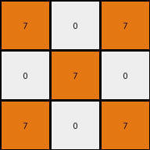
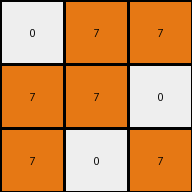

# a87f7484 • 009 • refine_dreamer

---


Previous Code:
```python
"""
1. Identify all pixels of color orange (7) in the input grid.
2. Observe relative position and relationships, with special attention to the surrounding white spaces (0).
3. Create a 3x3 output grid.
4. Fill the output grid using the spatial arrangement and the distribution pattern of orange as the main reference.
5. Complete the output using white (0) as needed.

In other words. Extract all orange (7) colored pixels. If an orange pixel is present at input[x,y], place it at output[x%3, y%3], and fill other places with white.
"""

import numpy as np

def transform(input_grid):
    """Transforms the input grid to the output grid based on orange pixel positions."""
    input_grid = np.array(input_grid)
    output_grid = np.zeros((3, 3), dtype=int)  # Initialize 3x3 output grid with white (0)

    rows, cols = input_grid.shape

    # Iterate through the input grid
    for i in range(rows):
        for j in range(cols):
            # Check if the pixel is orange (7)
            if input_grid[i, j] == 7:
                # Map the orange pixel to the output grid using modulo operation
                output_grid[i % 3, j % 3] = 7

    return output_grid.tolist()
```

Train Set Results:

## Example 1:

Input:
```
6 0 6
0 6 6
6 0 6
4 0 4
0 4 4
4 0 4
8 8 8
8 0 8
8 8 8
```
Expected Output:
```
8 8 8
8 0 8
8 8 8
```
Transformed Output:
```
0 0 0
0 0 0
0 0 0
```

match: False
pixels_off: 8
size_correct: True
color_palette_correct: True
correct_pixel_counts: False

## Example 2:

Input:
```
2 0 0 3 0 0 7 0 7 1 0 0
2 0 0 3 0 0 0 7 0 1 0 0
0 2 2 0 3 3 7 0 7 0 1 1
```
Expected Output:
```
7 0 7
0 7 0
7 0 7
```
Transformed Output:
```
7 0 7
0 7 0
7 0 7
```

match: True
pixels_off: 0
size_correct: True
color_palette_correct: True
correct_pixel_counts: True

## Example 3:

Input:
```
3 0 0 4 0 4 2 0 0 8 0 0 1 0 0
0 3 3 4 4 4 0 2 2 0 8 8 0 1 1
0 3 0 4 0 4 0 2 0 0 8 0 0 1 0
```
Expected Output:
```
4 0 4
4 4 4
4 0 4
```
Transformed Output:
```
0 0 0
0 0 0
0 0 0
```

match: False
pixels_off: 7
size_correct: True
color_palette_correct: True
correct_pixel_counts: False

## Example 4:

Input:
```
0 7 7
7 7 0
7 0 7
3 0 0
0 3 3
3 0 0
2 0 0
0 2 2
2 0 0
8 0 0
0 8 8
8 0 0
```
Expected Output:
```
0 7 7
7 7 0
7 0 7
```
Transformed Output:
```
0 7 7
7 7 0
7 0 7
```

match: True
pixels_off: 0
size_correct: True
color_palette_correct: True
correct_pixel_counts: True

**INSTRUCTIONS**

The code above was generated based on observations from the first training
example

we have tested the transform function on each of the task example inputs and
compared with the expected output

review each of the examples provided and the results and consider how the
natural language program should be updated to accommodate this new knowledge

respond with the following deliverables:

- general assessment of the information provided and strategy for resolving the
  errors
- gather metrics about each of the examples and results - use code_execution to
  develop accurate reports on your assumptions
- a YAML block documenting facts - Focus on identifying objects, their properties, and the actions performed on them.
- a natural language program - Be as clear and concise as possible, providing a complete description of the transformation rule.


your responses should be considered as information in a report - not a
conversation
