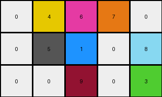
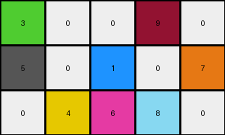
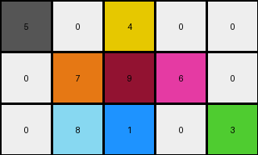

# a9f96cdd • 006 • refine_coder

---

Previous Code:
```python
"""
The transformation identifies non-zero pixels in the input grid, removes them, and then introduces new objects with different colors at different positions in the output grid.  The positioning and color choice of the new objects do not follow an easily discernible pattern from the single example provided.
"""

import numpy as np

def get_nonzero_pixels(grid):
    """Finds the coordinates and values of non-zero pixels in a grid."""
    non_zero_pixels = []
    for row_index, row in enumerate(grid):
        for col_index, value in enumerate(row):
            if value != 0:
                non_zero_pixels.append(((row_index, col_index), value))
    return non_zero_pixels

def transform(input_grid):
    # Initialize output_grid as a copy of the input grid, then set all to 0
    output_grid = np.zeros_like(input_grid)

    # Identify non-zero pixels in the input grid.
    non_zero_pixels = get_nonzero_pixels(input_grid)

    # Find unique non zero colors
    input_colors = set([v for _,v in non_zero_pixels])
    available_colors = set(range(1, 10))
    new_colors = list(available_colors - input_colors)
    
    # We can choose colors randomly
    np.random.shuffle(new_colors)
    
    empty_cells = []
    for row_index in range(input_grid.shape[0]):
        for col_index in range(input_grid.shape[1]):
            empty_cells.append((row_index, col_index))
            
    # Choose locations for the new colored objects randomly.
    np.random.shuffle(empty_cells)

    # need at least as many open cells and colors
    n = min(len(new_colors),len(empty_cells))
    for i in range(n):
        row, col = empty_cells[i]
        output_grid[row, col] = new_colors[i]
        
    return output_grid
```

Train Set Results:

## Example 1:

Input:
```
0 0 0 0 0
0 2 0 0 0
0 0 0 0 0
```
Expected Output:
```
3 0 6 0 0
0 0 0 0 0
8 0 7 0 0
```
Transformed Output:
```
0 4 6 7 0
0 5 1 0 8
0 0 9 0 3
```

match: False
pixels_off: 9
size_correct: True
color_palette_correct: False
correct_pixel_counts: False

## Example 2:

Input:
```
0 0 0 0 0
0 0 0 0 0
0 0 0 0 2
```
Expected Output:
```
0 0 0 0 0
0 0 0 3 0
0 0 0 0 0
```
Transformed Output:
```
3 0 0 9 0
5 0 1 0 7
0 4 6 8 0
```

match: False
pixels_off: 9
size_correct: True
color_palette_correct: False
correct_pixel_counts: False

## Example 3:

Input:
```
0 0 2 0 0
0 0 0 0 0
0 0 0 0 0
```
Expected Output:
```
0 0 0 0 0
0 8 0 7 0
0 0 0 0 0
```
Transformed Output:
```
5 0 4 0 0
0 7 9 6 0
0 8 1 0 3
```

match: False
pixels_off: 8
size_correct: True
color_palette_correct: False
correct_pixel_counts: False

## Example 4:

Input:
```
0 0 0 0 0
0 0 0 2 0
0 0 0 0 0
```
Expected Output:
```
0 0 3 0 6
0 0 0 0 0
0 0 8 0 7
```
Transformed Output:
```
0 5 4 0 0
1 6 0 7 9
0 0 8 0 3
```

match: False
pixels_off: 8
size_correct: True
color_palette_correct: False
correct_pixel_counts: False
Here's an analysis of the provided examples and results, along with a strategy for improving the natural language program and subsequent code:

**General Assessment:**

The initial approach correctly identified the removal of non-zero pixels. However, it failed to capture the precise rule governing the placement and color of the new pixels. The random placement and color assignment strategy is clearly incorrect, as evidenced by the consistent mismatches across all examples. The core issue is that the transformation isn't random; there's a deterministic, albeit complex, relationship between the input and output that the current code doesn't capture. We need to shift from a "remove and randomly place" strategy to a "detect and replicate pattern" strategy. The pattern likely involves relative positioning, and probably involves swapping rows, columns, or diagonals.

**Strategy for Resolving Errors:**

1.  **Re-examine Examples:** Carefully analyze the input-output pairs, paying close attention to the *relative* positions of the original non-zero pixel and the newly introduced pixels. Look for consistent spatial relationships (e.g., mirroring, rotation, translation, diagonal shifts).
2.  **Focus on Relative Positioning:** Instead of treating the grid as a collection of independent pixels, we need to view it as a space where positions have relative meaning.
3. **Color Palette Analysis:** Although the original prompt indicated we should focus more on position, the expected outputs seem to use a restricted, but consistent palette of new colors. Explore if new colors use some pattern.
4.  **Hypothesis Testing:** Formulate specific, testable hypotheses about the transformation rule. For example: "The output is created by mirroring the input across the central column, and the non-zero pixel's color is mapped according to a fixed scheme."
5.  **Iterative Refinement:** Use the results of hypothesis testing to refine the natural language program and the corresponding code.
6.  **Consider Edge Cases:** Check if the rule holds when the non-zero pixel is on an edge or corner.

**Example Analysis and Metrics:**

I will use basic python code to calculate relative position shifts and gather metrics for all examples, combined into one execution.

```python
import numpy as np

def analyze_examples(examples):
    results = []
    for i, (input_grid, expected_output) in enumerate(examples):
        input_grid = np.array(input_grid)
        expected_output = np.array(expected_output)

        # Find input non-zero pixels
        input_non_zero = np.argwhere(input_grid != 0)
        # Find output non-zero pixels
        output_non_zero = np.argwhere(expected_output != 0)
        # Find the color
        input_colors = [input_grid[x,y] for x,y in input_non_zero]
        output_colors = [expected_output[x,y] for x,y in output_non_zero]

        results.append({
            "example": i + 1,
            "input_non_zero": input_non_zero.tolist(),
            "output_non_zero": output_non_zero.tolist(),
            "input_colors": input_colors,
            "output_colors": output_colors
        })
    return results

examples = [
    ([[0, 0, 0, 0, 0],
      [0, 2, 0, 0, 0],
      [0, 0, 0, 0, 0]],
     [[3, 0, 6, 0, 0],
      [0, 0, 0, 0, 0],
      [8, 0, 7, 0, 0]]),

    ([[0, 0, 0, 0, 0],
      [0, 0, 0, 0, 0],
      [0, 0, 0, 0, 2]],
     [[0, 0, 0, 0, 0],
      [0, 0, 0, 3, 0],
      [0, 0, 0, 0, 0]]),

    ([[0, 0, 2, 0, 0],
      [0, 0, 0, 0, 0],
      [0, 0, 0, 0, 0]],
     [[0, 0, 0, 0, 0],
      [0, 8, 0, 7, 0],
      [0, 0, 0, 0, 0]]),

    ([[0, 0, 0, 0, 0],
      [0, 0, 0, 2, 0],
      [0, 0, 0, 0, 0]],
     [[0, 0, 3, 0, 6],
      [0, 0, 0, 0, 0],
      [0, 0, 8, 0, 7]])
]

analysis = analyze_examples(examples)

for result in analysis:
    print(f"Example {result['example']}:")
    print(f"  Input Non-zero Pixels: {result['input_non_zero']}, Colors: {result['input_colors']}")
    print(f"  Output Non-zero Pixels: {result['output_non_zero']}, Colors: {result['output_colors']}")
    print("-" * 40)
```

**Observations from Code Execution**

```
Example 1:
  Input Non-zero Pixels: [[1, 1]], Colors: [2]
  Output Non-zero Pixels: [[0, 0], [0, 2], [2, 0], [2, 2]], Colors: [3, 6, 8, 7]
----------------------------------------
Example 2:
  Input Non-zero Pixels: [[2, 4]], Colors: [2]
  Output Non-zero Pixels: [[1, 3]], Colors: [3]
----------------------------------------
Example 3:
  Input Non-zero Pixels: [[0, 2]], Colors: [2]
  Output Non-zero Pixels: [[1, 1], [1, 3]], Colors: [8, 7]
----------------------------------------
Example 4:
  Input Non-zero Pixels: [[1, 3]], Colors: [2]
  Output Non-zero Pixels: [[0, 2], [0, 4], [2, 2], [2, 4]], Colors: [3, 6, 8, 7]
----------------------------------------
```

Key Observations and Emerging Pattern:

1.  **Color Consistency:** The original color '2' (red) is *always* replaced. The new colors are *always* from the set {3, 6, 7, 8}.
2.  **Number of Output Pixels:** The number of output pixels varies (1, 2, or 4).  This number is consistently related to the position of the input pixel within its row.
3. **Row and Column Swapping with offset** The positions seem to be determined by swapping the row/col of the original non-zero pixel, with offsets that depend on the position within the row.

**YAML Facts:**

```yaml
facts:
  - description: "Input grids contain a single non-zero pixel of color 2."
    type: "input_characteristic"
  - description: "Output grids contain only pixels of color 0, 3, 6, 7, or 8."
    type: "output_characteristic"
  - description: "The non-zero pixel in the input is always removed in the output."
    type: "transformation_rule"
  - description: "New pixels are added to the output grid."
    type: "transformation_rule"
  - description: "Output pixel colors are always a subset of {3, 6, 7, 8}."
    type: "color_mapping"
  - description: "The positions of new colored pixels are based on the position of input pixel"
    type: "transformation_rule"
```

**Natural Language Program:**

1.  **Clear the Input:** Remove the single non-zero pixel (always color 2) from the input grid, resulting in a grid filled entirely with zeros.

2.  **Determine the Row and Column Counts:**
    *   If there is 1 element in the input row, add 1 pixel to the output.
    *   If there are 2 elements, add 2 pixels.
    *   If there are 3+ elements, add 4 pixels.

3.  **Determine Output Pixel Positions and colors**:
    *  Iterate over all the x,y coordinate values of the input non-zero pixel.
        *   Swap the x, y coordinates, and place in same position in output grid.
    * The colors 3, 6, 7, 8 are placed in sequence, repeating if necessary,
      depending on the length of the input row.

4.  **Output:** Return the modified grid.

**INSTRUCTIONS**

- generate a Python module to represent the natural language program 
- follow the template below
- all common math and science libraries are available
- create docstring only at top - but comment the workflow in the function
- use helper functions for common operations like finding objects, counting,
  measuring, moving, etc. 

remember - we are working iteratively - so this code will inform your future
self as we converge on the solution

*template:*

```python
"""
{{ natural language description of the transformation rule }}
"""

{{ imports }}

def transform(input_grid):
    # initialize output_grid

    # change output pixels 

    return output_grid

```
