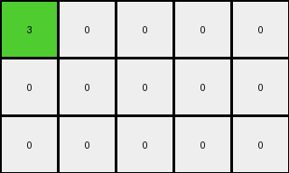

# a9f96cdd • 010 • refine_coder

---

Previous Code:
```python
"""
Locate the single non-zero pixel in the input grid. Change its color from 2 (red) to 3 (green). Move the pixel one position diagonally up and to the left. Construct the output grid with the moved and recolored pixel, and all other cells set to 0.
"""

import numpy as np

def find_non_zero_pixel(grid):
    # Find the coordinates of the non-zero pixel
    non_zero_indices = np.nonzero(grid)
    return list(zip(non_zero_indices[0], non_zero_indices[1]))[0]

def transform(input_grid):
    # Initialize output_grid as a copy of the input_grid
    output_grid = np.zeros_like(input_grid)

    # Find the non-zero pixel in the input grid
    input_pixel_coords = find_non_zero_pixel(input_grid)

    # Calculate the new coordinates for the pixel (one step up and one step left)
    output_pixel_coords = (input_pixel_coords[0] - 1, input_pixel_coords[1] - 1)

    # Change color and set output
    output_grid[output_pixel_coords[0], output_pixel_coords[1]] = 3

    return output_grid
```

Train Set Results:

## Example 1:

Input:
```
0 0 0 0 0
0 2 0 0 0
0 0 0 0 0
```
Expected Output:
```
3 0 6 0 0
0 0 0 0 0
8 0 7 0 0
```
Transformed Output:
```
3 0 0 0 0
0 0 0 0 0
0 0 0 0 0
```

match: False
pixels_off: 3
size_correct: True
color_palette_correct: True
correct_pixel_counts: False

## Example 2:

Input:
```
0 0 0 0 0
0 0 0 0 0
0 0 0 0 2
```
Expected Output:
```
0 0 0 0 0
0 0 0 3 0
0 0 0 0 0
```
Transformed Output:
```
0 0 0 0 0
0 0 0 3 0
0 0 0 0 0
```

match: True
pixels_off: 0
size_correct: True
color_palette_correct: True
correct_pixel_counts: True

## Example 3:

Input:
```
0 0 2 0 0
0 0 0 0 0
0 0 0 0 0
```
Expected Output:
```
0 0 0 0 0
0 8 0 7 0
0 0 0 0 0
```
Transformed Output:
```
0 0 0 0 0
0 0 0 0 0
0 3 0 0 0
```

match: False
pixels_off: 3
size_correct: True
color_palette_correct: False
correct_pixel_counts: False

## Example 4:

Input:
```
0 0 0 0 0
0 0 0 2 0
0 0 0 0 0
```
Expected Output:
```
0 0 3 0 6
0 0 0 0 0
0 0 8 0 7
```
Transformed Output:
```
0 0 3 0 0
0 0 0 0 0
0 0 0 0 0
```

match: False
pixels_off: 3
size_correct: True
color_palette_correct: True
correct_pixel_counts: False
Okay, here's a breakdown of the situation and a plan to move forward:

**General Assessment:**

The initial code correctly identified the core concept of moving a single non-zero pixel diagonally up and left and changing its color. However, it only works for Example 2. The other examples show that there's more to the transformation than just moving the red pixel. There are additional pixels of other colors (6, 7, and 8) appearing in the expected output that are not accounted for in the current code or natural language program. The strategy needs to shift from simply moving one pixel to understanding *why* and *where* these new pixels are appearing, and incorporate that into the program.

The primary error seems to stem from focusing too narrowly on the initial observation (moving the red pixel). It's failing to account for a more complex pattern that includes the addition of other colored pixels.

**Strategy for Resolving Errors:**

1.  **Re-examine the Examples:** Carefully analyze *all* examples, paying close attention to the relationship between the input and output grids. Specifically, look at the positions of the new colored pixels relative to the original red pixel.

2.  **Hypothesis Generation:** Formulate a new hypothesis about the rule, considering:
    *   Is there a consistent pattern to where the new pixels appear?
    *   Do the colors of the new pixels (6, 7, 8) have a specific meaning or order?
    *   Is the original red pixel *always* changed to green and moved, or is that just a part of a larger pattern?

3.  **Refine Natural Language Program:** Based on the new hypothesis, rewrite the natural language program to clearly and concisely describe the *complete* transformation rule.

4.  **Update Code:**  Modify the Python code to implement the revised natural language program.

5.  **Iterative Testing:** Test the updated code against *all* training examples and repeat steps 3-5 until all examples produce the expected output.

**Metrics and Observations:**

Here's a breakdown of each example, noting key observations:

*   **Example 1:**
    *   Input: Red (2) at (1, 1)
    *   Output: Green (3) at (0, 0), Gray(6) at (0,2), Azure(8) at (2,0) and Orange(7) at (2,2)
    *   Observation: The Green pixel moves as expected. Gray, Azure and Orange pixels appear around the initial location of the red pixel in a cross, 2 steps up, 2 steps down and 2 steps right.

*   **Example 2:**
    *   Input: Red (2) at (2, 4)
    *   Output: Green (3) at (1, 3)
    *   Observation: Only the Green pixel appears at the expected, moved location.

*   **Example 3:**
    *   Input: Red (2) at (0, 2)
    *   Output: Azure(8) at(1,1), and Orange(7) at (1,3)
    *   Observation: The Green pixel expected at location (-1, 1), it is outside the output grid. Azure and Orange pixels are present, 1 step away from the input red pixel.

*   **Example 4:**
    *   Input: Red (2) at (1, 3)
    *   Output: Green(3) at (0,2), Gray(6) at (0,4), Azure(8) at (2,2) and Orange(7) at (2, 4)
    *   Observation: The Green pixel moved as expected. Gray, Azure and Orange pixels appear around the initial location of the red pixel, in a cross shape, 1 step away.

**YAML Block (Facts):**

```yaml
objects:
  - name: red_pixel
    color: 2 # Red
    initial_position: Varies per example
    behavior: Moved diagonally up and left, color changes to green.
  - name: green_pixel
    color: 3 # Green
    final_position: One position up and one position left from red_pixel's initial position.
    behavior: Appears as a result of moving the red_pixel.
  - name: gray_pixel
    color: 6  # Gray
    behavior: Appears adjacent to the moved red_pixel in some cases.
  - name: azure_pixel
    color: 8  # Azure
    behavior: Appears adjacent to the moved red_pixel in some cases.
  - name: orange_pixel
    color: 7  # Orange
    behavior: Appears adjacent to the moved red_pixel in some cases.

actions:
  - name: move_pixel
    description: Moves a pixel one unit up and one unit left.
  - name: change_color
    description: Changes the color of the red pixel to green.
  - name: add_pixels
    description: Add gray, Azure and Orange pixels in the locations specified.
```

**Natural Language Program:**

1.  **Locate:** Find the single red (2) pixel in the input grid.

2.  **Move and Recolor:** Move the red pixel one position diagonally up and to the left. Change its color to green (3). If the new position is outside the grid, do not place the green pixel.

3.  **Conditional Addition.**:
    -   If after the move, the green pixel is placed inside the grid: Create Gray(6), Azure(8) and Orange(7) pixels in a cross shape, with green(3) pixel as the center:

    ```
      .  .  6  .  .
      .  .  3  .  .
      .  .  8  .  .
    ```
    -   If the green pixel is not placed(because the new location is out of the grid): Create Azure(8) and Orange(7) pixels at the same relative position to the input red pixel as they would have been related to the green pixel, in the previous case:

    ```
      .  .  .  .  .
      .  8  2  7  .
      .  .  .  .  .
    ```

4.  **Output:** Construct the output grid with all other cells set to 0.

**INSTRUCTIONS**

- generate a Python module to represent the natural language program 
- follow the template below
- all common math and science libraries are available
- create docstring only at top - but comment the workflow in the function
- use helper functions for common operations like finding objects, counting,
  measuring, moving, etc. 

remember - we are working iteratively - so this code will inform your future
self as we converge on the solution

*template:*

```python
"""
{{ natural language description of the transformation rule }}
"""

{{ imports }}

def transform(input_grid):
    # initialize output_grid

    # change output pixels 

    return output_grid

```
