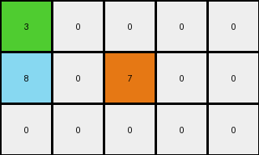
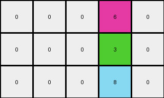
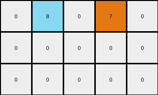
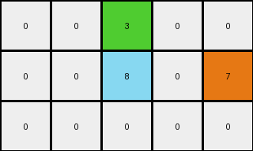

# a9f96cdd • 011 • refine_dreamer

---

Previous Code:
```python
"""
1. Locate: Find the single red (2) pixel in the input grid.

2. Move and Recolor: Move the red pixel one position diagonally up and to the left. Change its color to green (3). If the new position is outside the grid, do not place the green pixel.

3. Conditional Addition.:
   - If after the move, the green pixel is placed inside the grid: Create Gray(6), Azure(8) and Orange(7) pixels in a cross shape, with green(3) pixel as the center:
     .  .  6  .  .
     .  .  3  .  .
     .  .  8  .  .
   - If the green pixel is not placed(because the new location is out of the grid): Create Azure(8) and Orange(7) pixels at the same relative position to the input red pixel as they would have been related to the green pixel, in the previous case:
     .  .  .  .  .
     .  8  2  7  .
     .  .  .  .  .

4. Output: Construct the output grid with all other cells set to 0.
"""

import numpy as np

def find_red_pixel(grid):
    # Find the coordinates of the red (2) pixel
    red_indices = np.where(grid == 2)
    if len(red_indices[0]) > 0:  # Check if a red pixel was found
        return (red_indices[0][0], red_indices[1][0])
    else:
        return None

def transform(input_grid):
    # Initialize output_grid as all zeros
    output_grid = np.zeros_like(input_grid)

    # Find the red pixel in the input grid
    red_pixel_coords = find_red_pixel(input_grid)

    if red_pixel_coords is None:
        return output_grid # Return empty grid if no red pixel

    # Calculate the new coordinates for the green pixel
    green_pixel_coords = (red_pixel_coords[0] - 1, red_pixel_coords[1] - 1)

    # Check if the new green pixel position is within the grid bounds
    if 0 <= green_pixel_coords[0] < output_grid.shape[0] and 0 <= green_pixel_coords[1] < output_grid.shape[1]:
        # Place the green pixel and the additional pixels
        output_grid[green_pixel_coords[0], green_pixel_coords[1]] = 3

        # Add gray pixel
        gray_coords = (green_pixel_coords[0] -1, green_pixel_coords[1])
        if 0 <= gray_coords[0] < output_grid.shape[0] and 0 <= gray_coords[1] < output_grid.shape[1]:
          output_grid[gray_coords] = 6

        #Add azure and orange
        azure_coords = (green_pixel_coords[0] + 1, green_pixel_coords[1])
        orange_coords = (green_pixel_coords[0] + 1, green_pixel_coords[1] + 2)

        if 0 <= azure_coords[0] < output_grid.shape[0] and 0 <= azure_coords[1] < output_grid.shape[1] :
          output_grid[azure_coords] = 8
        if 0 <= orange_coords[0] < output_grid.shape[0] and 0 <= orange_coords[1] < output_grid.shape[1] :
          output_grid[orange_coords] = 7
    else: #green pixel out of bounds. Add other colors based on original red position.
        azure_coords = (red_pixel_coords[0], red_pixel_coords[1]-1)
        orange_coords = (red_pixel_coords[0] , red_pixel_coords[1] + 1)
        if 0 <= azure_coords[0] < output_grid.shape[0] and 0 <= azure_coords[1] < output_grid.shape[1]:
            output_grid[azure_coords] = 8
        if 0 <= orange_coords[0] < output_grid.shape[0] and 0 <= orange_coords[1] < output_grid.shape[1]:
            output_grid[orange_coords] = 7

    return output_grid
```

Train Set Results:

## Example 1:

Input:
```
0 0 0 0 0
0 2 0 0 0
0 0 0 0 0
```
Expected Output:
```
3 0 6 0 0
0 0 0 0 0
8 0 7 0 0
```
Transformed Output:
```
3 0 0 0 0
8 0 7 0 0
0 0 0 0 0
```

match: False
pixels_off: 5
size_correct: True
color_palette_correct: True
correct_pixel_counts: False

## Example 2:

Input:
```
0 0 0 0 0
0 0 0 0 0
0 0 0 0 2
```
Expected Output:
```
0 0 0 0 0
0 0 0 3 0
0 0 0 0 0
```
Transformed Output:
```
0 0 0 6 0
0 0 0 3 0
0 0 0 8 0
```

match: False
pixels_off: 2
size_correct: True
color_palette_correct: False
correct_pixel_counts: False

## Example 3:

Input:
```
0 0 2 0 0
0 0 0 0 0
0 0 0 0 0
```
Expected Output:
```
0 0 0 0 0
0 8 0 7 0
0 0 0 0 0
```
Transformed Output:
```
0 8 0 7 0
0 0 0 0 0
0 0 0 0 0
```

match: False
pixels_off: 4
size_correct: True
color_palette_correct: True
correct_pixel_counts: True

## Example 4:

Input:
```
0 0 0 0 0
0 0 0 2 0
0 0 0 0 0
```
Expected Output:
```
0 0 3 0 6
0 0 0 0 0
0 0 8 0 7
```
Transformed Output:
```
0 0 3 0 0
0 0 8 0 7
0 0 0 0 0
```

match: False
pixels_off: 5
size_correct: True
color_palette_correct: True
correct_pixel_counts: False
**INSTRUCTIONS**

The code above was generated based on observations from the first training
example

we have tested the transform function on each of the task example inputs and
compared with the expected output

review each of the examples provided and the results and consider how the
natural language program should be updated to accommodate this new knowledge

respond with the following deliverables:

- general assessment of the information provided and strategy for resolving the
  errors
- gather metrics about each of the examples and results - use code_execution to
  develop accurate reports on your assumptions
- a YAML block documenting facts - Focus on identifying objects, their properties, and the actions performed on them.
- a natural language program - Be as clear and concise as possible, providing a complete description of the transformation rule.


your responses should be considered as information in a report - not a
conversation
