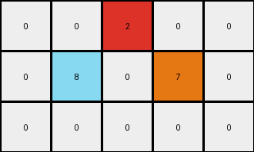

# a9f96cdd • 015 • refine_dreamer

---


Previous Code:
```python
"""
1.  **Initialization:** Start with an input grid of dimensions 3x5.
2.  **Locate:** Note the red pixel (value 2) in the top row at position (0,2).
3.  **Transformation**: Create azure colored pixel with value 8 and orange colored pixel with value 7 in the second row of the output grid. Azure is one row down and one column to the left and orange is one row down and one column to the right, relative to the input red pixel.
4. **Output:** maintain original grid size and all the white pixels.
"""

import numpy as np

def find_pixel_by_value(grid, value):
    # Find the coordinates of a pixel with a specific value.
    coords = np.where(grid == value)
    if len(coords[0]) > 0:
        return (coords[0][0], coords[1][0])  # Return the first occurrence
    return None

def transform(input_grid):
    """Transforms the input grid according to the observed rule."""

    # Initialize the output grid as a copy of the input grid.
    output_grid = np.copy(input_grid)

    # Find the red pixel (value 2).
    red_pixel_coords = find_pixel_by_value(input_grid, 2)

    if red_pixel_coords:
        # Calculate coordinates for the azure and orange pixels.
        azure_coords = (red_pixel_coords[0] + 1, red_pixel_coords[1] - 1)
        orange_coords = (red_pixel_coords[0] + 1, red_pixel_coords[1] + 1)

        # Set the azure and orange pixels in the output grid,
        # checking bounds.
        if 0 <= azure_coords[0] < output_grid.shape[0] and 0 <= azure_coords[1] < output_grid.shape[1]:
            output_grid[azure_coords] = 8
        if 0 <= orange_coords[0] < output_grid.shape[0] and 0 <= orange_coords[1] < output_grid.shape[1]:
             output_grid[orange_coords] = 7

    return output_grid
```

Train Set Results:

## Example 1:

Input:
```
0 0 0 0 0
0 2 0 0 0
0 0 0 0 0
```
Expected Output:
```
3 0 6 0 0
0 0 0 0 0
8 0 7 0 0
```
Transformed Output:
```
0 0 0 0 0
0 2 0 0 0
8 0 7 0 0
```

match: False
pixels_off: 3
size_correct: True
color_palette_correct: False
correct_pixel_counts: False

## Example 2:

Input:
```
0 0 0 0 0
0 0 0 0 0
0 0 0 0 2
```
Expected Output:
```
0 0 0 0 0
0 0 0 3 0
0 0 0 0 0
```
Transformed Output:
```
0 0 0 0 0
0 0 0 0 0
0 0 0 0 2
```

match: False
pixels_off: 2
size_correct: True
color_palette_correct: False
correct_pixel_counts: False

## Example 3:

Input:
```
0 0 2 0 0
0 0 0 0 0
0 0 0 0 0
```
Expected Output:
```
0 0 0 0 0
0 8 0 7 0
0 0 0 0 0
```
Transformed Output:
```
0 0 2 0 0
0 8 0 7 0
0 0 0 0 0
```

match: False
pixels_off: 1
size_correct: True
color_palette_correct: False
correct_pixel_counts: False

## Example 4:

Input:
```
0 0 0 0 0
0 0 0 2 0
0 0 0 0 0
```
Expected Output:
```
0 0 3 0 6
0 0 0 0 0
0 0 8 0 7
```
Transformed Output:
```
0 0 0 0 0
0 0 0 2 0
0 0 8 0 7
```

match: False
pixels_off: 3
size_correct: True
color_palette_correct: False
correct_pixel_counts: False

**INSTRUCTIONS**

The code above was generated based on observations from the first training
example

we have tested the transform function on each of the task example inputs and
compared with the expected output

review each of the examples provided and the results and consider how the
natural language program should be updated to accommodate this new knowledge

respond with the following deliverables:

- general assessment of the information provided and strategy for resolving the
  errors
- gather metrics about each of the examples and results - use code_execution to
  develop accurate reports on your assumptions
- a YAML block documenting facts - Focus on identifying objects, their properties, and the actions performed on them.
- a natural language program - Be as clear and concise as possible, providing a complete description of the transformation rule.


your responses should be considered as information in a report - not a
conversation
