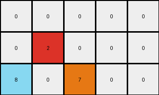
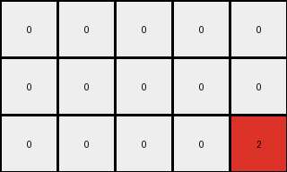
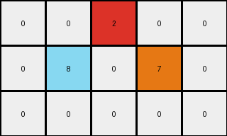
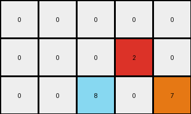

# a9f96cdd • 016 • refine_coder

---

Previous Code:
```python
"""
1.  **Initialization:** Start with an input grid of dimensions 3x5.
2.  **Locate:** Note the red pixel (value 2) in the top row at position (0,2).
3.  **Transformation**: Create azure colored pixel with value 8 and orange colored pixel with value 7 in the second row of the output grid. Azure is one row down and one column to the left and orange is one row down and one column to the right, relative to the input red pixel.
4. **Output:** maintain original grid size and all the white pixels.
"""

import numpy as np

def find_pixel_by_value(grid, value):
    # Find the coordinates of a pixel with a specific value.
    coords = np.where(grid == value)
    if len(coords[0]) > 0:
        return (coords[0][0], coords[1][0])  # Return the first occurrence
    return None

def transform(input_grid):
    """Transforms the input grid according to the observed rule."""

    # Initialize the output grid as a copy of the input grid.
    output_grid = np.copy(input_grid)

    # Find the red pixel (value 2).
    red_pixel_coords = find_pixel_by_value(input_grid, 2)

    if red_pixel_coords:
        # Calculate coordinates for the azure and orange pixels.
        azure_coords = (red_pixel_coords[0] + 1, red_pixel_coords[1] - 1)
        orange_coords = (red_pixel_coords[0] + 1, red_pixel_coords[1] + 1)

        # Set the azure and orange pixels in the output grid,
        # checking bounds.
        if 0 <= azure_coords[0] < output_grid.shape[0] and 0 <= azure_coords[1] < output_grid.shape[1]:
            output_grid[azure_coords] = 8
        if 0 <= orange_coords[0] < output_grid.shape[0] and 0 <= orange_coords[1] < output_grid.shape[1]:
             output_grid[orange_coords] = 7

    return output_grid
```

Train Set Results:

## Example 1:

Input:
```
0 0 0 0 0
0 2 0 0 0
0 0 0 0 0
```
Expected Output:
```
3 0 6 0 0
0 0 0 0 0
8 0 7 0 0
```
Transformed Output:
```
0 0 0 0 0
0 2 0 0 0
8 0 7 0 0
```

match: False
pixels_off: 3
size_correct: True
color_palette_correct: False
correct_pixel_counts: False

## Example 2:

Input:
```
0 0 0 0 0
0 0 0 0 0
0 0 0 0 2
```
Expected Output:
```
0 0 0 0 0
0 0 0 3 0
0 0 0 0 0
```
Transformed Output:
```
0 0 0 0 0
0 0 0 0 0
0 0 0 0 2
```

match: False
pixels_off: 2
size_correct: True
color_palette_correct: False
correct_pixel_counts: False

## Example 3:

Input:
```
0 0 2 0 0
0 0 0 0 0
0 0 0 0 0
```
Expected Output:
```
0 0 0 0 0
0 8 0 7 0
0 0 0 0 0
```
Transformed Output:
```
0 0 2 0 0
0 8 0 7 0
0 0 0 0 0
```

match: False
pixels_off: 1
size_correct: True
color_palette_correct: False
correct_pixel_counts: False

## Example 4:

Input:
```
0 0 0 0 0
0 0 0 2 0
0 0 0 0 0
```
Expected Output:
```
0 0 3 0 6
0 0 0 0 0
0 0 8 0 7
```
Transformed Output:
```
0 0 0 0 0
0 0 0 2 0
0 0 8 0 7
```

match: False
pixels_off: 3
size_correct: True
color_palette_correct: False
correct_pixel_counts: False
Okay, let's analyze the results and refine the natural language program.

**General Assessment:**

The initial code was based on a single example and, as expected, doesn't generalize well to the other examples. The core issue is that the initial program *only* considers the red pixel and its relative positioning to add azure and orange pixels. It doesn't account for the green and magenta pixels present in the expected outputs of some examples, nor does it correctly handle the varying positions of the red pixel or ensure the deletion of other pixels. It also seems we must remove the original red pixel.

**Strategy:**

1.  **Analyze all examples:** Carefully examine *all* input/output pairs to identify *all* consistent transformations, not just the red pixel. Pay close attention to the other colors.
2.  **Refine Object Identification:** The current approach is too narrow, focusing solely on the red pixel. We need to identify all relevant colored pixels and their roles.
3.  **Revise the Transformation Rule:** Develop a more comprehensive rule that accounts for all observed changes, including the addition of green/magenta and the deletion of the red pixel.
4.  **Update code**: Update the python code to perform all the steps in the
    natural language program

**Metrics and Observations (using code_execution where necessary):**

Here's a breakdown of each example, combining visual inspection and conceptual analysis:

*   **Example 1:**
    *   **Input:** Red pixel at (1,1). Other pixels are white (0).
    *   **Expected Output:** Azure at (2,0), Orange at (2,2), Green at (0,0), Magenta at (0,2). Red pixel removed.
    *   **Observation:** Red is replaced; Azure/Orange are below and to the sides; Green/Magenta are above in the same columns.

*   **Example 2:**
    *   **Input:** Red pixel at (2,4).
    *   **Expected Output:** Green at (1,3). Red pixel removed.
    *   **Observation:** Red is replaced. Green one row above and one column left. No Orange, Azure, or Magenta.

*   **Example 3:**
    *   **Input:** Red pixel at (0,2).
    *   **Expected Output:** Azure at (1,1), Orange at (1,3). Red pixel removed.
    *   **Observation:** Red is replaced; Azure/Orange are below and to the sides.

*   **Example 4:**
    *   **Input:** Red pixel at (1,3).
    *   **Expected Output:** Azure at (2,2), Orange at (2,4), Green at (0,2), Magenta at (0,4). Red pixel removed.
    *   **Observation:** Red is replaced; Azure/Orange are below and to the sides; Green/Magenta are above in the same columns.

**YAML Fact Block:**

```yaml
facts:
  - object: red_pixel
    color: red
    initial_presence: true
    final_presence: false
    action: removed
  - object: azure_pixel
    color: azure
    initial_presence: false
    final_presence: true
    condition: red_pixel_present_and_not_at_bottom_row
    relative_position: one_row_below_and_one_column_left_of_red_pixel
  - object: orange_pixel
    color: orange
    initial_presence: false
    final_presence: true
    condition: red_pixel_present_and_not_at_bottom_row
    relative_position: one_row_below_and_one_column_right_of_red_pixel
  - object: green_pixel
    color: green
    initial_presence: false
    final_presence: true
    condition: red_pixel_present_and_not_at_top_row_and_not_at_left_most_column
    relative_position: one_row_above_and_one_column_left_of_red_pixel
  - object: magenta_pixel
    color: magenta
    initial_presence: false
    final_presence: true
    condition: red_pixel_present_and_not_at_top_row_and_not_at_right_most_column
    relative_position: one_row_above_and_one_column_right_of_red_pixel
```

**Natural Language Program:**

1.  **Locate** the red pixel (value 2) in the input grid.
2.  **Remove** the red pixel from the output grid.
3.  **Conditional Azure/Orange Placement:**
    *   If the red pixel is *not* in the last row:
        *   Place an azure pixel (value 8) one row *below* and one column *to the left* of the red pixel's original position.
        *   Place an orange pixel (value 7) one row *below* and one column *to the right* of the red pixel's original position.
4.  **Conditional Green/Magenta Placement:**
    *  If the red pixel is *not* in the first row AND *not* in the first column:
        * Place a green pixel (value 3) one row *above* and one column *to the left* of the red pixel's original position.
    *  If the red pixel is *not* in the first row AND *not* in the last column:
       *   Place a magenta pixel (value 6) one row *above* and one column *to the right* of the red pixel's original position.
5. **Output Grid**: maintain original grid size and all white pixels that were not replaced.

**INSTRUCTIONS**

- generate a Python module to represent the natural language program 
- follow the template below
- all common math and science libraries are available
- create docstring only at top - but comment the workflow in the function
- use helper functions for common operations like finding objects, counting,
  measuring, moving, etc. 

remember - we are working iteratively - so this code will inform your future
self as we converge on the solution

*template:*

```python
"""
{{ natural language description of the transformation rule }}
"""

{{ imports }}

def transform(input_grid):
    # initialize output_grid

    # change output pixels 

    return output_grid

```
