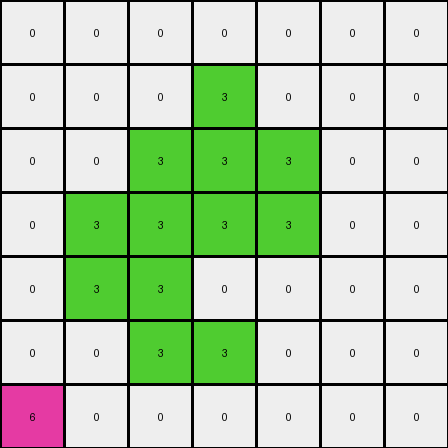

# aabf363d • 004 • refine_coder

---

Previous Code:
```python
"""
Identifies a contiguous shape of red pixels and a single yellow pixel in the input grid. Replaces the red shape with yellow pixels and removes the original yellow pixel.
"""

import numpy as np

def find_object(grid, color):
    # Find coordinates of all pixels of the specified color.
    coords = np.argwhere(grid == color)
    if len(coords) == 0:
        return None

    # Check connectivity - only consider directly adjacent pixels.
    visited = set()
    object_coords = []

    def dfs(row, col):
        if (row, col) in visited or not (0 <= row < grid.shape[0] and 0 <= col < grid.shape[1]) or grid[row, col] != color:
            return
        visited.add((row, col))
        object_coords.append((row, col))
        dfs(row + 1, col)
        dfs(row - 1, col)
        dfs(row, col + 1)
        dfs(row, col - 1)

    start_row, start_col = coords[0]
    dfs(start_row, start_col)
    return object_coords

def find_single_pixel(grid, color):
    coords = np.argwhere(grid == color)
    if len(coords) == 1:
      return coords[0]
    return None


def transform(input_grid):
    # Initialize output_grid as a copy of the input_grid.
    output_grid = np.copy(input_grid)

    # Find the red object.
    red_object_coords = find_object(input_grid, 2)

    # find single yellow pixel
    yellow_pixel_coord = find_single_pixel(input_grid, 4)

    # Change the color of the red object to yellow in the output_grid.
    if red_object_coords:
        for row, col in red_object_coords:
            output_grid[row, col] = 4

    if yellow_pixel_coord:
      output_grid[yellow_pixel_coord[0], yellow_pixel_coord[1]] = 0

    return output_grid
```

Train Set Results:

## Example 1:

Input:
```
0 0 0 0 0 0 0
0 2 2 2 0 0 0
0 0 2 0 0 0 0
0 2 2 2 2 0 0
0 0 2 2 2 0 0
0 0 0 2 0 0 0
4 0 0 0 0 0 0
```
Expected Output:
```
0 0 0 0 0 0 0
0 4 4 4 0 0 0
0 0 4 0 0 0 0
0 4 4 4 4 0 0
0 0 4 4 4 0 0
0 0 0 4 0 0 0
0 0 0 0 0 0 0
```
match: ERROR: The truth value of an array with more than one element is ambiguous. Use a.any() or a.all()
pixels_off: None
size_correct: None
color_palette_correct: None
correct_pixel_counts: None

## Example 2:

Input:
```
0 0 0 0 0 0 0
0 0 0 3 0 0 0
0 0 3 3 3 0 0
0 3 3 3 3 0 0
0 3 3 0 0 0 0
0 0 3 3 0 0 0
6 0 0 0 0 0 0
```
Expected Output:
```
0 0 0 0 0 0 0
0 0 0 6 0 0 0
0 0 6 6 6 0 0
0 6 6 6 6 0 0
0 6 6 0 0 0 0
0 0 6 6 0 0 0
0 0 0 0 0 0 0
```
Transformed Output:
```
0 0 0 0 0 0 0
0 0 0 3 0 0 0
0 0 3 3 3 0 0
0 3 3 3 3 0 0
0 3 3 0 0 0 0
0 0 3 3 0 0 0
6 0 0 0 0 0 0
```

match: False
pixels_off: 13
size_correct: True
color_palette_correct: False
correct_pixel_counts: False
Okay, here's an analysis of the situation and a plan to move forward:

**General Assessment:**

The initial code was designed to find a red object and a single yellow pixel, replace the red object with yellow, and remove the original yellow pixel. This worked for the first example, but failed on the second. The second example reveals a critical flaw in the initial assumption: the code assumes the target object is always red and should be replaced by the color of the single isolated pixel. The second example shows this isn't always the case; the connected object is green, and the replacement color is magenta. It also fails because it does not remove the single pixel.

The error on the first example also shows that the current version of the code is unable to correctly compare the transformed output.

The primary strategy is to generalize the object and color identification. Instead of looking for *red* objects, we should look for *any* contiguous object of a uniform color. Instead of assuming the replacement color is yellow, determine the single isolated pixel, extract its color, and use that for replacement.

**Metrics and Observations:**

Here's a breakdown of each example:

*   **Example 1:**
    *   Input: Contains a red object and a single yellow pixel.
    *   Expected Output: Red object becomes yellow, original yellow pixel removed.
    *   Code Result: Error, `The truth value of an array with more than one element is ambiguous`
    *   Issue: Code did not handle comparison correctly
*   **Example 2:**
    *   Input: Contains a green object and a single magenta pixel.
    *   Expected Output: Green object becomes magenta, original magenta pixel removed.
    *   Code Result: The output grid is identical to the input grid. No changes were made.
    *   Issue: Hardcoded colors (red and yellow) prevent correct transformation.

**YAML Facts:**

```yaml
example_1:
  input:
    objects:
      - color: red
        type: contiguous
        shape: irregular
      - color: yellow
        type: single_pixel
  output:
    objects:
      - color: yellow
        type: contiguous
        shape: irregular # Same shape as the original red object
example_2:
  input:
    objects:
      - color: green
        type: contiguous
        shape: irregular
      - color: magenta
        type: single_pixel
  output:
    objects:
      - color: magenta
        type: contiguous
        shape: irregular
```

**Natural Language Program:**

1.  **Identify Objects:** In the input grid, find all contiguous objects (groups of adjacent pixels of the same color). Also, identify all single, isolated pixels (pixels that are not adjacent to any other pixel of the same color).
2.  **Find Single Pixel:** Of those single, isolated pixels. There should be only one per the current problem constraints.
3.  **Determine Replacement Color**: Record the color of the single isolated pixel.
4.  **Target Object:** Identify any one of the contiguous objects.
5. **Replace**: Change the contiguous object color to the single pixel color.
6. **Remove**: Change the single pixel color to the background color (0).


**INSTRUCTIONS**

- generate a Python module to represent the natural language program 
- follow the template below
- all common math and science libraries are available
- create docstring only at top - but comment the workflow in the function
- use helper functions for common operations like finding objects, counting,
  measuring, moving, etc. 

remember - we are working iteratively - so this code will inform your future
self as we converge on the solution

*template:*

```python
"""
{{ natural language description of the transformation rule }}
"""

{{ imports }}

def transform(input_grid):
    # initialize output_grid

    # change output pixels 

    return output_grid

```
