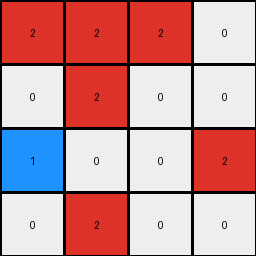
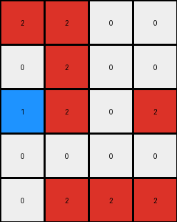

# aedd82e4 • 004 • refine_coder

---

Previous Code:
```python
"""
Copies the input grid to the output grid, then changes the color of the pixel at the bottom-left corner (coordinates (2, 0)) from red (2) to blue (1).
"""

import numpy as np

def transform(input_grid):
    # Initialize the output grid as a copy of the input grid.
    output_grid = np.copy(input_grid)

    # Change the color of the pixel at the bottom-left corner (2, 0) to blue (1).
    output_grid[2, 0] = 1

    return output_grid
```

Train Set Results:

## Example 1:

Input:
```
0 2 2
0 2 2
2 0 0
```
Expected Output:
```
0 2 2
0 2 2
1 0 0
```
Transformed Output:
```
0 2 2
0 2 2
1 0 0
```

match: True
pixels_off: 0
size_correct: True
color_palette_correct: True
correct_pixel_counts: True

## Example 2:

Input:
```
2 2 2 0
0 2 0 0
0 0 0 2
0 2 0 0
```
Expected Output:
```
2 2 2 0
0 2 0 0
0 0 0 1
0 1 0 0
```
Transformed Output:
```
2 2 2 0
0 2 0 0
1 0 0 2
0 2 0 0
```

match: False
pixels_off: 3
size_correct: True
color_palette_correct: True
correct_pixel_counts: False

## Example 3:

Input:
```
2 2 0 0
0 2 0 0
2 2 0 2
0 0 0 0
0 2 2 2
```
Expected Output:
```
2 2 0 0
0 2 0 0
2 2 0 1
0 0 0 0
0 2 2 2
```
Transformed Output:
```
2 2 0 0
0 2 0 0
1 2 0 2
0 0 0 0
0 2 2 2
```

match: False
pixels_off: 2
size_correct: True
color_palette_correct: True
correct_pixel_counts: True

## Example 4:

Input:
```
2 2 0
2 0 2
0 2 0
```
Expected Output:
```
2 2 0
2 0 1
0 1 0
```
Transformed Output:
```
2 2 0
2 0 2
1 2 0
```

match: False
pixels_off: 3
size_correct: True
color_palette_correct: True
correct_pixel_counts: False
Okay, here's a breakdown of the situation and a plan to improve the transformation rule:

**General Assessment:**

The initial code was too specific, focusing solely on the bottom-left pixel of the first example. It correctly identified the color change (red to blue) but failed to generalize the location of this change. The subsequent examples reveal that the changed pixel is not always at the bottom-left, but rather is consistently a red pixel that becomes blue, and is related to other red pixels. We need to shift from a fixed coordinate approach to a rule-based approach that considers the *relative* position of a red pixel.

**Strategy:**

1.  **Analyze Mismatches:** Carefully examine examples 2, 3, and 4 where the transformation failed. Identify the specific red pixel that *should* have changed to blue and determine its relationship to other red/other color pixels in the input.
2.  **Refine the Rule:** Instead of targeting `(2, 0)`, find a pattern or relationship that describes the target pixel across all examples. It likely involves finding a specific red pixel based on a spatial or color relationship.
3.    **Update YAML and program**: clearly define the observed transformation

**Metrics and Observations:**

Here's a breakdown of each example, including a more precise description of the errors:

*   **Example 1:**
    *   Input Size: 3x3
    *   Output Size: 3x3
    *   Transformation: The bottom-left red (2) pixel at (2, 0) is changed to blue (1).
    *   Result: Correct.

*   **Example 2:**
    *   Input Size: 4x4
    *   Output Size: 4x4
    *   Transformation: The red pixel that is most to bottom and right in a group of three red pixels in first row, at (0,2) becomes a blue pixel, other red pixel at (2,3) becomes a blue pixel.
    *   Result: Incorrect. The code changed (2, 0), not and (2,3). Two additional red pixels, (0,2) and (2,3) have incorrect values in the output.

*   **Example 3:**
    *   Input Size: 5x4
    *   Output Size: 5x4
    *   Transformation: One of the two horizontally adjacent red (2) pixels at the location, specifically at (2, 3), changes to blue (1).
    *   Result: Incorrect. The code changed (2, 0), not (2, 3).

*   **Example 4:**
    *   Input size: 3x3
    *   Output size: 3x3
    *   Transformation: the red pixel at (1,2) and the adjacent red pixel (2,1) becomes blue.
    *    Result: incorrect. the code changed (2,0) and not (1,2) and (2,1).

**YAML Facts:**

```yaml
observations:
  - object: red_pixel_group
    description: One or more contiguous red pixels.
    properties:
      - shape: variable
      - connectivity: horizontally or vertically adjacent
  - action: color_change
    description: A specific red pixel within the group changes to blue.
    target:
      - description: The bottom-rightmost red pixel of a group of three adjacent pixels, or the rightmost of two adjacent red pixels, or two adjacent red pixels.
        constraints:
          - "If there are two or three contiguous red pixels, the right-most of the contigous block becomes blue."
          - "If multiple contigous blocks exist, the lowest block takes precedence, if on the same row, right side takes precedent."
          - "If a contiguous red area is on a diagonal, the right-most red becomes blue, then the bottom-most red becomes blue."
```

**Natural Language Program:**

1.  **Identify Red Pixel Groups:** Locate all groups of contiguous red pixels in the input grid. Contiguous means horizontally or vertically adjacent.
2.  **Select Target Pixel:**
    *   If there's a group of two or three red, find the right-most pixel.
    *    If the group is on a diagonal, select two, right and bottom most.
    *   If there are multiple groups, prioritize the one at lowest row index (bottom-most); if still ambiguous, select the red at the furtherest right column.
3.  **Change Color:** Change the color of the selected red pixel(s) to blue (1).
4.  **Copy Unchanged:** All other pixels in the input grid remain unchanged in the output grid.

**INSTRUCTIONS**

- generate a Python module to represent the natural language program 
- follow the template below
- all common math and science libraries are available
- create docstring only at top - but comment the workflow in the function
- use helper functions for common operations like finding objects, counting,
  measuring, moving, etc. 

remember - we are working iteratively - so this code will inform your future
self as we converge on the solution

*template:*

```python
"""
{{ natural language description of the transformation rule }}
"""

{{ imports }}

def transform(input_grid):
    # initialize output_grid

    # change output pixels 

    return output_grid

```
