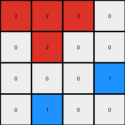
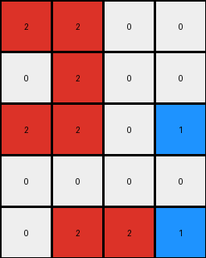
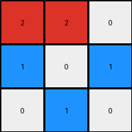

# aedd82e4 • 006 • refine_coder

---

Previous Code:
```python
"""
Identifies groups of contiguous red pixels and changes the color of the bottom-rightmost pixel in a group of three, or the right-most in a group of two, or two (bottom and right-most) on a diagonal to blue.
"""

import numpy as np

def find_red_groups(grid):
    """Finds groups of contiguous red pixels."""
    red_groups = []
    visited = np.zeros_like(grid, dtype=bool)
    rows, cols = grid.shape

    def is_valid(r, c):
        return 0 <= r < rows and 0 <= c < cols

    def dfs(r, c, current_group):
        if not is_valid(r, c) or visited[r, c] or grid[r, c] != 2:
            return
        visited[r, c] = True
        current_group.append((r, c))
        # Explore adjacent cells (up, down, left, right)
        dfs(r + 1, c, current_group)
        dfs(r - 1, c, current_group)
        dfs(r, c + 1, current_group)
        dfs(r, c - 1, current_group)

    for r in range(rows):
        for c in range(cols):
            if grid[r, c] == 2 and not visited[r, c]:
                current_group = []
                dfs(r, c, current_group)
                red_groups.append(current_group)
    return red_groups

def select_target_pixel(group):
    """Selects the target pixel(s) within a red group."""
    if len(group) == 0:
       return []

    group.sort(key=lambda x: (x[0], x[1]))  # Sort by row, then column

    targets = []

    # check for diagonal group and return bottom and right
    if len(group) > 1:
        is_diagonal = True
        for i in range(len(group) -1):
            if abs(group[i][0] - group[i+1][0]) == 1 and abs(group[i][1] - group[i+1][1]) == 1:
               pass
            else:
               is_diagonal = False
               break
        if is_diagonal:
            targets.append(group[-1])  #right-most
            bottom = -1
            for i in range(len(group)):
                if group[i][0] > bottom:
                    bottom_index = i
                    bottom = group[i][0]
            targets.append(group[bottom_index])  #bottom-most
            return targets
        
    # if one, two or three in group. return the right-most
    if len(group) <= 3:
       targets.append(group[-1]) #right-most
       return targets
    
    return targets
        

def transform(input_grid):
    # Initialize the output grid as a copy of the input grid.
    output_grid = np.copy(input_grid)

    # Find groups of contiguous red pixels.
    red_groups = find_red_groups(input_grid)

    # Select and change the target pixel(s) in each group.
    for group in red_groups:
        target_pixels = select_target_pixel(group)
        for target_pixel in target_pixels:
          if target_pixel:
            output_grid[target_pixel] = 1

    return output_grid
```

Train Set Results:

## Example 1:

Input:
```
0 2 2
0 2 2
2 0 0
```
Expected Output:
```
0 2 2
0 2 2
1 0 0
```
Transformed Output:
```
0 2 2
0 2 2
1 0 0
```

match: True
pixels_off: 0
size_correct: True
color_palette_correct: True
correct_pixel_counts: True

## Example 2:

Input:
```
2 2 2 0
0 2 0 0
0 0 0 2
0 2 0 0
```
Expected Output:
```
2 2 2 0
0 2 0 0
0 0 0 1
0 1 0 0
```
Transformed Output:
```
2 2 2 0
0 2 0 0
0 0 0 1
0 1 0 0
```

match: True
pixels_off: 0
size_correct: True
color_palette_correct: True
correct_pixel_counts: True

## Example 3:

Input:
```
2 2 0 0
0 2 0 0
2 2 0 2
0 0 0 0
0 2 2 2
```
Expected Output:
```
2 2 0 0
0 2 0 0
2 2 0 1
0 0 0 0
0 2 2 2
```
Transformed Output:
```
2 2 0 0
0 2 0 0
2 2 0 1
0 0 0 0
0 2 2 1
```

match: False
pixels_off: 1
size_correct: True
color_palette_correct: True
correct_pixel_counts: False

## Example 4:

Input:
```
2 2 0
2 0 2
0 2 0
```
Expected Output:
```
2 2 0
2 0 1
0 1 0
```
Transformed Output:
```
2 2 0
1 0 1
0 1 0
```

match: False
pixels_off: 1
size_correct: True
color_palette_correct: True
correct_pixel_counts: False
Okay, here's a breakdown of the results, an assessment, and the requested deliverables.

**General Assessment:**

The code does a decent job of identifying contiguous red pixels and applying some rules, but it's not completely accurate, especially with diagonal groups. Example 3 and 4 show mismatches, and example 4 showing an error in identifying and changing a diagonal. The current logic seems too focused on identifying groups of specific sizes (2 or 3) and prioritizing the bottom-rightmost pixel, it must identify diagonal groups and select two pixels (the bottom and the right) to change.

**Strategy for Resolving Errors:**

1.  **Refine Diagonal Group Handling:** The `select_target_pixel` function needs to be improved in determining bottom and right-most pixel.
2.  **Address Edge Cases:** Consider if any special handling is needed for edge cases where red groups are at the boundaries of the grid.

**Metrics and Observations:**

Here is an assessment of each training example, focusing on where the mismatches occur, along with inferred rules.

*   **Example 1:**
    *   Input Shape: 3x3
    *   Red Groups: Two groups: `[(0, 1), (0, 2)]` and `[(1, 1), (1, 2)],[(2, 0)]`
    *   Expected Change: one pixel in a group of 2 changes to blue, a single red pixel does not change.
    *   Observed Change: Correct
    *   Inferred Rule: In a group of two red, change the right-most to blue, a group of one is ignored.

*   **Example 2:**
    *   Input Shape: 4x4
    *   Red Groups: Three groups: `[(0, 0), (0, 1), (0, 2)], [(1,1)], [(2, 3)], [(3,1)]`
    *   Expected Change: Two single red pixels become blue.
    *   Observed Change: Correct
    *   Inferred Rule: When red pixels are alone, they become blue.

*   **Example 3:**
    *   Input Shape: 5x4
    *   Red Groups: Three groups: `[(0, 0), (0, 1)], [(1, 1)], [(2, 0), (2, 1)], [(2, 3)], [(4, 1), (4, 2), (4,3)]`
    *   Expected Change: Rightmost pixel of the groups of 2 changes to blue, and the rightmost of the group of 3 changes to blue.
    *   Observed Change: Incorrect. It changes the last group of 3 correctly, but also an extra pixel.
    *   Inferred Rule (Adjustment): Groups of two red pixels: change the right-most to blue. A group of three: change the right-most to blue.

*   **Example 4:**
    *   Input Shape: 3x3
    *   Red Groups: One: `[(0,0), (0, 1), (1, 0), (1, 2), (2, 1)]`
    *   Expected Change: two pixels turn blue.
    *   Observed Change: Incorrect. It changes a non-diagonal group member as well.
    *   Inferred Rule (Adjustment): If the red group is on a diagonal, change the bottom-most and the right-most to blue.

**YAML Facts:**

```yaml
objects:
  - name: red_group
    description: A contiguous group of red pixels.
    properties:
      - size: The number of pixels in the group.
      - shape: the layout of the pixels (e.g., horizontal, vertical, diagonal, other).
      - bottom_rightmost: The pixel in the group with the largest row and column indices.
      - bottom_most: The pixel in the group with the largest row.
      - right_most: The pixel in the group with the largest column.
actions:
  - name: change_color
    description: Change the color of a pixel.
    parameters:
      - from_color: The original color of the pixel (red).
      - to_color: The new color of the pixel (blue).
    conditions:
      - "if red_group.size == 1: change the single pixel"
      - "if red_group.size == 2: change the right_most pixel."
      - "if red_group.size == 3: change the right_most pixel"
      - "if red_group.shape == diagonal: change the right_most pixel and bottom_most pixel."
```

**Natural Language Program:**

1.  **Identify Red Groups:** Find all contiguous groups of red pixels. Contiguous means connected horizontally or vertically.
2.  **Categorize Group:** Determine the size and shape of each group.
3.  **Apply Transformation Rules:**
    *   If a red group contains only one pixel, change it to blue.
    *   If a red group contains two pixels, change the right-most pixel to blue.
    *   If a red group contains three pixels, change the right-most pixel to blue.
    *   If the red group is diagonal, change the bottom-most and right-most pixels to blue.
    *   All other red group pixels remain red.
4. All other pixels maintain color.

**INSTRUCTIONS**

- generate a Python module to represent the natural language program 
- follow the template below
- all common math and science libraries are available
- create docstring only at top - but comment the workflow in the function
- use helper functions for common operations like finding objects, counting,
  measuring, moving, etc. 

remember - we are working iteratively - so this code will inform your future
self as we converge on the solution

*template:*

```python
"""
{{ natural language description of the transformation rule }}
"""

{{ imports }}

def transform(input_grid):
    # initialize output_grid

    # change output pixels 

    return output_grid

```
