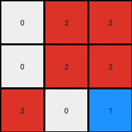
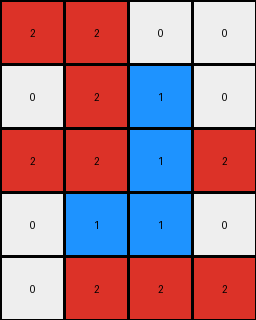

# aedd82e4 • 009 • refine_dreamer

---


Previous Code:
```python
"""
Identify all red pixels within the input grid.
Identify all white pixels.
Identify all white pixels that are *diagonally adjacent* to red pixels, traveling down and to the left *from* the red pixels.
Change the color of the selected white pixels from white (0) to blue (1).
Preserve the color and position of all other pixels (red and the remaining white).
"""

import numpy as np

def get_red_pixels(grid):
    # Find coordinates of all red pixels (value 2).
    red_pixels = []
    for row_idx, row in enumerate(grid):
        for col_idx, pixel in enumerate(row):
            if pixel == 2:
                red_pixels.append((row_idx, col_idx))
    return red_pixels

def get_white_pixels(grid):
    # Find coordinates of all white pixels
    white_pixels = []
    for row_idx, row in enumerate(grid):
        for col_idx, pixel in enumerate(row):
            if pixel == 0:
                white_pixels.append((row_idx, col_idx))
    return white_pixels

def get_diagonally_adjacent_down_left(grid, red_pixels):
    # Find white pixels diagonally adjacent (down-left) to red pixels.

    adjacent_pixels = []
    rows = len(grid)
    cols = len(grid[0])

    for r_row, r_col in red_pixels:
      target_row = r_row + 1
      target_col = r_col + 1

      if 0 <= target_row < rows and 0 <= target_col < cols:
          adjacent_pixels.append((target_row, target_col))
    return adjacent_pixels

def transform(input_grid):
    # initialize output_grid
    output_grid = np.copy(input_grid)
    
    # Find red pixels.
    red_pixels = get_red_pixels(input_grid)

    # find white pixels
    white_pixels = get_white_pixels(input_grid)
    
    # Find diagonally adjacent pixels
    down_left_adjacent = get_diagonally_adjacent_down_left(input_grid, red_pixels)

    # change output pixels
    for row, col in down_left_adjacent:
        if output_grid[row, col] == 0:
           output_grid[row, col] = 1

    return output_grid
```

Train Set Results:

## Example 1:

Input:
```
0 2 2
0 2 2
2 0 0
```
Expected Output:
```
0 2 2
0 2 2
1 0 0
```
Transformed Output:
```
0 2 2
0 2 2
2 0 1
```

match: False
pixels_off: 2
size_correct: True
color_palette_correct: True
correct_pixel_counts: False

## Example 2:

Input:
```
2 2 2 0
0 2 0 0
0 0 0 2
0 2 0 0
```
Expected Output:
```
2 2 2 0
0 2 0 0
0 0 0 1
0 1 0 0
```
Transformed Output:
```
2 2 2 0
0 2 1 1
0 0 1 2
0 2 0 0
```

match: False
pixels_off: 5
size_correct: True
color_palette_correct: True
correct_pixel_counts: False

## Example 3:

Input:
```
2 2 0 0
0 2 0 0
2 2 0 2
0 0 0 0
0 2 2 2
```
Expected Output:
```
2 2 0 0
0 2 0 0
2 2 0 1
0 0 0 0
0 2 2 2
```
Transformed Output:
```
2 2 0 0
0 2 1 0
2 2 1 2
0 1 1 0
0 2 2 2
```

match: False
pixels_off: 5
size_correct: True
color_palette_correct: True
correct_pixel_counts: False

## Example 4:

Input:
```
2 2 0
2 0 2
0 2 0
```
Expected Output:
```
2 2 0
2 0 1
0 1 0
```
Transformed Output:
```
2 2 0
2 1 2
0 2 0
```

match: False
pixels_off: 3
size_correct: True
color_palette_correct: True
correct_pixel_counts: False

**INSTRUCTIONS**

The code above was generated based on observations from the first training
example

we have tested the transform function on each of the task example inputs and
compared with the expected output

review each of the examples provided and the results and consider how the
natural language program should be updated to accommodate this new knowledge

respond with the following deliverables:

- general assessment of the information provided and strategy for resolving the
  errors
- gather metrics about each of the examples and results - use code_execution to
  develop accurate reports on your assumptions
- a YAML block documenting facts - Focus on identifying objects, their properties, and the actions performed on them.
- a natural language program - Be as clear and concise as possible, providing a complete description of the transformation rule.


your responses should be considered as information in a report - not a
conversation
