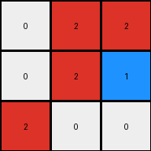
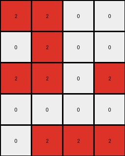
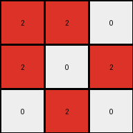

# aedd82e4 • 015 • refine_dreamer

---

Previous Code:
```python
"""
Detects all instances of four adjacent red cells in a square, then transforms the red pixel at the lower-right of the square to blue.
"""

import numpy as np

def find_2x2_squares(grid, color):
    """Finds all 2x2 squares of the specified color."""
    rows, cols = grid.shape
    squares = []
    for i in range(rows - 1):
        for j in range(cols - 1):
            if (grid[i, j] == color and
                grid[i + 1, j] == color and
                grid[i, j + 1] == color and
                grid[i + 1, j + 1] == color):
                squares.append((i, j))
    return squares

def transform(input_grid):
    """
    Transforms the input grid by changing the color of the lower-right pixel
    of each 2x2 red square from red to blue.
    """
    output_grid = np.copy(input_grid)
    red_squares = find_2x2_squares(output_grid, 2)

    # Change the color of the lower-right pixel of each identified square
    for i, j in red_squares:
        output_grid[i + 1, j + 1] = 1

    return output_grid
```

Train Set Results:

## Example 1:

Input:
```
0 2 2
0 2 2
2 0 0
```
Expected Output:
```
0 2 2
0 2 2
1 0 0
```
Transformed Output:
```
0 2 2
0 2 1
2 0 0
```

match: False
pixels_off: 2
size_correct: True
color_palette_correct: True
correct_pixel_counts: True

## Example 2:

Input:
```
2 2 2 0
0 2 0 0
0 0 0 2
0 2 0 0
```
Expected Output:
```
2 2 2 0
0 2 0 0
0 0 0 1
0 1 0 0
```
Transformed Output:
```
2 2 2 0
0 2 0 0
0 0 0 2
0 2 0 0
```

match: False
pixels_off: 2
size_correct: True
color_palette_correct: True
correct_pixel_counts: False

## Example 3:

Input:
```
2 2 0 0
0 2 0 0
2 2 0 2
0 0 0 0
0 2 2 2
```
Expected Output:
```
2 2 0 0
0 2 0 0
2 2 0 1
0 0 0 0
0 2 2 2
```
Transformed Output:
```
2 2 0 0
0 2 0 0
2 2 0 2
0 0 0 0
0 2 2 2
```

match: False
pixels_off: 1
size_correct: True
color_palette_correct: True
correct_pixel_counts: False

## Example 4:

Input:
```
2 2 0
2 0 2
0 2 0
```
Expected Output:
```
2 2 0
2 0 1
0 1 0
```
Transformed Output:
```
2 2 0
2 0 2
0 2 0
```

match: False
pixels_off: 2
size_correct: True
color_palette_correct: True
correct_pixel_counts: False
**INSTRUCTIONS**

The code above was generated based on observations from the first training
example

we have tested the transform function on each of the task example inputs and
compared with the expected output

review each of the examples provided and the results and consider how the
natural language program should be updated to accommodate this new knowledge

respond with the following deliverables:

- general assessment of the information provided and strategy for resolving the
  errors
- gather metrics about each of the examples and results - use code_execution to
  develop accurate reports on your assumptions
- a YAML block documenting facts - Focus on identifying objects, their properties, and the actions performed on them.
- a natural language program - Be as clear and concise as possible, providing a complete description of the transformation rule.


your responses should be considered as information in a report - not a
conversation
