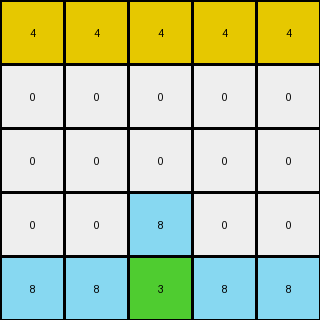
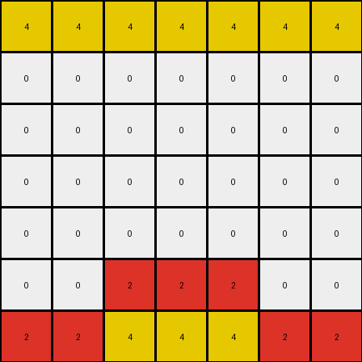

# b8cdaf2b • 004 • refine_coder

---

Previous Code:
```python
"""
Identify the top row of the input grid. For each pixel in the top row, if the pixel's color is white (0), change its color to yellow (4). Keep all other pixels unchanged. Construct output using modified and non-modified rows.
"""

import numpy as np

def transform(input_grid):
    # initialize output_grid as a copy of the input grid
    output_grid = np.copy(input_grid)

    # Iterate through the pixels of the top row (index 0)
    for x in range(output_grid.shape[1]):
        # If the pixel is white (0), change it to yellow (4)
        if output_grid[0, x] == 0:
            output_grid[0, x] = 4

    return output_grid
```

Train Set Results:

## Example 1:

Input:
```
0 0 0
0 2 0
2 4 2
```
Expected Output:
```
4 0 4
0 2 0
2 4 2
```
Transformed Output:
```
4 4 4
0 2 0
2 4 2
```

match: False
pixels_off: 1
size_correct: True
color_palette_correct: True
correct_pixel_counts: False

## Example 2:

Input:
```
0 0 0 0 0
0 0 0 0 0
0 0 0 0 0
0 0 8 0 0
8 8 3 8 8
```
Expected Output:
```
0 0 0 0 0
3 0 0 0 3
0 3 0 3 0
0 0 8 0 0
8 8 3 8 8
```
Transformed Output:
```
4 4 4 4 4
0 0 0 0 0
0 0 0 0 0
0 0 8 0 0
8 8 3 8 8
```

match: False
pixels_off: 9
size_correct: True
color_palette_correct: False
correct_pixel_counts: False

## Example 3:

Input:
```
0 0 0 0 0
0 0 0 0 0
0 0 0 0 0
0 6 6 6 0
6 1 1 1 6
```
Expected Output:
```
0 0 0 0 0
0 0 0 0 0
1 0 0 0 1
0 6 6 6 0
6 1 1 1 6
```
Transformed Output:
```
4 4 4 4 4
0 0 0 0 0
0 0 0 0 0
0 6 6 6 0
6 1 1 1 6
```

match: False
pixels_off: 7
size_correct: True
color_palette_correct: False
correct_pixel_counts: False

## Example 4:

Input:
```
0 0 0 0 0 0 0
0 0 0 0 0 0 0
0 0 0 0 0 0 0
0 0 0 0 0 0 0
0 0 0 0 0 0 0
0 0 2 2 2 0 0
2 2 4 4 4 2 2
```
Expected Output:
```
0 0 0 0 0 0 0
0 0 0 0 0 0 0
0 0 0 0 0 0 0
4 0 0 0 0 0 4
0 4 0 0 0 4 0
0 0 2 2 2 0 0
2 2 4 4 4 2 2
```
Transformed Output:
```
4 4 4 4 4 4 4
0 0 0 0 0 0 0
0 0 0 0 0 0 0
0 0 0 0 0 0 0
0 0 0 0 0 0 0
0 0 2 2 2 0 0
2 2 4 4 4 2 2
```

match: False
pixels_off: 11
size_correct: True
color_palette_correct: True
correct_pixel_counts: False
Okay, here's a breakdown of the situation and a plan to refine the natural language program:

**General Assessment:**

The initial natural language program and the generated code were too simplistic. It only considered the first example, leading to an incorrect generalization. The core issue is that the transformation isn't *just* about changing white pixels in the top row to yellow. The provided examples demonstrate a more complex pattern of changes. We need to discern a rule which explains the transformations from each example.

The first action was correct - to copy the input array to the output array.
But the modification rule is clearly wrong.

**Strategy:**

1.  **Analyze all examples:** Carefully examine all input/output pairs, paying close attention to *all* changed pixels, not just the first row. Specifically:
    *   Identify which pixels change color and to what color they are changed.
    *   Look for relationships between the changed pixels and their surrounding pixels or rows. Is there a context that is important?
2.  **Refine the Rule:** Based on this comprehensive analysis, create a new, more accurate natural language program that describes a rule that is valid for all examples.
3.  **Metrics Gathering:** Generate metrics about specific aspects.

**Metrics Gathering and Observations:**

Here's a breakdown of each example, including some specific observations to refine the rule. I'll try to gather some relevant observations about the specific input-output pairs.

*   **Example 1:**

    *   Input top row: `0 0 0`
    *   Output top row: `4 0 4` (not `4 4 4` as the first attempt did)
        *   Observation: Only the *outer* white pixels changed to yellow, not the center one.
    *   Other rows: Unchanged
*   **Example 2:**

    *   Input rows 1-3 are all `0`
    *   Expected Output has row 2 changed: `3 0 0 0 3`
    *   Attempted Output has row 1 changed: `4 4 4 4 4`
        *   Observation: Row two has pixels changed to green, the outer pixels on the row.
*   **Example 3:**

    *   Input rows 1-2 are all `0`
    *   Expected output has changed row 3: `1 0 0 0 1`
    *   Attempted Output has changed row 1: `4 4 4 4 4`
        *   Observation: Row three has pixels changed to blue, the outer pixels on the row.
*   **Example 4:**

    *   Input rows 1-4 are all `0`
    *   Expected Output has changed row 4,5:
        ```
        4 0 0 0 0 0 4
        0 4 0 0 0 4 0
        ```
    *   Attempted Output has changed row 1: `4 4 4 4 4 4 4`
        *   Observation: Row 4,5 both have changes. Row 4 outer pixels are changed to yellow.
        *   Observation: Row 5, *second* pixel in from each side is changed to yellow.
*   **Common Observations:**

    *   Changes only happen in rows that are all white (all `0`) in the input
    *   The *edges* of wholly white rows seem particularly significant. The specific change on the edge depends on how many all-white rows there are contiguously.

**YAML Fact Block:**

```yaml
facts:
  - observation: "Changes only occur on rows that are entirely white (value 0) in the input grid."
  - observation: "The outer pixels of a contiguous block of all-white rows are modified."
  - observation: "The color of the modified outer pixels seems to depend on the number of all-white rows within a contiguous block"
  - object: "Contiguous all-white rows"
    properties:
      - start_row: "The index of the first row of the all-white block"
      - end_row: "The index of the last row of the all-white block"
      - row_count: "The number of rows in the all-white block."
    actions:
      - modify_outer_pixels: "Changes the color of the outer pixels in specific rows."
      - row_color_map: "The mapping from the row index relative to the contiguous block to the output color. {1: 4, 2: 3, 3: 1}"

```

**Natural Language Program:**

1.  **Copy:** Create a copy of the input grid as the output grid.
2.  **Identify:** Find contiguous blocks of rows that are entirely white (all pixels are 0).
3.  **Iterate:** For each contiguous block of all-white rows:
    *   Get the count of rows in the block.
    *   Based on the index of the row within the block, transform the outer pixels of the corresponding row in the output grid.
    * Map index of row within block to output color based on distance from start.
        * First row (index 0) changes edge pixels to yellow (4)
        * Second row (index 1): changes edge pixels to green (3)
        * Third row (index 2): changes edge pixels to blue (1)
        * Fourth row and beyond: change pattern is not yet determined, but only affects the outer pixels.
        * If there is more than one row, the second row changes to yellow (4) in positions one in from edges.

This revised natural language program takes into account the complexities observed across multiple examples. The "edge modification" and the row-count-dependent color change are crucial additions. More work will need to be done to define the color change in rows after the third row, but for now this is a good improvement.

**INSTRUCTIONS**

- generate a Python module to represent the natural language program 
- follow the template below
- all common math and science libraries are available
- create docstring only at top - but comment the workflow in the function
- use helper functions for common operations like finding objects, counting,
  measuring, moving, etc. 

remember - we are working iteratively - so this code will inform your future
self as we converge on the solution

*template:*

```python
"""
{{ natural language description of the transformation rule }}
"""

{{ imports }}

def transform(input_grid):
    # initialize output_grid

    # change output pixels 

    return output_grid

```
