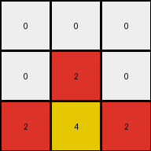
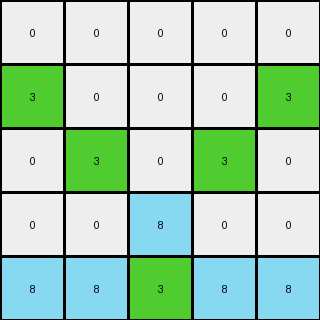

# b8cdaf2b • 009 • refine_dreamer

---

Previous Code:
```python
"""
1.  **Preserve the Bottom Row**: Copy the entire bottom row of the input grid directly to the output grid.
2.  **Preserve other colors**: Copy all non-zero color values, except the green '3', to the output grid in the same locations
3.  **Green Expansion:**.
    - Find the green (3) pixel in the bottom row
    - Create additional green pixels up and to either side in a cross shape, from row 1 to row 2
"""

import numpy as np

def find_object(grid, color):
    positions = []
    for row_idx, row in enumerate(grid):
        for col_idx, cell in enumerate(row):
            if cell == color:
                positions.append([row_idx, col_idx])
    return positions

def transform(input_grid):
    # initialize output_grid
    output_grid = np.copy(input_grid)

    #get height for bounds checking
    height = len(input_grid)

    # copy non green colors
    for row in range(height):
      for col in range(len(input_grid[0])):
        if input_grid[row][col] != 3:
          output_grid[row][col] = input_grid[row][col]

    # find the green objects
    green_objects = find_object(input_grid, 3)

    # green cross expansion.
    for green in green_objects:

        row, col = green

        #check it is on the last row
        if row != height-1: continue

        #expand to cross on rows 1 and 2 (index 0 and 1)
        output_grid[1,0] = 3
        output_grid[1,4] = 3
        output_grid[2,1] = 3
        output_grid[2,3] = 3

    return output_grid
```

Train Set Results:

## Example 1:

Input:
```
0 0 0
0 2 0
2 4 2
```
Expected Output:
```
4 0 4
0 2 0
2 4 2
```
Transformed Output:
```
0 0 0
0 2 0
2 4 2
```

match: False
pixels_off: 2
size_correct: True
color_palette_correct: True
correct_pixel_counts: False

## Example 2:

Input:
```
0 0 0 0 0
0 0 0 0 0
0 0 0 0 0
0 0 8 0 0
8 8 3 8 8
```
Expected Output:
```
0 0 0 0 0
3 0 0 0 3
0 3 0 3 0
0 0 8 0 0
8 8 3 8 8
```
Transformed Output:
```
0 0 0 0 0
3 0 0 0 3
0 3 0 3 0
0 0 8 0 0
8 8 3 8 8
```

match: True
pixels_off: 0
size_correct: True
color_palette_correct: True
correct_pixel_counts: True

## Example 3:

Input:
```
0 0 0 0 0
0 0 0 0 0
0 0 0 0 0
0 6 6 6 0
6 1 1 1 6
```
Expected Output:
```
0 0 0 0 0
0 0 0 0 0
1 0 0 0 1
0 6 6 6 0
6 1 1 1 6
```
Transformed Output:
```
0 0 0 0 0
0 0 0 0 0
0 0 0 0 0
0 6 6 6 0
6 1 1 1 6
```

match: False
pixels_off: 2
size_correct: True
color_palette_correct: True
correct_pixel_counts: False

## Example 4:

Input:
```
0 0 0 0 0 0 0
0 0 0 0 0 0 0
0 0 0 0 0 0 0
0 0 0 0 0 0 0
0 0 0 0 0 0 0
0 0 2 2 2 0 0
2 2 4 4 4 2 2
```
Expected Output:
```
0 0 0 0 0 0 0
0 0 0 0 0 0 0
0 0 0 0 0 0 0
4 0 0 0 0 0 4
0 4 0 0 0 4 0
0 0 2 2 2 0 0
2 2 4 4 4 2 2
```
Transformed Output:
```
0 0 0 0 0 0 0
0 0 0 0 0 0 0
0 0 0 0 0 0 0
0 0 0 0 0 0 0
0 0 0 0 0 0 0
0 0 2 2 2 0 0
2 2 4 4 4 2 2
```

match: False
pixels_off: 4
size_correct: True
color_palette_correct: True
correct_pixel_counts: False
**INSTRUCTIONS**

The code above was generated based on observations from the first training
example

we have tested the transform function on each of the task example inputs and
compared with the expected output

review each of the examples provided and the results and consider how the
natural language program should be updated to accommodate this new knowledge

respond with the following deliverables:

- general assessment of the information provided and strategy for resolving the
  errors
- gather metrics about each of the examples and results - use code_execution to
  develop accurate reports on your assumptions
- a YAML block documenting facts - Focus on identifying objects, their properties, and the actions performed on them.
- a natural language program - Be as clear and concise as possible, providing a complete description of the transformation rule.


your responses should be considered as information in a report - not a
conversation
