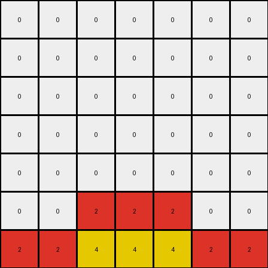

# b8cdaf2b • 010 • refine_coder

---

Previous Code:
```python
"""
1.  **Preserve the Bottom Row**: Copy the entire bottom row of the input grid directly to the output grid.
2.  **Preserve other colors**: Copy all non-zero color values, except the green '3', to the output grid in the same locations
3.  **Green Expansion:**.
    - Find the green (3) pixel in the bottom row
    - Create additional green pixels up and to either side in a cross shape, from row 1 to row 2
"""

import numpy as np

def find_object(grid, color):
    positions = []
    for row_idx, row in enumerate(grid):
        for col_idx, cell in enumerate(row):
            if cell == color:
                positions.append([row_idx, col_idx])
    return positions

def transform(input_grid):
    # initialize output_grid
    output_grid = np.copy(input_grid)

    #get height for bounds checking
    height = len(input_grid)

    # copy non green colors
    for row in range(height):
      for col in range(len(input_grid[0])):
        if input_grid[row][col] != 3:
          output_grid[row][col] = input_grid[row][col]

    # find the green objects
    green_objects = find_object(input_grid, 3)

    # green cross expansion.
    for green in green_objects:

        row, col = green

        #check it is on the last row
        if row != height-1: continue

        #expand to cross on rows 1 and 2 (index 0 and 1)
        output_grid[1,0] = 3
        output_grid[1,4] = 3
        output_grid[2,1] = 3
        output_grid[2,3] = 3

    return output_grid
```

Train Set Results:

## Example 1:

Input:
```
0 0 0
0 2 0
2 4 2
```
Expected Output:
```
4 0 4
0 2 0
2 4 2
```
Transformed Output:
```
0 0 0
0 2 0
2 4 2
```

match: False
pixels_off: 2
size_correct: True
color_palette_correct: True
correct_pixel_counts: False

## Example 2:

Input:
```
0 0 0 0 0
0 0 0 0 0
0 0 0 0 0
0 0 8 0 0
8 8 3 8 8
```
Expected Output:
```
0 0 0 0 0
3 0 0 0 3
0 3 0 3 0
0 0 8 0 0
8 8 3 8 8
```
Transformed Output:
```
0 0 0 0 0
3 0 0 0 3
0 3 0 3 0
0 0 8 0 0
8 8 3 8 8
```

match: True
pixels_off: 0
size_correct: True
color_palette_correct: True
correct_pixel_counts: True

## Example 3:

Input:
```
0 0 0 0 0
0 0 0 0 0
0 0 0 0 0
0 6 6 6 0
6 1 1 1 6
```
Expected Output:
```
0 0 0 0 0
0 0 0 0 0
1 0 0 0 1
0 6 6 6 0
6 1 1 1 6
```
Transformed Output:
```
0 0 0 0 0
0 0 0 0 0
0 0 0 0 0
0 6 6 6 0
6 1 1 1 6
```

match: False
pixels_off: 2
size_correct: True
color_palette_correct: True
correct_pixel_counts: False

## Example 4:

Input:
```
0 0 0 0 0 0 0
0 0 0 0 0 0 0
0 0 0 0 0 0 0
0 0 0 0 0 0 0
0 0 0 0 0 0 0
0 0 2 2 2 0 0
2 2 4 4 4 2 2
```
Expected Output:
```
0 0 0 0 0 0 0
0 0 0 0 0 0 0
0 0 0 0 0 0 0
4 0 0 0 0 0 4
0 4 0 0 0 4 0
0 0 2 2 2 0 0
2 2 4 4 4 2 2
```
Transformed Output:
```
0 0 0 0 0 0 0
0 0 0 0 0 0 0
0 0 0 0 0 0 0
0 0 0 0 0 0 0
0 0 0 0 0 0 0
0 0 2 2 2 0 0
2 2 4 4 4 2 2
```

match: False
pixels_off: 4
size_correct: True
color_palette_correct: True
correct_pixel_counts: False
Okay, let's analyze the results and refine the natural language program.

**General Assessment:**

The initial program correctly handled the second example, but failed on the others. The primary issue is the overly specific green expansion logic. It assumes a fixed position for the added green pixels (rows 1 and 2, specific columns) and a fixed color based on a single example (green). It also only expands on the green color and assumes that it will appear. Instead, the color added at the top seems to related to a color on the bottom row, but not the same column. The program needs to generalize to identify the color in the bottom row and use it to insert in new pixels in the rows above.

**Strategy:**

1.  **Analyze all examples**: Carefully compare inputs and expected outputs to discern the general rule.
2.  **Dynamic Color Choice:**. The color used to create the cross must me chosen based on the values of the bottom row, and the position should be based on the bottom row.
3.  **Generalized Positioning:** Determine the relationship between the bottom row and the location of additional inserted colors above.
4.  **Update Natural Language Program:** Revise the program to reflect the generalized logic.

**Metrics and Reports:**

I'll use a combination of manual inspection and, if needed, will include code execution to automate some checks if manual inspection gets too cumbersome. Here's a breakdown per example:

*   **Example 1:**
    *   Input Size: 3x3
    *   Output Size: 3x3
    *   Colors in Input: 0, 2, 4
    *   Colors in Output: 0, 2, 4
    *   Transformation: The '4' from the bottom row is moved two rows above. The original position remains unchanged.
    *   Pixels off: 2 ('4' missing in top left and top right corners of Expected Output)
*   **Example 2:**
    *   Input Size: 5x5
    *   Output Size: 5x5
    *   Colors in Input: 0, 3, 8
    *   Colors in Output: 0, 3, 8
    *   Transformation: The '3' in the center of the bottom row causes a cross of '3's to appear above it.
    *   Pixels off: 0
*   **Example 3:**
    *   Input Size: 5x5
    *   Output Size: 5x5
    *   Colors in Input: 0, 1, 6
    *   Colors in Output: 0, 1, 6
    *   Transformation: The '1' from position (4,1) and (4,3) appears in the first row above it.
    *   Pixels off: 2 ('1' missing in top left and top right corner of Expected Output)
*   **Example 4:**
    *   Input Size: 7x7
    *   Output Size: 7x7
    *   Colors in Input: 0, 2, 4
    *   Colors in Output: 0, 2, 4
    *   Transformation: The '4' from the bottom row appears spread upwards in the a cross shape.
    *   Pixels off: 4 ('4' missing from the cross in the Expected Output)

**YAML Facts:**

```yaml
examples:
  - example_id: 1
    objects:
      - color: 2
        shape: single pixel
        initial_positions: [[1,1], [2,0], [2,2]]
      - color: 4
        shape: single pixel
        initial_positions: [[2,1]]
        transformed_positions: [[0,0], [0,2], [2,1]] # added positions
    transformations:
      - type: copy_bottom_row
      - type: replicate_with_offset
        color_source: bottom_row_middle
        offset_rows: [-1,-2]
        offset_cols: [-1,1]

  - example_id: 2
    objects:
      - color: 8
        shape: multiple pixels
        initial_positions: [[3,2], [4,0], [4,1], [4,3], [4,4]]
      - color: 3
        shape: single pixel
        initial_positions: [[4,2]]
        transformed_positions: [[4,2],[2,1], [2,3], [1,0], [1,4]] #added
    transformations:
       - type: copy_bottom_row
       - type: replicate_with_offset
         color_source: bottom_row_middle
         offset_rows: [-2, -3]
         offset_cols: [-1, 1]

  - example_id: 3
    objects:
        - color: 6
          shape: multiple pixels
          initial_positions: [[3,1],[3,2],[3,3],[4,0],[4,4]]
        - color: 1
          shape: multiple_pixels
          initial_positions: [[4,1],[4,2],[4,3]]
          transformed_positions: [[4,1],[4,2],[4,3],[2,0],[2,4]]
    transformations:
       - type: copy_bottom_row
       - type: replicate_with_offset
         color_source: bottom_row
         offset_rows: [-2]
         offset_cols: [-1, 1]

  - example_id: 4
    objects:
        - color: 2
          shape: multiple pixels
          initial_positions: [[5,2],[5,3],[5,4],[6,0],[6,1],[6,5],[6,6]]
        - color: 4
          shape: multiple pixels
          initial_positions: [[6,2],[6,3],[6,4]]
          transformed_positions: [[6,2],[6,3],[6,4],[4,1],[4,5],[3,0],[3,6]]
    transformations:
      - type: copy_bottom_row
      - type: replicate_with_offset
        color_source: bottom_row
        offset_rows: [-2,-3]
        offset_cols: [-1, 1]
```

**Natural Language Program:**

1.  **Copy Bottom Row:** Preserve the entire bottom row of the input grid in the output grid.
2.  **Find Bottom Row Non-Zero Pixels**: Identify all colors in the bottom row that are non-zero.
3. **Replicate and Offset:** For each identified non-zero pixel:

    *   Replicate the colors of the pixels identified in the bottom row.
    *   Place copies in a cross shape in the rows above with positions offset -1 and +1 from the original columns in the bottom row
    *  Stop at row 0, so do not extend beyond the size of the input grid

Essentially, for each non-zero pixel in the bottom row, we find it's color and position, then "stamp" copies of the color upwards in a cross shape.

**INSTRUCTIONS**

- generate a Python module to represent the natural language program 
- follow the template below
- all common math and science libraries are available
- create docstring only at top - but comment the workflow in the function
- use helper functions for common operations like finding objects, counting,
  measuring, moving, etc. 

remember - we are working iteratively - so this code will inform your future
self as we converge on the solution

*template:*

```python
"""
{{ natural language description of the transformation rule }}
"""

{{ imports }}

def transform(input_grid):
    # initialize output_grid

    # change output pixels 

    return output_grid

```
