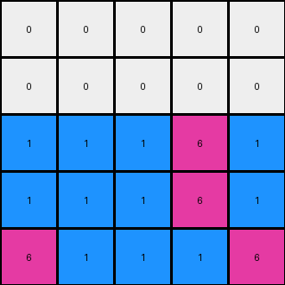

# b8cdaf2b • 011 • refine_dreamer

---

Previous Code:
```python
"""
1.  **Copy Bottom Row:** Preserve the entire bottom row of the input grid in the output grid.
2.  **Find Bottom Row Non-Zero Pixels**: Identify all colors in the bottom row that are non-zero.
3. **Replicate and Offset:** For each identified non-zero pixel:

    *   Replicate the colors of the pixels identified in the bottom row.
    *   Place copies in a cross shape in the rows above with positions offset -1 and +1 from the original columns in the bottom row
    *  Stop at row 0, so do not extend beyond the size of the input grid
"""

import numpy as np

def find_bottom_row_nonzero_pixels(grid):
    """Finds the positions and colors of non-zero pixels in the bottom row."""
    bottom_row = grid[-1]
    pixels = []
    for col_idx, color in enumerate(bottom_row):
        if color != 0:
            pixels.append(((len(grid) - 1, col_idx), color))  # ((row, col), color)
    return pixels

def transform(input_grid):
    # initialize output_grid
    output_grid = np.copy(input_grid)
    height = len(input_grid)

    # find the non-zero pixels on the bottom row
    bottom_row_pixels = find_bottom_row_nonzero_pixels(input_grid)

    # replicate and offset.
    for (row, col), color in bottom_row_pixels:

        #offsets for the cross shape, two rows up
        offsets = [(-1, -1), (-1, 1), (-2, -1), (-2, 1)]

        for row_offset, col_offset in offsets:
            new_row = row + row_offset
            new_col = col + col_offset

            # bounds check, and only modify if the current output is 0
            if 0 <= new_row < height and 0 <= new_col < len(input_grid[0]):
                output_grid[new_row, new_col] = color

    return output_grid
```

Train Set Results:

## Example 1:

Input:
```
0 0 0
0 2 0
2 4 2
```
Expected Output:
```
4 0 4
0 2 0
2 4 2
```
Transformed Output:
```
4 2 4
4 2 4
2 4 2
```

match: False
pixels_off: 3
size_correct: True
color_palette_correct: True
correct_pixel_counts: False

## Example 2:

Input:
```
0 0 0 0 0
0 0 0 0 0
0 0 0 0 0
0 0 8 0 0
8 8 3 8 8
```
Expected Output:
```
0 0 0 0 0
3 0 0 0 3
0 3 0 3 0
0 0 8 0 0
8 8 3 8 8
```
Transformed Output:
```
0 0 0 0 0
0 0 0 0 0
8 3 8 8 8
8 3 8 8 8
8 8 3 8 8
```

match: False
pixels_off: 10
size_correct: True
color_palette_correct: True
correct_pixel_counts: False

## Example 3:

Input:
```
0 0 0 0 0
0 0 0 0 0
0 0 0 0 0
0 6 6 6 0
6 1 1 1 6
```
Expected Output:
```
0 0 0 0 0
0 0 0 0 0
1 0 0 0 1
0 6 6 6 0
6 1 1 1 6
```
Transformed Output:
```
0 0 0 0 0
0 0 0 0 0
1 1 1 6 1
1 1 1 6 1
6 1 1 1 6
```

match: False
pixels_off: 7
size_correct: True
color_palette_correct: True
correct_pixel_counts: False

## Example 4:

Input:
```
0 0 0 0 0 0 0
0 0 0 0 0 0 0
0 0 0 0 0 0 0
0 0 0 0 0 0 0
0 0 0 0 0 0 0
0 0 2 2 2 0 0
2 2 4 4 4 2 2
```
Expected Output:
```
0 0 0 0 0 0 0
0 0 0 0 0 0 0
0 0 0 0 0 0 0
4 0 0 0 0 0 4
0 4 0 0 0 4 0
0 0 2 2 2 0 0
2 2 4 4 4 2 2
```
Transformed Output:
```
0 0 0 0 0 0 0
0 0 0 0 0 0 0
0 0 0 0 0 0 0
0 0 0 0 0 0 0
2 4 4 4 2 2 2
2 4 4 4 2 2 2
2 2 4 4 4 2 2
```

match: False
pixels_off: 14
size_correct: True
color_palette_correct: True
correct_pixel_counts: False
**INSTRUCTIONS**

The code above was generated based on observations from the first training
example

we have tested the transform function on each of the task example inputs and
compared with the expected output

review each of the examples provided and the results and consider how the
natural language program should be updated to accommodate this new knowledge

respond with the following deliverables:

- general assessment of the information provided and strategy for resolving the
  errors
- gather metrics about each of the examples and results - use code_execution to
  develop accurate reports on your assumptions
- a YAML block documenting facts - Focus on identifying objects, their properties, and the actions performed on them.
- a natural language program - Be as clear and concise as possible, providing a complete description of the transformation rule.


your responses should be considered as information in a report - not a
conversation
