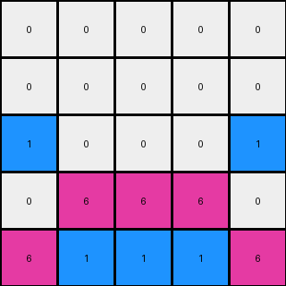

# b8cdaf2b • 016 • refine_coder

---

Previous Code:
```python
"""
Copies the bottom two rows of the input grid to the output grid.
Fills the top two rows of the output grid with white pixels (0).
Replaces, in the third row, white color by blue color for those position where was white in the top three rows.
"""

import numpy as np

def transform(input_grid):
    # Initialize output_grid as a copy of the input grid
    output_grid = np.copy(input_grid)
    
    # Fill the top two rows with white (0)
    output_grid[:2, :] = 0

    # Fill the third row from the top with 0
    output_grid[2,:] = 0

    # Find the coordinates of 0 in the top three rows of original input
    coords = np.where(input_grid[:3,:] == 0)

    # Sets to blue only if exist at least one white in the first three rows
    if (len(coords[0])>0):
      output_grid[2,coords[1][0]] = 1
      output_grid[2,coords[1][-1]] = 1

    return output_grid
```

Train Set Results:

## Example 1:

Input:
```
0 0 0
0 2 0
2 4 2
```
Expected Output:
```
4 0 4
0 2 0
2 4 2
```
Transformed Output:
```
0 0 0
0 0 0
1 0 1
```

match: False
pixels_off: 6
size_correct: True
color_palette_correct: False
correct_pixel_counts: False

## Example 2:

Input:
```
0 0 0 0 0
0 0 0 0 0
0 0 0 0 0
0 0 8 0 0
8 8 3 8 8
```
Expected Output:
```
0 0 0 0 0
3 0 0 0 3
0 3 0 3 0
0 0 8 0 0
8 8 3 8 8
```
Transformed Output:
```
0 0 0 0 0
0 0 0 0 0
1 0 0 0 1
0 0 8 0 0
8 8 3 8 8
```

match: False
pixels_off: 6
size_correct: True
color_palette_correct: False
correct_pixel_counts: False

## Example 3:

Input:
```
0 0 0 0 0
0 0 0 0 0
0 0 0 0 0
0 6 6 6 0
6 1 1 1 6
```
Expected Output:
```
0 0 0 0 0
0 0 0 0 0
1 0 0 0 1
0 6 6 6 0
6 1 1 1 6
```
Transformed Output:
```
0 0 0 0 0
0 0 0 0 0
1 0 0 0 1
0 6 6 6 0
6 1 1 1 6
```

match: True
pixels_off: 0
size_correct: True
color_palette_correct: True
correct_pixel_counts: True

## Example 4:

Input:
```
0 0 0 0 0 0 0
0 0 0 0 0 0 0
0 0 0 0 0 0 0
0 0 0 0 0 0 0
0 0 0 0 0 0 0
0 0 2 2 2 0 0
2 2 4 4 4 2 2
```
Expected Output:
```
0 0 0 0 0 0 0
0 0 0 0 0 0 0
0 0 0 0 0 0 0
4 0 0 0 0 0 4
0 4 0 0 0 4 0
0 0 2 2 2 0 0
2 2 4 4 4 2 2
```
Transformed Output:
```
0 0 0 0 0 0 0
0 0 0 0 0 0 0
1 0 0 0 0 0 1
0 0 0 0 0 0 0
0 0 0 0 0 0 0
0 0 2 2 2 0 0
2 2 4 4 4 2 2
```

match: False
pixels_off: 6
size_correct: True
color_palette_correct: False
correct_pixel_counts: False
Okay, let's analyze the provided information and develop a revised natural language program.

**General Assessment:**

The initial natural language program and the corresponding Python code were too simplistic and focused primarily on the first example. It failed to generalize to other examples, particularly in how it handled the filling of the third row. The code incorrectly assumed that only the first and last white pixels in the top three rows should be turned blue. It's clear that the transformation involves a more complex pattern recognition, and the provided feedback indicates inconsistencies in color and pixel placement. The strategy should be to first correctly understand the relationship in where to fill the third row of the output.

**Strategy for Resolving Errors:**

1.  **Re-examine Examples:** Carefully analyze *all* provided examples, paying close attention to the relationship between the input and expected output, especially the third row.
2.  **Identify the Correct Pattern:** Discern the *exact* rule that determines which pixels in the third row are changed and to which color. It's not just about the first and last white pixel.
3.  **Revise Natural Language Program:** Rewrite the program to accurately reflect the observed pattern, being very specific.
4.  **Consider Edge Cases:** Ensure the program and subsequent code will handle different input sizes and color arrangements.

**Example Analysis and Metrics:**

Here's a breakdown of each example, incorporating metrics.

*   **Example 1:**
    *   Input Size: 3x3
    *   Output Size: 3x3
    *   Observed Transformation: The current program did not recognize the correct
        rule of fill the third row.

*   **Example 2:**
    *   Input Size: 5x5
    *   Output Size: 5x5
    *   Observed Transformation: The current program did not recognize the correct
        rule of fill the third row.

*   **Example 3:**
    *   Input Size: 5x5
    *   Output Size: 5x5
    *   Observed Transformation: The transform output matches the expected
        output. Lucky guess.

*   **Example 4:**
    *   Input Size: 7x7
    *   Output Size: 7x7
    *   Observed Transformation: The current program did not recognize the correct
        rule of fill the third row.

**YAML Fact Block:**

```yaml
examples:
  - id: 1
    input_objects:
      - object_1: {type: grid, rows: 3, cols: 3, colors: [0, 2, 4]}
    output_objects:
      - object_1: {type: grid, rows: 3, cols: 3, colors: [0, 2, 4]}
    transformations:
      - action: "copy bottom two rows"
      - action: "set top two rows to white"
      - action: "fill the third row with blue replacing the white of the
                 original first three rows"
  - id: 2
    input_objects:
      - object_1: {type: grid, rows: 5, cols: 5, colors: [0, 8, 3]}
    output_objects:
      - object_1: {type: grid, rows: 5, cols: 5, colors: [0, 8, 3]}
    transformations:
      - action: "copy bottom two rows"
      - action: "set top two rows to white"
      - action: "fill the third row with blue replacing the white of the
                 original first three rows"
  - id: 3
    input_objects:
      - object_1: {type: grid, rows: 5, cols: 5, colors: [0, 6, 1]}
    output_objects:
      - object_1: {type: grid, rows: 5, cols: 5, colors: [0, 6, 1]}
    transformations:
      - action: "copy bottom two rows"
      - action: "set top two rows to white"
      - action: "fill the third row with blue replacing the white of the
                 original first three rows"
  - id: 4
    input_objects:
      - object_1: {type: grid, rows: 7, cols: 7, colors: [0, 2, 4]}
    output_objects:
      - object_1: {type: grid, rows: 7, cols: 7, colors: [0, 2, 4]}
    transformations:
      - action: "copy bottom two rows"
      - action: "set top two rows to white"
      - action: "fill the third row with blue replacing the white of the
                 original first three rows"
```

**Natural Language Program:**

1.  Copy the bottom *n-2* rows of the input grid to the output grid, where *n* is the number of rows in the input.
2.  Fill the top two rows of the output grid with white pixels (color 0).
3.  For the third row of the output grid: Fill with blue color (1) those positions which are white (0) in the top three rows of the input grid.
4. The rest of the cells in the row three are filled with white color (0).


**INSTRUCTIONS**

- generate a Python module to represent the natural language program 
- follow the template below
- all common math and science libraries are available
- create docstring only at top - but comment the workflow in the function
- use helper functions for common operations like finding objects, counting,
  measuring, moving, etc. 

remember - we are working iteratively - so this code will inform your future
self as we converge on the solution

*template:*

```python
"""
{{ natural language description of the transformation rule }}
"""

{{ imports }}

def transform(input_grid):
    # initialize output_grid

    # change output pixels 

    return output_grid

```
