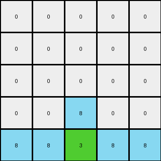

# b8cdaf2b • 023 • refine_dreamer

---

Previous Code:
```python
"""
The transformation adds mirrored shapes (single pixels or "L" shapes) to a region in the input grid. The shapes are added above a boundary line defined by the transition between rows of uniform color and rows of multiple colors at the bottom. The color of the shapes appears to be influenced by the colors in the multi-colored rows.
"""

import numpy as np

def find_boundary_row(grid):
    """Finds the boundary row index."""
    rows, _ = grid.shape
    for i in range(rows - 1, -1, -1):
        if len(np.unique(grid[i])) > 1:
            return i + 1
    return 0

def get_shape_color(grid, boundary_row):
    """Determines the color for the added shapes."""
    row_below = boundary_row -1
    
    if row_below < 0:
        return 0

    rows, cols = grid.shape
    
    left_color = 0
    for j in range(cols):
        if grid[row_below, j] != 0:
            left_color = grid[row_below, j]
            break

    right_color = 0
    for j in range(cols-1, -1, -1):
         if grid[row_below, j] != 0:
            right_color = grid[row_below, j]
            break;
    
    if left_color == right_color:
        return left_color
    
    return left_color

def find_shape_positions(grid, boundary_row):
    """Finds the column indices for shape placement."""
    rows, cols = grid.shape
    left_col = -1
    right_col = -1

    if boundary_row >= rows:  # Handle cases where no boundary is found (all rows are the same color).
        return left_col, right_col

    for j in range(cols):
      if grid[boundary_row-1,j] == 0:
        left_col = j
        break
    
    for j in range(cols-1, -1, -1):
      if grid[boundary_row-1,j] == 0:
        right_col = j
        break

    return left_col, right_col

def transform(input_grid):
    """Transforms the input grid by adding mirrored shapes."""
    output_grid = np.copy(input_grid)
    rows, cols = output_grid.shape

    # Find the boundary row
    boundary_row = find_boundary_row(output_grid)

    # Determine shape positions
    left_col, right_col = find_shape_positions(output_grid, boundary_row)
    
    if left_col ==-1 or right_col == -1:
      return output_grid
    
    # Get color
    shape_color = get_shape_color(output_grid, boundary_row)
    
    # Draw the mirrored shapes
    if boundary_row - 1 >= 0 :
        if left_col != -1:
            output_grid[boundary_row - 1, left_col] = shape_color
        if right_col != -1:
            output_grid[boundary_row - 1, right_col] = shape_color

    if boundary_row - 2 >= 0:
        if left_col +1 < cols :
          output_grid[boundary_row - 2, left_col+1] = shape_color
        if right_col -1 >= 0:
          output_grid[boundary_row - 2, right_col-1] = shape_color

    return output_grid
```

Train Set Results:

## Example 1:

Input:
```
0 0 0
0 2 0
2 4 2
```
Expected Output:
```
4 0 4
0 2 0
2 4 2
```
Transformed Output:
```
0 0 0
0 2 0
2 4 2
```

match: False
pixels_off: 2
size_correct: True
color_palette_correct: True
correct_pixel_counts: False

## Example 2:

Input:
```
0 0 0 0 0
0 0 0 0 0
0 0 0 0 0
0 0 8 0 0
8 8 3 8 8
```
Expected Output:
```
0 0 0 0 0
3 0 0 0 3
0 3 0 3 0
0 0 8 0 0
8 8 3 8 8
```
Transformed Output:
```
0 0 0 0 0
0 0 0 0 0
0 0 0 0 0
0 0 8 0 0
8 8 3 8 8
```

match: False
pixels_off: 4
size_correct: True
color_palette_correct: True
correct_pixel_counts: False

## Example 3:

Input:
```
0 0 0 0 0
0 0 0 0 0
0 0 0 0 0
0 6 6 6 0
6 1 1 1 6
```
Expected Output:
```
0 0 0 0 0
0 0 0 0 0
1 0 0 0 1
0 6 6 6 0
6 1 1 1 6
```
Transformed Output:
```
0 0 0 0 0
0 0 0 0 0
0 0 0 0 0
0 6 6 6 0
6 1 1 1 6
```

match: False
pixels_off: 2
size_correct: True
color_palette_correct: True
correct_pixel_counts: False

## Example 4:

Input:
```
0 0 0 0 0 0 0
0 0 0 0 0 0 0
0 0 0 0 0 0 0
0 0 0 0 0 0 0
0 0 0 0 0 0 0
0 0 2 2 2 0 0
2 2 4 4 4 2 2
```
Expected Output:
```
0 0 0 0 0 0 0
0 0 0 0 0 0 0
0 0 0 0 0 0 0
4 0 0 0 0 0 4
0 4 0 0 0 4 0
0 0 2 2 2 0 0
2 2 4 4 4 2 2
```
Transformed Output:
```
0 0 0 0 0 0 0
0 0 0 0 0 0 0
0 0 0 0 0 0 0
0 0 0 0 0 0 0
0 0 0 0 0 0 0
0 0 2 2 2 0 0
2 2 4 4 4 2 2
```

match: False
pixels_off: 4
size_correct: True
color_palette_correct: True
correct_pixel_counts: False
**INSTRUCTIONS**

The code above was generated based on observations from the first training
example

we have tested the transform function on each of the task example inputs and
compared with the expected output

review each of the examples provided and the results and consider how the
natural language program should be updated to accommodate this new knowledge

respond with the following deliverables:

- general assessment of the information provided and strategy for resolving the
  errors
- gather metrics about each of the examples and results - use code_execution to
  develop accurate reports on your assumptions
- a YAML block documenting facts - Focus on identifying objects, their properties, and the actions performed on them.
- a natural language program - Be as clear and concise as possible, providing a complete description of the transformation rule.


your responses should be considered as information in a report - not a
conversation
