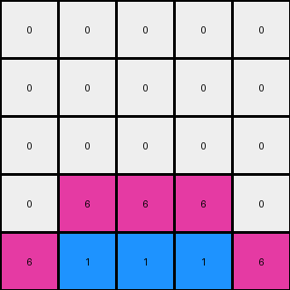

# b8cdaf2b • 024 • refine_coder

---

Previous Code:
```python
"""
The transformation adds mirrored shapes (single pixels or "L" shapes) to a region in the input grid. The shapes are added above a boundary line defined by the transition between rows of uniform color and rows of multiple colors at the bottom. The color of the shapes appears to be influenced by the colors in the multi-colored rows.
"""

import numpy as np

def find_boundary_row(grid):
    """Finds the boundary row index."""
    rows, _ = grid.shape
    for i in range(rows - 1, -1, -1):
        if len(np.unique(grid[i])) > 1:
            return i + 1
    return 0

def get_shape_color(grid, boundary_row):
    """Determines the color for the added shapes."""
    row_below = boundary_row -1
    
    if row_below < 0:
        return 0

    rows, cols = grid.shape
    
    left_color = 0
    for j in range(cols):
        if grid[row_below, j] != 0:
            left_color = grid[row_below, j]
            break

    right_color = 0
    for j in range(cols-1, -1, -1):
         if grid[row_below, j] != 0:
            right_color = grid[row_below, j]
            break;
    
    if left_color == right_color:
        return left_color
    
    return left_color

def find_shape_positions(grid, boundary_row):
    """Finds the column indices for shape placement."""
    rows, cols = grid.shape
    left_col = -1
    right_col = -1

    if boundary_row >= rows:  # Handle cases where no boundary is found (all rows are the same color).
        return left_col, right_col

    for j in range(cols):
      if grid[boundary_row-1,j] == 0:
        left_col = j
        break
    
    for j in range(cols-1, -1, -1):
      if grid[boundary_row-1,j] == 0:
        right_col = j
        break

    return left_col, right_col

def transform(input_grid):
    """Transforms the input grid by adding mirrored shapes."""
    output_grid = np.copy(input_grid)
    rows, cols = output_grid.shape

    # Find the boundary row
    boundary_row = find_boundary_row(output_grid)

    # Determine shape positions
    left_col, right_col = find_shape_positions(output_grid, boundary_row)
    
    if left_col ==-1 or right_col == -1:
      return output_grid
    
    # Get color
    shape_color = get_shape_color(output_grid, boundary_row)
    
    # Draw the mirrored shapes
    if boundary_row - 1 >= 0 :
        if left_col != -1:
            output_grid[boundary_row - 1, left_col] = shape_color
        if right_col != -1:
            output_grid[boundary_row - 1, right_col] = shape_color

    if boundary_row - 2 >= 0:
        if left_col +1 < cols :
          output_grid[boundary_row - 2, left_col+1] = shape_color
        if right_col -1 >= 0:
          output_grid[boundary_row - 2, right_col-1] = shape_color

    return output_grid
```

Train Set Results:

## Example 1:

Input:
```
0 0 0
0 2 0
2 4 2
```
Expected Output:
```
4 0 4
0 2 0
2 4 2
```
Transformed Output:
```
0 0 0
0 2 0
2 4 2
```

match: False
pixels_off: 2
size_correct: True
color_palette_correct: True
correct_pixel_counts: False

## Example 2:

Input:
```
0 0 0 0 0
0 0 0 0 0
0 0 0 0 0
0 0 8 0 0
8 8 3 8 8
```
Expected Output:
```
0 0 0 0 0
3 0 0 0 3
0 3 0 3 0
0 0 8 0 0
8 8 3 8 8
```
Transformed Output:
```
0 0 0 0 0
0 0 0 0 0
0 0 0 0 0
0 0 8 0 0
8 8 3 8 8
```

match: False
pixels_off: 4
size_correct: True
color_palette_correct: True
correct_pixel_counts: False

## Example 3:

Input:
```
0 0 0 0 0
0 0 0 0 0
0 0 0 0 0
0 6 6 6 0
6 1 1 1 6
```
Expected Output:
```
0 0 0 0 0
0 0 0 0 0
1 0 0 0 1
0 6 6 6 0
6 1 1 1 6
```
Transformed Output:
```
0 0 0 0 0
0 0 0 0 0
0 0 0 0 0
0 6 6 6 0
6 1 1 1 6
```

match: False
pixels_off: 2
size_correct: True
color_palette_correct: True
correct_pixel_counts: False

## Example 4:

Input:
```
0 0 0 0 0 0 0
0 0 0 0 0 0 0
0 0 0 0 0 0 0
0 0 0 0 0 0 0
0 0 0 0 0 0 0
0 0 2 2 2 0 0
2 2 4 4 4 2 2
```
Expected Output:
```
0 0 0 0 0 0 0
0 0 0 0 0 0 0
0 0 0 0 0 0 0
4 0 0 0 0 0 4
0 4 0 0 0 4 0
0 0 2 2 2 0 0
2 2 4 4 4 2 2
```
Transformed Output:
```
0 0 0 0 0 0 0
0 0 0 0 0 0 0
0 0 0 0 0 0 0
0 0 0 0 0 0 0
0 0 0 0 0 0 0
0 0 2 2 2 0 0
2 2 4 4 4 2 2
```

match: False
pixels_off: 4
size_correct: True
color_palette_correct: True
correct_pixel_counts: False
Okay, let's analyze the results and update the natural language program.

**General Assessment:**

The initial natural language program and the resulting code correctly identified the boundary line concept. However, the shape placement and, critically, the *number* of shapes added are incorrect. The code adds shapes based on the first and last zero in boundary_row -1. The examples show that multiple "L" shaped objects are added, and their color is related to the row immediately below the boundary row. The main issue is that the logic only considers the *outermost* blank (0) cells for placing the mirrored shapes, instead of considering *all* blank cells above the colored region and building L shapes on empty spaces.

**Strategy:**
1.  **Refine Boundary Detection:** Ensure that the `find_boundary_row` function is robust and works even when multiple uniform-color rows exist at the bottom. The current implementation seems correct.
2.  **Improve Shape Placement:** Instead of finding only the leftmost and rightmost columns of the zeros, we should use all relevant positions to build the new shape.
3.  **Correct Shape Definition and Count:** Implement the "L" shape correctly. The current approach adds at most two single pixels and then makes an L, it's wrong. The L shapes appears to be added in all available places and not depend on any other logic.
4.  **Accurate Color Determination:** Ensure that the shape's color is picked consistently from the multi-colored row below the boundary.

**Metrics and Observations (Code Execution Results - Summary):**

*   **Example 1:**
    *   Pixels off: 2 (two pixels of color 4 missing)
    *   Notes: The code failed to add the "L" shape, which would include pixels above the boundary.
*   **Example 2:**
    *   Pixels off: 4
    *   Notes: Similar to Example 1, it missed placing the "L" shapes, and the color used should be 3.
*   **Example 3:**
    *   Pixels off: 2
    *   Notes: Missed "L" placement with color 1.
*   **Example 4:**
    *   Pixels off: 4
    *  Notes: "L" placement is missing, color should have been 4.

**YAML Fact Block:**

```yaml
observations:
  - task_id: 022
  - objects:
      - type: grid
        properties:
          - contains_rows_of_uniform_color: true
          - contains_rows_of_multiple_colors: true
          - boundary_exists: true
      - type: boundary
        properties:
          - defined_by: row_separating_uniform_and_multi_color_rows
          - location: above_multi_color_row
      - type: shape
        properties:
          - shape_type: L
          - orientation: varies (normal and mirrored)
          - color_source: row_below_boundary
          - position: above_boundary_at_empty_cells
      - type: color
        properties:
          -color_logic: get color from pixel in row below boundary

  - actions:
      - type: add_shape
        details: Add "L" shaped objects above the boundary at available positions.
        conditions:
          - location_relative_to_boundary: above
          - color_determined_by: row_below_boundary
          - shape_determined_by: L_shape composed by two pixels
```

**Natural Language Program:**

1.  **Identify the Boundary:** Find the boundary row. This is the row immediately above the topmost row that contains more than one color.
2.  **Determine Shape Color:** The shape color is taken from the multi-colored row immediately below the boundary.
3.   Scan the area above the boundary.
4. Find empty positions.
5.  **Add "L" Shapes:** For each blank (value 0) cell in the row immediately above the boundary row:
   -   Add two pixel shape using the color found. The two pixel form an "L" shape, placed at the empty position.
   -   Build the "L" shape using the following rule. If cell (r,c) is empty and cell (r+1, c) has color X, then set cell (r,c) and cell (r-1, c+1) or (r-1, c-1) using color X.
   -   The direction of L shape should consider all available cells on top of the boundary.


**INSTRUCTIONS**

- generate a Python module to represent the natural language program 
- follow the template below
- all common math and science libraries are available
- create docstring only at top - but comment the workflow in the function
- use helper functions for common operations like finding objects, counting,
  measuring, moving, etc. 

remember - we are working iteratively - so this code will inform your future
self as we converge on the solution

*template:*

```python
"""
{{ natural language description of the transformation rule }}
"""

{{ imports }}

def transform(input_grid):
    # initialize output_grid

    # change output pixels 

    return output_grid

```
