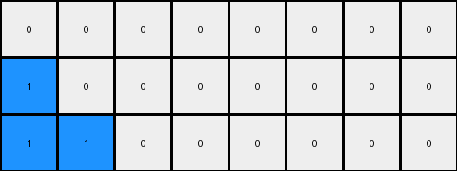
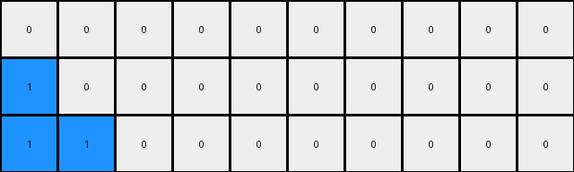
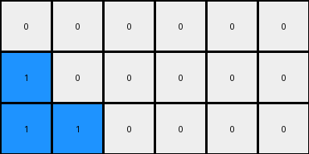

# bbc9ae5d • 003 • refine_dreamer

---


Previous Code:
```python
"""
The input grid contains a horizontal line of blue and white pixels. The blue region expands downwards and to the right to form a rectangle, while the white region remains unchanged. The output grid always has three rows.
"""

import numpy as np

def find_regions(grid):
    # Find contiguous regions of the same color.
    regions = []
    visited = np.zeros_like(grid, dtype=bool)
    rows, cols = grid.shape

    def dfs(row, col, color, current_region):
        if (
            row < 0
            or row >= rows
            or col < 0
            or col >= cols
            or visited[row, col]
            or grid[row, col] != color
        ):
            return
        visited[row, col] = True
        current_region.append((row, col))
        dfs(row + 1, col, color, current_region)
        dfs(row - 1, col, color, current_region)
        dfs(row, col + 1, color, current_region)
        dfs(row, col - 1, color, current_region)

    for row in range(rows):
        for col in range(cols):
            if not visited[row, col]:
                current_region = []
                dfs(row, col, grid[row, col], current_region)
                regions.append((grid[row, col], current_region))
    return regions

def transform(input_grid):
    # Convert input to numpy array
    input_grid = np.array(input_grid)

    # Find regions in the input grid
    regions = find_regions(input_grid)

    # Determine the number of blue and white columns
    blue_cols = 0
    white_cols = 0

    for color, pixels in regions:
      if color == 1:
        blue_cols = len(pixels)
      elif color == 0:
        white_cols = len(pixels)


    # Initialize the output grid (3 rows, same number of columns as input)
    output_grid = np.zeros((3, input_grid.shape[1]), dtype=int)

    # Expand the blue region
    for r in range(3):
      for c in range(blue_cols + r):
        output_grid[r,c] = 1

    # fill white regions
    for r in range(3):
      for c in range(blue_cols + r, input_grid.shape[1]):
        output_grid[r,c] = 0
        
    return output_grid.tolist()
```

Train Set Results:

## Example 1:

Input:
```
1 1 0 0 0 0
```
Expected Output:
```
1 1 0 0 0 0
1 1 1 0 0 0
1 1 1 1 0 0
```
Transformed Output:
```
1 1 0 0 0 0
1 1 1 0 0 0
1 1 1 1 0 0
```

match: True
pixels_off: 0
size_correct: True
color_palette_correct: True
correct_pixel_counts: True

## Example 2:

Input:
```
2 0 0 0 0 0 0 0
```
Expected Output:
```
2 0 0 0 0 0 0 0
2 2 0 0 0 0 0 0
2 2 2 0 0 0 0 0
2 2 2 2 0 0 0 0
```
Transformed Output:
```
0 0 0 0 0 0 0 0
1 0 0 0 0 0 0 0
1 1 0 0 0 0 0 0
```

match: False
pixels_off: None
size_correct: False
color_palette_correct: False
correct_pixel_counts: False

## Example 3:

Input:
```
5 5 5 0 0 0 0 0 0 0
```
Expected Output:
```
5 5 5 0 0 0 0 0 0 0
5 5 5 5 0 0 0 0 0 0
5 5 5 5 5 0 0 0 0 0
5 5 5 5 5 5 0 0 0 0
5 5 5 5 5 5 5 0 0 0
```
Transformed Output:
```
0 0 0 0 0 0 0 0 0 0
1 0 0 0 0 0 0 0 0 0
1 1 0 0 0 0 0 0 0 0
```

match: False
pixels_off: None
size_correct: False
color_palette_correct: False
correct_pixel_counts: False

## Example 4:

Input:
```
8 8 8 8 0 0
```
Expected Output:
```
8 8 8 8 0 0
8 8 8 8 8 0
8 8 8 8 8 8
```
Transformed Output:
```
0 0 0 0 0 0
1 0 0 0 0 0
1 1 0 0 0 0
```

match: False
pixels_off: 15
size_correct: True
color_palette_correct: False
correct_pixel_counts: False

## Example 5:

Input:
```
7 0 0 0 0 0
```
Expected Output:
```
7 0 0 0 0 0
7 7 0 0 0 0
7 7 7 0 0 0
```
Transformed Output:
```
0 0 0 0 0 0
1 0 0 0 0 0
1 1 0 0 0 0
```

match: False
pixels_off: 6
size_correct: True
color_palette_correct: False
correct_pixel_counts: False

**INSTRUCTIONS**

The code above was generated based on observations from the first training
example

we have tested the transform function on each of the task example inputs and
compared with the expected output

review each of the examples provided and the results and consider how the
natural language program should be updated to accommodate this new knowledge

respond with the following deliverables:

- general assessment of the information provided and strategy for resolving the
  errors
- gather metrics about each of the examples and results - use code_execution to
  develop accurate reports on your assumptions
- a YAML block documenting facts - Focus on identifying objects, their properties, and the actions performed on them.
- a natural language program - Be as clear and concise as possible, providing a complete description of the transformation rule.


your responses should be considered as information in a report - not a
conversation
