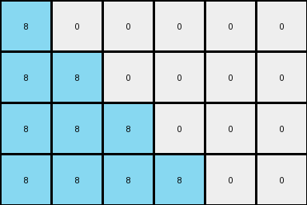

# bbc9ae5d • 017 • refine_dreamer

---


Previous Code:
```python
"""
Transforms a 1xN input grid into an MxN output grid where non-zero values in the input expand into
growing "squares" (actually triangles), and zero values are copied to all rows. The height M of the
output grid is equal to the number of non-zero values in the input.
"""

import numpy as np

def transform(input_grid):
    # Initialize the output grid with zeros.
    input_grid = np.array(input_grid)
    num_nonzero = np.count_nonzero(input_grid)
    output_grid = np.zeros((num_nonzero, input_grid.shape[1]), dtype=int)

    # Keep track of number of non-zeros
    non_zero_count = 0

    # Iterate through the input row
    for j in range(input_grid.shape[1]):
        if input_grid[0, j] != 0:
            # Expand non-zero values into growing triangles.
            color = input_grid[0, j]
            for i in range(non_zero_count,num_nonzero):
                row_width = i - non_zero_count + 1
                output_grid[i, j:min(j + row_width,input_grid.shape[1])] = color #stay within bound
            non_zero_count += 1
        else:
            # Copy zero values directly to all rows.
            for i in range(num_nonzero):
                output_grid[i, j] = input_grid[0, j]
    return output_grid
```

Train Set Results:

## Example 1:

Input:
```
1 1 0 0 0 0
```
Expected Output:
```
1 1 0 0 0 0
1 1 1 0 0 0
1 1 1 1 0 0
```
Transformed Output:
```
1 0 0 0 0 0
1 1 0 0 0 0
```

match: False
pixels_off: None
size_correct: False
color_palette_correct: True
correct_pixel_counts: False

## Example 2:

Input:
```
2 0 0 0 0 0 0 0
```
Expected Output:
```
2 0 0 0 0 0 0 0
2 2 0 0 0 0 0 0
2 2 2 0 0 0 0 0
2 2 2 2 0 0 0 0
```
Transformed Output:
```
2 0 0 0 0 0 0 0
```

match: False
pixels_off: None
size_correct: False
color_palette_correct: True
correct_pixel_counts: False

## Example 3:

Input:
```
5 5 5 0 0 0 0 0 0 0
```
Expected Output:
```
5 5 5 0 0 0 0 0 0 0
5 5 5 5 0 0 0 0 0 0
5 5 5 5 5 0 0 0 0 0
5 5 5 5 5 5 0 0 0 0
5 5 5 5 5 5 5 0 0 0
```
Transformed Output:
```
5 0 0 0 0 0 0 0 0 0
5 5 0 0 0 0 0 0 0 0
5 5 5 0 0 0 0 0 0 0
```

match: False
pixels_off: None
size_correct: False
color_palette_correct: True
correct_pixel_counts: False

## Example 4:

Input:
```
8 8 8 8 0 0
```
Expected Output:
```
8 8 8 8 0 0
8 8 8 8 8 0
8 8 8 8 8 8
```
Transformed Output:
```
8 0 0 0 0 0
8 8 0 0 0 0
8 8 8 0 0 0
8 8 8 8 0 0
```

match: False
pixels_off: None
size_correct: False
color_palette_correct: True
correct_pixel_counts: False

## Example 5:

Input:
```
7 0 0 0 0 0
```
Expected Output:
```
7 0 0 0 0 0
7 7 0 0 0 0
7 7 7 0 0 0
```
Transformed Output:
```
7 0 0 0 0 0
```

match: False
pixels_off: None
size_correct: False
color_palette_correct: True
correct_pixel_counts: False

**INSTRUCTIONS**

The code above was generated based on observations from the first training
example

we have tested the transform function on each of the task example inputs and
compared with the expected output

review each of the examples provided and the results and consider how the
natural language program should be updated to accommodate this new knowledge

respond with the following deliverables:

- general assessment of the information provided and strategy for resolving the
  errors
- gather metrics about each of the examples and results - use code_execution to
  develop accurate reports on your assumptions
- a YAML block documenting facts - Focus on identifying objects, their properties, and the actions performed on them.
- a natural language program - Be as clear and concise as possible, providing a complete description of the transformation rule.


your responses should be considered as information in a report - not a
conversation
