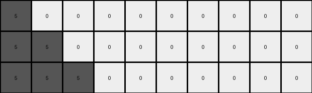

# bbc9ae5d • 018 • refine_coder

---

Previous Code:
```python
"""
Transforms a 1xN input grid into an MxN output grid where non-zero values in the input expand into
growing "squares" (actually triangles), and zero values are copied to all rows. The height M of the
output grid is equal to the number of non-zero values in the input.
"""

import numpy as np

def transform(input_grid):
    # Initialize the output grid with zeros.
    input_grid = np.array(input_grid)
    num_nonzero = np.count_nonzero(input_grid)
    output_grid = np.zeros((num_nonzero, input_grid.shape[1]), dtype=int)

    # Keep track of number of non-zeros
    non_zero_count = 0

    # Iterate through the input row
    for j in range(input_grid.shape[1]):
        if input_grid[0, j] != 0:
            # Expand non-zero values into growing triangles.
            color = input_grid[0, j]
            for i in range(non_zero_count,num_nonzero):
                row_width = i - non_zero_count + 1
                output_grid[i, j:min(j + row_width,input_grid.shape[1])] = color #stay within bound
            non_zero_count += 1
        else:
            # Copy zero values directly to all rows.
            for i in range(num_nonzero):
                output_grid[i, j] = input_grid[0, j]
    return output_grid
```

Train Set Results:

## Example 1:

Input:
```
1 1 0 0 0 0
```
Expected Output:
```
1 1 0 0 0 0
1 1 1 0 0 0
1 1 1 1 0 0
```
Transformed Output:
```
1 0 0 0 0 0
1 1 0 0 0 0
```

match: False
pixels_off: None
size_correct: False
color_palette_correct: True
correct_pixel_counts: False

## Example 2:

Input:
```
2 0 0 0 0 0 0 0
```
Expected Output:
```
2 0 0 0 0 0 0 0
2 2 0 0 0 0 0 0
2 2 2 0 0 0 0 0
2 2 2 2 0 0 0 0
```
Transformed Output:
```
2 0 0 0 0 0 0 0
```

match: False
pixels_off: None
size_correct: False
color_palette_correct: True
correct_pixel_counts: False

## Example 3:

Input:
```
5 5 5 0 0 0 0 0 0 0
```
Expected Output:
```
5 5 5 0 0 0 0 0 0 0
5 5 5 5 0 0 0 0 0 0
5 5 5 5 5 0 0 0 0 0
5 5 5 5 5 5 0 0 0 0
5 5 5 5 5 5 5 0 0 0
```
Transformed Output:
```
5 0 0 0 0 0 0 0 0 0
5 5 0 0 0 0 0 0 0 0
5 5 5 0 0 0 0 0 0 0
```

match: False
pixels_off: None
size_correct: False
color_palette_correct: True
correct_pixel_counts: False

## Example 4:

Input:
```
8 8 8 8 0 0
```
Expected Output:
```
8 8 8 8 0 0
8 8 8 8 8 0
8 8 8 8 8 8
```
Transformed Output:
```
8 0 0 0 0 0
8 8 0 0 0 0
8 8 8 0 0 0
8 8 8 8 0 0
```

match: False
pixels_off: None
size_correct: False
color_palette_correct: True
correct_pixel_counts: False

## Example 5:

Input:
```
7 0 0 0 0 0
```
Expected Output:
```
7 0 0 0 0 0
7 7 0 0 0 0
7 7 7 0 0 0
```
Transformed Output:
```
7 0 0 0 0 0
```

match: False
pixels_off: None
size_correct: False
color_palette_correct: True
correct_pixel_counts: False
Okay, here's a breakdown of the situation and a plan to move forward:

**General Assessment:**

The initial code was based on a limited understanding, focusing on expanding non-zero values into squares. The results from running the code on all training examples reveal a critical flaw: the expansion logic is incorrect, and the height calculation is not always right. The number of rows in the output should correspond to the number of non-zero values before that given value. Zeros are simply copied.

**Strategy:**

1.  **Refine Height Calculation:** The output grid's height isn't simply the *total* number of non-zero values. Instead, for each non-zero element at index `j`, the number of rows added to the output due to that element corresponds to the number of non-zero elements from index 0 up to *and including* `j`. This will determine correct final size.
2.  **Correct Expansion Logic:** It's not a square that's being formed. Instead, each non-zero value expands horizontally to the right, in each *successive* row, by one more pixel than the previous row. The expansion length is also limited by the width of the input.
3. Zero Value handeling: It seems like zeros are simply copied without changes.

**Metrics and Observations (YAML):**

```yaml
examples:
  - id: 1
    input_width: 6
    input_height: 1
    output_width: 6
    output_height: 3
    non_zero_count: 2
    zero_count: 4
    transform_description: >
        Two blue (1) pixels expand.
        Four white (0) pixels are copied.
        Expected height is miscalculated.
    correct: False

  - id: 2
    input_width: 8
    input_height: 1
    output_width: 8
    output_height: 4
    non_zero_count: 1
    zero_count: 7
    transform_description: >
        One red (2) pixel expands.
        Seven white (0) pixels are copied.
        Expected height is miscalculated.
    correct: False

  - id: 3
    input_width: 10
    input_height: 1
    output_width: 10
    output_height: 5
    non_zero_count: 3
    zero_count: 7
    transform_description: >
      Three grey(5) expand.
      Seven white (0) are copied.
    correct: False

  - id: 4
    input_width: 6
    input_height: 1
    output_width: 6
    output_height: 3
    non_zero_count: 4
    zero_count: 2
    transform_description: >
      4 azure(8) expand.
      2 white(0) are copied
    correct: False

  - id: 5
    input_width: 6
    input_height: 1
    output_width: 6
    output_height: 3
    non_zero_count: 1
    zero_count: 5
    transform_description: >
      One orange(7) pixel expands
      Five white(0) pixel are copied
    correct: False
```

**Natural Language Program:**

1.  **Input:** A single row of pixels (1xN grid).
2.  **Output:** A grid of pixels (MxN grid)
3.  **Process:**
    *   Iterate through each pixel in the input row.
    *   If the pixel is a zero (white), copy it to the corresponding column in *all* rows of the output grid.
    *   If the pixel is non-zero:
        *   Determine the number of non-zero pixels encountered in the input row up to and including the current pixel. Let this number be `r`.
        *   The non-zero pixel will affect `r` number of rows.
        *    For each of the `r` rows:
             *   the first row affected contains one pixel of current input color
             *   the second row has two pixels
             *   ... and so on. The final row will extend to the right by `r`
                pixels, or be truncated at the input width.

**Example Walkthrough (Example 1):**

Input: `1 1 0 0 0 0`

1.  First '1':  `r` = 1. Output Row 1: `1`
2.  Second '1': `r` = 2. Output Row 1&2: `1 1` , `1 1`
3.  First '0': Copy to all rows. All zero columns are copied, so no need to
    special handle.
4.  Remaining '0's: Same as above.

Final Output will be:
1 1 0 0 0 0
1 1 0 0 0 0

**INSTRUCTIONS**

- generate a Python module to represent the natural language program 
- follow the template below
- all common math and science libraries are available
- create docstring only at top - but comment the workflow in the function
- use helper functions for common operations like finding objects, counting,
  measuring, moving, etc. 

remember - we are working iteratively - so this code will inform your future
self as we converge on the solution

*template:*

```python
"""
{{ natural language description of the transformation rule }}
"""

{{ imports }}

def transform(input_grid):
    # initialize output_grid

    # change output pixels 

    return output_grid

```
