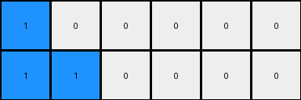
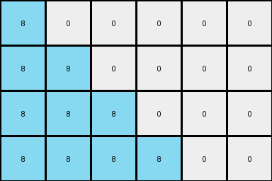

# bbc9ae5d • 023 • refine_dreamer

---

Previous Code:
```python
"""
Identify the sequence of non-zero color pixels in the input row and the sequence of trailing zero pixels.
Determine the length of the non-zero sequence and the index of the first zero in this sequence.
Create output rows. The number of output rows is equal to the count of non-zero colors in the input.
Extend For each output row:
    Copy the initial non-zero color sequence from the input.
    Extend the sequence by one pixel for each subsequent row, repeating the last color of the sequence.
    Append the original trailing zeros from the input to maintain their original length.
"""

import numpy as np

def transform(input_grid):
    # Identify the sequence of non-zero colors and trailing zeros.
    input_row = input_grid[0]
    first_zero_index = -1
    for i, pixel in enumerate(input_row):
        if pixel == 0:
            first_zero_index = i
            break
    if first_zero_index == -1:
        first_zero_index = len(input_row)

    non_zero_length = first_zero_index
    num_output_rows = non_zero_length

    # Create output rows.
    output_grid = np.zeros((num_output_rows, len(input_row)), dtype=int)

    # Extend non-zero sequence and append trailing zeros.
    for i in range(num_output_rows):
        # Copy and extend non-zero sequence.
        output_grid[i, :i+1] = input_row[:i+1]
        if i+1<first_zero_index:
            output_grid[i,i] = input_row[i]
        if i+1>0 and i+1 <= first_zero_index:
            output_grid[i,i] = input_row[i]

        # Append trailing zeros.
        output_grid[i, first_zero_index:] = input_row[first_zero_index:]

    return output_grid
```

Train Set Results:

## Example 1:

Input:
```
1 1 0 0 0 0
```
Expected Output:
```
1 1 0 0 0 0
1 1 1 0 0 0
1 1 1 1 0 0
```
Transformed Output:
```
1 0 0 0 0 0
1 1 0 0 0 0
```

match: False
pixels_off: None
size_correct: False
color_palette_correct: True
correct_pixel_counts: False

## Example 2:

Input:
```
2 0 0 0 0 0 0 0
```
Expected Output:
```
2 0 0 0 0 0 0 0
2 2 0 0 0 0 0 0
2 2 2 0 0 0 0 0
2 2 2 2 0 0 0 0
```
Transformed Output:
```
2 0 0 0 0 0 0 0
```

match: False
pixels_off: None
size_correct: False
color_palette_correct: True
correct_pixel_counts: False

## Example 3:

Input:
```
5 5 5 0 0 0 0 0 0 0
```
Expected Output:
```
5 5 5 0 0 0 0 0 0 0
5 5 5 5 0 0 0 0 0 0
5 5 5 5 5 0 0 0 0 0
5 5 5 5 5 5 0 0 0 0
5 5 5 5 5 5 5 0 0 0
```
Transformed Output:
```
5 0 0 0 0 0 0 0 0 0
5 5 0 0 0 0 0 0 0 0
5 5 5 0 0 0 0 0 0 0
```

match: False
pixels_off: None
size_correct: False
color_palette_correct: True
correct_pixel_counts: False

## Example 4:

Input:
```
8 8 8 8 0 0
```
Expected Output:
```
8 8 8 8 0 0
8 8 8 8 8 0
8 8 8 8 8 8
```
Transformed Output:
```
8 0 0 0 0 0
8 8 0 0 0 0
8 8 8 0 0 0
8 8 8 8 0 0
```

match: False
pixels_off: None
size_correct: False
color_palette_correct: True
correct_pixel_counts: False

## Example 5:

Input:
```
7 0 0 0 0 0
```
Expected Output:
```
7 0 0 0 0 0
7 7 0 0 0 0
7 7 7 0 0 0
```
Transformed Output:
```
7 0 0 0 0 0
```

match: False
pixels_off: None
size_correct: False
color_palette_correct: True
correct_pixel_counts: False
**INSTRUCTIONS**

The code above was generated based on observations from the first training
example

we have tested the transform function on each of the task example inputs and
compared with the expected output

review each of the examples provided and the results and consider how the
natural language program should be updated to accommodate this new knowledge

respond with the following deliverables:

- general assessment of the information provided and strategy for resolving the
  errors
- gather metrics about each of the examples and results - use code_execution to
  develop accurate reports on your assumptions
- a YAML block documenting facts - Focus on identifying objects, their properties, and the actions performed on them.
- a natural language program - Be as clear and concise as possible, providing a complete description of the transformation rule.


your responses should be considered as information in a report - not a
conversation
