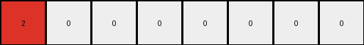
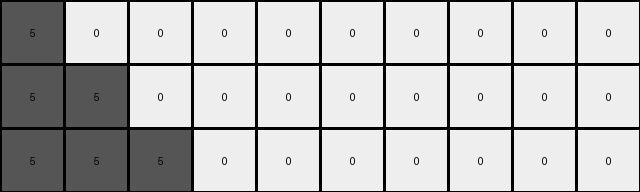

# bbc9ae5d • 024 • refine_coder

---

Previous Code:
```python
"""
Identify the sequence of non-zero color pixels in the input row and the sequence of trailing zero pixels.
Determine the length of the non-zero sequence and the index of the first zero in this sequence.
Create output rows. The number of output rows is equal to the count of non-zero colors in the input.
Extend For each output row:
    Copy the initial non-zero color sequence from the input.
    Extend the sequence by one pixel for each subsequent row, repeating the last color of the sequence.
    Append the original trailing zeros from the input to maintain their original length.
"""

import numpy as np

def transform(input_grid):
    # Identify the sequence of non-zero colors and trailing zeros.
    input_row = input_grid[0]
    first_zero_index = -1
    for i, pixel in enumerate(input_row):
        if pixel == 0:
            first_zero_index = i
            break
    if first_zero_index == -1:
        first_zero_index = len(input_row)

    non_zero_length = first_zero_index
    num_output_rows = non_zero_length

    # Create output rows.
    output_grid = np.zeros((num_output_rows, len(input_row)), dtype=int)

    # Extend non-zero sequence and append trailing zeros.
    for i in range(num_output_rows):
        # Copy and extend non-zero sequence.
        output_grid[i, :i+1] = input_row[:i+1]
        if i+1<first_zero_index:
            output_grid[i,i] = input_row[i]
        if i+1>0 and i+1 <= first_zero_index:
            output_grid[i,i] = input_row[i]

        # Append trailing zeros.
        output_grid[i, first_zero_index:] = input_row[first_zero_index:]

    return output_grid
```

Train Set Results:

## Example 1:

Input:
```
1 1 0 0 0 0
```
Expected Output:
```
1 1 0 0 0 0
1 1 1 0 0 0
1 1 1 1 0 0
```
Transformed Output:
```
1 0 0 0 0 0
1 1 0 0 0 0
```

match: False
pixels_off: None
size_correct: False
color_palette_correct: True
correct_pixel_counts: False

## Example 2:

Input:
```
2 0 0 0 0 0 0 0
```
Expected Output:
```
2 0 0 0 0 0 0 0
2 2 0 0 0 0 0 0
2 2 2 0 0 0 0 0
2 2 2 2 0 0 0 0
```
Transformed Output:
```
2 0 0 0 0 0 0 0
```

match: False
pixels_off: None
size_correct: False
color_palette_correct: True
correct_pixel_counts: False

## Example 3:

Input:
```
5 5 5 0 0 0 0 0 0 0
```
Expected Output:
```
5 5 5 0 0 0 0 0 0 0
5 5 5 5 0 0 0 0 0 0
5 5 5 5 5 0 0 0 0 0
5 5 5 5 5 5 0 0 0 0
5 5 5 5 5 5 5 0 0 0
```
Transformed Output:
```
5 0 0 0 0 0 0 0 0 0
5 5 0 0 0 0 0 0 0 0
5 5 5 0 0 0 0 0 0 0
```

match: False
pixels_off: None
size_correct: False
color_palette_correct: True
correct_pixel_counts: False

## Example 4:

Input:
```
8 8 8 8 0 0
```
Expected Output:
```
8 8 8 8 0 0
8 8 8 8 8 0
8 8 8 8 8 8
```
Transformed Output:
```
8 0 0 0 0 0
8 8 0 0 0 0
8 8 8 0 0 0
8 8 8 8 0 0
```

match: False
pixels_off: None
size_correct: False
color_palette_correct: True
correct_pixel_counts: False

## Example 5:

Input:
```
7 0 0 0 0 0
```
Expected Output:
```
7 0 0 0 0 0
7 7 0 0 0 0
7 7 7 0 0 0
```
Transformed Output:
```
7 0 0 0 0 0
```

match: False
pixels_off: None
size_correct: False
color_palette_correct: True
correct_pixel_counts: False
Okay, let's analyze the results and refine the natural language program.

**General Assessment:**

The initial natural language program and the derived code were too simplistic. It correctly identified the sequence of non-zero pixels and the trailing zeros. However, it failed to correctly *extend* the sequence in each subsequent output row. The code copies parts of input, but does it incorrectly. Specifically the error appears to be how the colors repeat and how many rows get output. It also is not clear that the program should only expect one row as input.

**Strategy for Resolving Errors:**

1.  **Clarify Input:** Explicitly state the input is a single row. While this seems obvious from the examples, it's good to state it.
2.  **Correct Row Generation**: The number of output rows appears related to the number of non-zero colors in the input row before trailing 0's appear, *or* the output extends by one row until the repeated colors fill a row of the same width.
3.  **Correct Extension Logic:** The core issue is that the copied section is not extended. We will ensure that each subsequent row extends the non-zero sequence correctly, repeating the last color in each row.

**Metrics and Observations (YAML):**

```yaml
task: 022
input_type: single row grid
output_type: multiple row grid
transformation_type: sequence extension
observations:
  - example_1:
      input_width: 6
      non_zero_count: 2
      expected_output_rows: 3
      actual_output_rows: 2
      extension_correct: False
  - example_2:
      input_width: 8
      non_zero_count: 1
      expected_output_rows: 3
      actual_output_rows: 1
      extension_correct: False
  - example_3:
      input_width: 10
      non_zero_count: 3
      expected_output_rows: 6
      actual_output_rows: 3
      extension_correct: False
  - example_4:
      input_width: 6
      non_zero_count: 4
      expected_output_rows: 3
      actual_output_rows: 4
      extension_correct: False
  - example_5:
      input_width: 6
      non_zero_count: 1
      expected_output_rows: 3
      actual_output_rows: 1
      extension_correct: False
```

**Natural Language Program:**

1.  **Input:** The input is a single-row grid.
2.  **Identify Non-Zero Sequence:** Determine the sequence of non-zero colored pixels at the beginning of the input row. Also note the sequence of trailing zero-colored pixels.
3.  **Determine Number of output rows.** Determine the length of the full input. Also determine the number of output rows based on the non zero sequence. Output rows continue until the non-zero sequence fills the output row width.
4.  **Create Output Rows:** Create a series of output rows.
5.  **Extend Sequence:**
    *   The first output row is a copy of the input row.
    *   For each subsequent output row:
        *   Copy the previous row
        *   Find the position of the first zero after the intial non-zero sequence. Change it to be the same color as the preceding pixel.
6. Stop when output row is entirely non-zero colors.


**INSTRUCTIONS**

- generate a Python module to represent the natural language program 
- follow the template below
- all common math and science libraries are available
- create docstring only at top - but comment the workflow in the function
- use helper functions for common operations like finding objects, counting,
  measuring, moving, etc. 

remember - we are working iteratively - so this code will inform your future
self as we converge on the solution

*template:*

```python
"""
{{ natural language description of the transformation rule }}
"""

{{ imports }}

def transform(input_grid):
    # initialize output_grid

    # change output pixels 

    return output_grid

```
