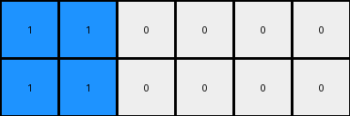
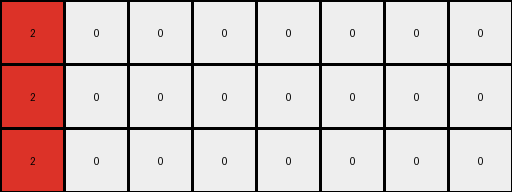

# bbc9ae5d • 029 • refine_dreamer

---

Previous Code:
```python
"""
1.  **Iterate** through each pixel of the input grid.
2.  **Check** if the pixel value is non-zero.
3.  **If non-zero:**
    *   Let `value` be the pixel's value.
    *   Calculate `output_height` as `input_height * (value + 1)`.
    *   Expand. For *each* row in the original input grid where there is
    *   Replicate current pixel `value + 1` times horizontally in the output grid. Perform this operation `value + 1` times vertically.
    *  That is, if the original pixel is at `input[row, col]`, and original value is V, output grid will include the same value `value + 1` times horizontally, at rows, `row`, `row + input_height`, `row + 2*input_height`, ..., `row + V*input_height`
4. **If zero:** preserve the pixel in the output grid at the respective expanded positions. Copy the zeros to all vertically stacked output grids.
"""

import numpy as np

def transform(input_grid):
    input_height, input_width = input_grid.shape
    output_height = 0  # Initialize for later determination

    # Find maximum height multiplier
    max_multiplier = 0
    for row in range(input_height):
        for col in range(input_width):
            if input_grid[row, col] != 0:
                max_multiplier = max(max_multiplier, input_grid[row,col] + 1)

    output_height = input_height * max_multiplier
    output_grid = np.zeros((output_height, input_width), dtype=int)

    # Iterate and expand
    for row in range(input_height):
        for col in range(input_width):
            value = input_grid[row, col]
            if value != 0:
                for i in range(value + 1):
                    for j in range(value + 1):
                      output_grid[row + i * input_height, col + j] = value
            else: # value is 0
                for i in range(max_multiplier):
                    output_grid[row + i * input_height, col] = 0


    return output_grid
```

Train Set Results:

## Example 1:

Input:
```
1 1 0 0 0 0
```
Expected Output:
```
1 1 0 0 0 0
1 1 1 0 0 0
1 1 1 1 0 0
```
Transformed Output:
```
1 1 0 0 0 0
1 1 0 0 0 0
```

match: False
pixels_off: None
size_correct: False
color_palette_correct: True
correct_pixel_counts: False

## Example 2:

Input:
```
2 0 0 0 0 0 0 0
```
Expected Output:
```
2 0 0 0 0 0 0 0
2 2 0 0 0 0 0 0
2 2 2 0 0 0 0 0
2 2 2 2 0 0 0 0
```
Transformed Output:
```
2 0 0 0 0 0 0 0
2 0 0 0 0 0 0 0
2 0 0 0 0 0 0 0
```

match: False
pixels_off: None
size_correct: False
color_palette_correct: True
correct_pixel_counts: False

## Example 3:

Input:
```
5 5 5 0 0 0 0 0 0 0
```
Expected Output:
```
5 5 5 0 0 0 0 0 0 0
5 5 5 5 0 0 0 0 0 0
5 5 5 5 5 0 0 0 0 0
5 5 5 5 5 5 0 0 0 0
5 5 5 5 5 5 5 0 0 0
```
Transformed Output:
```
5 5 5 0 0 0 0 0 0 0
5 5 5 0 0 0 0 0 0 0
5 5 5 0 0 0 0 0 0 0
5 5 5 0 0 0 0 0 0 0
5 5 5 0 0 0 0 0 0 0
5 5 5 0 0 0 0 0 0 0
```

match: False
pixels_off: None
size_correct: False
color_palette_correct: True
correct_pixel_counts: False

## Example 4:

Input:
```
8 8 8 8 0 0
```
Expected Output:
```
8 8 8 8 0 0
8 8 8 8 8 0
8 8 8 8 8 8
```
match: ERROR: index 6 is out of bounds for axis 1 with size 6
pixels_off: None
size_correct: None
color_palette_correct: None
correct_pixel_counts: None

## Example 5:

Input:
```
7 0 0 0 0 0
```
Expected Output:
```
7 0 0 0 0 0
7 7 0 0 0 0
7 7 7 0 0 0
```
match: ERROR: index 6 is out of bounds for axis 1 with size 6
pixels_off: None
size_correct: None
color_palette_correct: None
correct_pixel_counts: None
**INSTRUCTIONS**

The code above was generated based on observations from the first training
example

we have tested the transform function on each of the task example inputs and
compared with the expected output

review each of the examples provided and the results and consider how the
natural language program should be updated to accommodate this new knowledge

respond with the following deliverables:

- general assessment of the information provided and strategy for resolving the
  errors
- gather metrics about each of the examples and results - use code_execution to
  develop accurate reports on your assumptions
- a YAML block documenting facts - Focus on identifying objects, their properties, and the actions performed on them.
- a natural language program - Be as clear and concise as possible, providing a complete description of the transformation rule.


your responses should be considered as information in a report - not a
conversation
