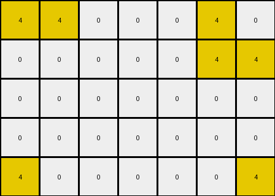
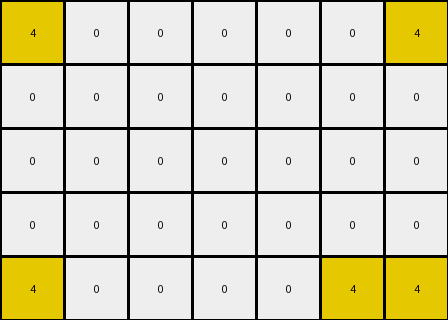
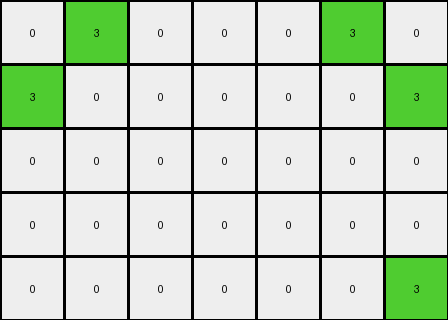

# bc1d5164 • 009 • refine_dreamer

---

Previous Code:
```python
"""
1. **Identify Corners:** Locate all red pixels (value 2) in the input grid that exist in the corners of any rectangle which has opposite corner also red.
2. **Find Bounding Box**: Select the smallest 3x3 box which contains red in its corners.

3.  **Construct Output:** Create a 3x3 output grid. Fill with contents extracted from the 3x3 box in the original image.
"""

import numpy as np

def find_red_corners(input_grid):
    red_pixels = []
    rows, cols = input_grid.shape
    for r in range(rows):
        for c in range(cols):
            if input_grid[r, c] == 2:
                red_pixels.append((r, c))
    return red_pixels

def extract_subgrid(input_grid, red_pixels):

    if len(red_pixels) < 2:
       return None #not enough red
    
    min_row = min(r for r, c in red_pixels)
    max_row = max(r for r, c in red_pixels)
    min_col = min(c for r, c in red_pixels)
    max_col = max(c for r, c in red_pixels)

    output_grid = input_grid[min_row:min_row + 3, min_col: min_col+3].copy()  # Extract 3x3 subgrid
    
    return output_grid


def transform(input_grid):
    """
    Transforms the input grid to the output grid based on the observed rule.
    """
    # Convert input to numpy array
    input_grid = np.array(input_grid)

    # Find red pixels
    red_pixels = find_red_corners(input_grid)

    # extract 3x3 box
    output_grid = extract_subgrid(input_grid, red_pixels)
    if output_grid is None:
       return input_grid.tolist() #handle edge case
    
    return output_grid.tolist()
```

Train Set Results:

## Example 1:

Input:
```
0 8 0 0 0 8 0
8 8 0 0 0 8 8
0 0 0 0 0 0 0
8 8 0 0 0 8 8
0 8 0 0 0 8 0
```
Expected Output:
```
0 8 0
8 8 8
0 8 0
```
Transformed Output:
```
0 8 0 0 0 8 0
8 8 0 0 0 8 8
0 0 0 0 0 0 0
8 8 0 0 0 8 8
0 8 0 0 0 8 0
```

match: False
pixels_off: None
size_correct: False
color_palette_correct: True
correct_pixel_counts: False

## Example 2:

Input:
```
2 2 0 0 0 2 2
0 0 0 0 0 0 2
0 0 0 0 0 0 0
0 2 0 0 0 2 0
2 0 0 0 0 0 2
```
Expected Output:
```
2 2 2
0 2 2
2 0 2
```
Transformed Output:
```
2 2 0
0 0 0
0 0 0
```

match: False
pixels_off: 5
size_correct: True
color_palette_correct: True
correct_pixel_counts: False

## Example 3:

Input:
```
4 4 0 0 0 4 0
0 0 0 0 0 4 4
0 0 0 0 0 0 0
0 0 0 0 0 0 0
4 0 0 0 0 0 4
```
Expected Output:
```
4 4 0
0 4 4
4 0 4
```
Transformed Output:
```
4 4 0 0 0 4 0
0 0 0 0 0 4 4
0 0 0 0 0 0 0
0 0 0 0 0 0 0
4 0 0 0 0 0 4
```

match: False
pixels_off: None
size_correct: False
color_palette_correct: True
correct_pixel_counts: False

## Example 4:

Input:
```
4 0 0 0 0 0 4
0 0 0 0 0 0 0
0 0 0 0 0 0 0
0 0 0 0 0 0 0
4 0 0 0 0 4 4
```
Expected Output:
```
4 0 4
0 0 0
4 4 4
```
Transformed Output:
```
4 0 0 0 0 0 4
0 0 0 0 0 0 0
0 0 0 0 0 0 0
0 0 0 0 0 0 0
4 0 0 0 0 4 4
```

match: False
pixels_off: None
size_correct: False
color_palette_correct: True
correct_pixel_counts: False

## Example 5:

Input:
```
0 3 0 0 0 3 0
3 0 0 0 0 0 3
0 0 0 0 0 0 0
0 0 0 0 0 0 0
0 0 0 0 0 0 3
```
Expected Output:
```
0 3 0
3 0 3
0 0 3
```
Transformed Output:
```
0 3 0 0 0 3 0
3 0 0 0 0 0 3
0 0 0 0 0 0 0
0 0 0 0 0 0 0
0 0 0 0 0 0 3
```

match: False
pixels_off: None
size_correct: False
color_palette_correct: True
correct_pixel_counts: False
**INSTRUCTIONS**

The code above was generated based on observations from the first training
example

we have tested the transform function on each of the task example inputs and
compared with the expected output

review each of the examples provided and the results and consider how the
natural language program should be updated to accommodate this new knowledge

respond with the following deliverables:

- general assessment of the information provided and strategy for resolving the
  errors
- gather metrics about each of the examples and results - use code_execution to
  develop accurate reports on your assumptions
- a YAML block documenting facts - Focus on identifying objects, their properties, and the actions performed on them.
- a natural language program - Be as clear and concise as possible, providing a complete description of the transformation rule.


your responses should be considered as information in a report - not a
conversation
