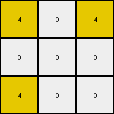

# bc1d5164 • 015 • refine_dreamer

---


Previous Code:
```python
"""
The transformation rule identifies the outermost yellow (4) pixels in the input grid and places them at the corners of a 3x3 output grid. The remaining cells in the output grid are filled with white (0) pixels.
"""

import numpy as np

def get_outermost_4s(input_grid):
    # Find all '4' pixels
    coords = np.argwhere(input_grid == 4)
    if coords.size == 0:  # Handle cases with no '4' pixels
        return []

    # find min and max of rows and columns
    min_row, min_col = np.min(coords, axis=0)
    max_row, max_col = np.max(coords, axis=0)

    outermost_4s = []

    for row, col in coords:
      if (row == min_row or row == max_row) or (col == min_col or col == max_col):
          # check for real corner
          is_corner = False
          if (row == min_row and col == min_col) or \
             (row == min_row and col == max_col) or \
             (row == max_row and col == min_col) or \
             (row == max_row and col == max_col):
            is_corner = True
          
          # check if point is on rectangle and handle
          if row == min_row and col > min_col and col < max_col:
            continue
          if row == max_row and col > min_col and col < max_col:
            continue
          if col == min_col and row > min_row and row < max_row:
            continue
          if col == max_col and row > min_row and row < max_row:
            continue
          
          if is_corner:
            outermost_4s.append((row, col))
    return outermost_4s

def transform(input_grid):
    """
    Transforms the input grid according to the rule: extracts outermost '4's,
    places them at corners of 3x3 grid, and fills the rest with '0's.
    """
    input_grid = np.array(input_grid)
    outermost_4s = get_outermost_4s(input_grid)
    output_grid = np.zeros((3, 3), dtype=int)

    # Place the outermost '4's in output grid corners.
    if len(outermost_4s) >= 1:
      output_grid[0, 0] = 4
    if len(outermost_4s) >= 2:
      output_grid[0, 2] = 4
    if len(outermost_4s) >= 3:
        output_grid[2, 0] = 4
    if len(outermost_4s) >= 4:
      output_grid[2, 2] = 4
    
    # check for more than 4, and if so, move the ones in the middle somewhere else
    if len(outermost_4s) > 4:
      output_grid[1,1] = 4 # middle, could be other empty spot

    return output_grid.tolist()
```

Train Set Results:

## Example 1:

Input:
```
0 8 0 0 0 8 0
8 8 0 0 0 8 8
0 0 0 0 0 0 0
8 8 0 0 0 8 8
0 8 0 0 0 8 0
```
Expected Output:
```
0 8 0
8 8 8
0 8 0
```
Transformed Output:
```
0 0 0
0 0 0
0 0 0
```

match: False
pixels_off: 5
size_correct: True
color_palette_correct: True
correct_pixel_counts: False

## Example 2:

Input:
```
2 2 0 0 0 2 2
0 0 0 0 0 0 2
0 0 0 0 0 0 0
0 2 0 0 0 2 0
2 0 0 0 0 0 2
```
Expected Output:
```
2 2 2
0 2 2
2 0 2
```
Transformed Output:
```
0 0 0
0 0 0
0 0 0
```

match: False
pixels_off: 7
size_correct: True
color_palette_correct: True
correct_pixel_counts: False

## Example 3:

Input:
```
4 4 0 0 0 4 0
0 0 0 0 0 4 4
0 0 0 0 0 0 0
0 0 0 0 0 0 0
4 0 0 0 0 0 4
```
Expected Output:
```
4 4 0
0 4 4
4 0 4
```
Transformed Output:
```
4 0 4
0 0 0
4 0 0
```

match: False
pixels_off: 5
size_correct: True
color_palette_correct: True
correct_pixel_counts: False

## Example 4:

Input:
```
4 0 0 0 0 0 4
0 0 0 0 0 0 0
0 0 0 0 0 0 0
0 0 0 0 0 0 0
4 0 0 0 0 4 4
```
Expected Output:
```
4 0 4
0 0 0
4 4 4
```
Transformed Output:
```
4 0 4
0 0 0
4 0 4
```

match: False
pixels_off: 1
size_correct: True
color_palette_correct: True
correct_pixel_counts: False

## Example 5:

Input:
```
0 3 0 0 0 3 0
3 0 0 0 0 0 3
0 0 0 0 0 0 0
0 0 0 0 0 0 0
0 0 0 0 0 0 3
```
Expected Output:
```
0 3 0
3 0 3
0 0 3
```
Transformed Output:
```
0 0 0
0 0 0
0 0 0
```

match: False
pixels_off: 4
size_correct: True
color_palette_correct: True
correct_pixel_counts: False

**INSTRUCTIONS**

The code above was generated based on observations from the first training
example

we have tested the transform function on each of the task example inputs and
compared with the expected output

review each of the examples provided and the results and consider how the
natural language program should be updated to accommodate this new knowledge

respond with the following deliverables:

- general assessment of the information provided and strategy for resolving the
  errors
- gather metrics about each of the examples and results - use code_execution to
  develop accurate reports on your assumptions
- a YAML block documenting facts - Focus on identifying objects, their properties, and the actions performed on them.
- a natural language program - Be as clear and concise as possible, providing a complete description of the transformation rule.


your responses should be considered as information in a report - not a
conversation
