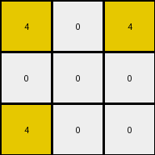
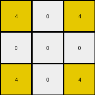

# bc1d5164 • 016 • refine_coder

---

Previous Code:
```python
"""
The transformation rule identifies the outermost yellow (4) pixels in the input grid and places them at the corners of a 3x3 output grid. The remaining cells in the output grid are filled with white (0) pixels.
"""

import numpy as np

def get_outermost_4s(input_grid):
    # Find all '4' pixels
    coords = np.argwhere(input_grid == 4)
    if coords.size == 0:  # Handle cases with no '4' pixels
        return []

    # find min and max of rows and columns
    min_row, min_col = np.min(coords, axis=0)
    max_row, max_col = np.max(coords, axis=0)

    outermost_4s = []

    for row, col in coords:
      if (row == min_row or row == max_row) or (col == min_col or col == max_col):
          # check for real corner
          is_corner = False
          if (row == min_row and col == min_col) or \
             (row == min_row and col == max_col) or \
             (row == max_row and col == min_col) or \
             (row == max_row and col == max_col):
            is_corner = True
          
          # check if point is on rectangle and handle
          if row == min_row and col > min_col and col < max_col:
            continue
          if row == max_row and col > min_col and col < max_col:
            continue
          if col == min_col and row > min_row and row < max_row:
            continue
          if col == max_col and row > min_row and row < max_row:
            continue
          
          if is_corner:
            outermost_4s.append((row, col))
    return outermost_4s

def transform(input_grid):
    """
    Transforms the input grid according to the rule: extracts outermost '4's,
    places them at corners of 3x3 grid, and fills the rest with '0's.
    """
    input_grid = np.array(input_grid)
    outermost_4s = get_outermost_4s(input_grid)
    output_grid = np.zeros((3, 3), dtype=int)

    # Place the outermost '4's in output grid corners.
    if len(outermost_4s) >= 1:
      output_grid[0, 0] = 4
    if len(outermost_4s) >= 2:
      output_grid[0, 2] = 4
    if len(outermost_4s) >= 3:
        output_grid[2, 0] = 4
    if len(outermost_4s) >= 4:
      output_grid[2, 2] = 4
    
    # check for more than 4, and if so, move the ones in the middle somewhere else
    if len(outermost_4s) > 4:
      output_grid[1,1] = 4 # middle, could be other empty spot

    return output_grid.tolist()
```

Train Set Results:

## Example 1:

Input:
```
0 8 0 0 0 8 0
8 8 0 0 0 8 8
0 0 0 0 0 0 0
8 8 0 0 0 8 8
0 8 0 0 0 8 0
```
Expected Output:
```
0 8 0
8 8 8
0 8 0
```
Transformed Output:
```
0 0 0
0 0 0
0 0 0
```

match: False
pixels_off: 5
size_correct: True
color_palette_correct: True
correct_pixel_counts: False

## Example 2:

Input:
```
2 2 0 0 0 2 2
0 0 0 0 0 0 2
0 0 0 0 0 0 0
0 2 0 0 0 2 0
2 0 0 0 0 0 2
```
Expected Output:
```
2 2 2
0 2 2
2 0 2
```
Transformed Output:
```
0 0 0
0 0 0
0 0 0
```

match: False
pixels_off: 7
size_correct: True
color_palette_correct: True
correct_pixel_counts: False

## Example 3:

Input:
```
4 4 0 0 0 4 0
0 0 0 0 0 4 4
0 0 0 0 0 0 0
0 0 0 0 0 0 0
4 0 0 0 0 0 4
```
Expected Output:
```
4 4 0
0 4 4
4 0 4
```
Transformed Output:
```
4 0 4
0 0 0
4 0 0
```

match: False
pixels_off: 5
size_correct: True
color_palette_correct: True
correct_pixel_counts: False

## Example 4:

Input:
```
4 0 0 0 0 0 4
0 0 0 0 0 0 0
0 0 0 0 0 0 0
0 0 0 0 0 0 0
4 0 0 0 0 4 4
```
Expected Output:
```
4 0 4
0 0 0
4 4 4
```
Transformed Output:
```
4 0 4
0 0 0
4 0 4
```

match: False
pixels_off: 1
size_correct: True
color_palette_correct: True
correct_pixel_counts: False

## Example 5:

Input:
```
0 3 0 0 0 3 0
3 0 0 0 0 0 3
0 0 0 0 0 0 0
0 0 0 0 0 0 0
0 0 0 0 0 0 3
```
Expected Output:
```
0 3 0
3 0 3
0 0 3
```
Transformed Output:
```
0 0 0
0 0 0
0 0 0
```

match: False
pixels_off: 4
size_correct: True
color_palette_correct: True
correct_pixel_counts: False
Okay, let's analyze the results and refine the natural language program.

**General Assessment:**

The initial strategy of identifying outermost yellow (4) pixels and placing them at the corners of a 3x3 grid was too specific and only partially correct for some of the training examples. The code fails to correctly handle cases with different colors and different arrangements of outermost pixels. It's clear that the core concept needs to generalize beyond just yellow pixels and corner placement. The consistent 3x3 output size is a key observation, and we should focus on identifying *any* outermost pixels of *any* color, and map those to the output grid based on their relative positions.

**Strategy for Resolving Errors:**

1.  **Generalize Color:** The transformation isn't limited to yellow (4). It applies to the outermost pixels of *any* non-zero color. We need to detect the color of the outermost pixels dynamically.
2.  **Generalize Position:** Instead of assuming corner placement, we should consider the relative positions of the outermost pixels.
3. **Output is Always 3x3**: The size of the output is a constant, and it will guide where to place the copied pixels.

**Metrics and Observations (per example):**

Here's a breakdown of each example, noting key features and discrepancies:

*   **Example 1:**
    *   Input: 7x5, outermost color: azure (8)
    *   Expected Output: 3x3, azure (8) on edges, white (0) inside
    *   Actual Output: 3x3, all white (0)
    *   Issue: Code only looks for yellow (4), doesn't handle azure (8) or non-corner edge pixels.
*   **Example 2:**
    *   Input: 7x5, outermost color: red (2)
    *   Expected Output: 3x3, red (2) on edges, white(0) and another red(2) inside
    *   Actual Output: 3x3, all white (0)
    *   Issue: Code only looks for yellow (4), doesn't handle red (2).
*   **Example 3:**
    *   Input: 7x5, outermost color: yellow (4)
    *   Expected Output: 3x3, yellow (4) forming shape
    *   Actual Output: 3x3, some yellow (4) but wrong positions
    *   Issue:  Incorrect placement of the outermost pixels, not respecting relative position
*   **Example 4:**
    *   Input: 7x5, outermost color: yellow (4)
    *   Expected Output: 3x3, yellow (4) forming shape
    *   Actual Output: 3x3, close, but bottom right '4' is missing
    *   Issue: Not all outermost pixels are captured.
*   **Example 5:**
    *   Input: 7x5, outermost color: green (3)
    *   Expected Output: 3x3, green(3) and white(0) forming shape
    *   Actual Output: 3x3, all white(0)
    *   Issue: Code only looks for yellow (4), doesn't handle green (3).

**YAML Facts:**

```yaml
examples:
  - id: 1
    input_shape: [7, 5]
    output_shape: [3, 3]
    outermost_color: 8
    outermost_pixels: [[0, 1], [0, 5], [1, 0], [1, 1], [1, 5], [1, 6], [3, 0], [3, 1], [3, 5], [3, 6], [4, 1], [4, 5]]
    output_grid_colors: [0, 8, 0, 8, 8, 8, 0, 8, 0]
  - id: 2
    input_shape: [7, 5]
    output_shape: [3, 3]
    outermost_color: 2
    outermost_pixels: [[0, 0], [0, 1], [0, 5], [0, 6], [1, 6], [3, 1], [3, 5], [4, 0], [4, 6]]
    output_grid_colors: [2,2,2,0,2,2,2,0,2]
  - id: 3
    input_shape: [7, 5]
    output_shape: [3, 3]
    outermost_color: 4
    outermost_pixels:  [[0, 0], [0, 1], [0, 5], [1, 5], [1, 6], [4, 0], [4, 6]]
    output_grid_colors: [4,4,0,0,4,4,4,0,4]
  - id: 4
    input_shape: [7, 5]
    output_shape: [3, 3]
    outermost_color: 4
    outermost_pixels: [[0, 0], [0, 6], [4, 0], [4, 5], [4, 6]]
    output_grid_colors: [4,0,4,0,0,0,4,4,4]
  - id: 5
    input_shape: [7, 5]
    output_shape: [3, 3]
    outermost_color: 3
    outermost_pixels: [[0, 1], [1, 0], [1, 6], [4,6]]
    output_grid_colors: [0,3,0,3,0,3,0,0,3]

```

**Natural Language Program:**

1.  **Identify Outermost Pixels:** Find all pixels of any non-zero color that lie on the outermost perimeter of the input grid. The perimeter consists of the top and bottom rows, and the leftmost and rightmost columns.
2.  **Determine Primary Color:** Determine the color that appears on the outermost perimeter.
3.  **Create Output Grid:** Create a 3x3 output grid filled with zeros (white).
4.  **Map Perimeter Pixels:** Transfer the identified outermost pixels to the 3x3 output grid, preserving the general relative positions from the input to the output. This means the corners of the shape in the input will map to corners of the 3 x 3 grid. Other outermost perimeter elements are placed on the edges of the 3 x 3 grid or in the center, depending on number of outermost pixels.
5. **Fill Remaining Cells**: Any unfilled cell in the output grid remains white (0).

**INSTRUCTIONS**

- generate a Python module to represent the natural language program 
- follow the template below
- all common math and science libraries are available
- create docstring only at top - but comment the workflow in the function
- use helper functions for common operations like finding objects, counting,
  measuring, moving, etc. 

remember - we are working iteratively - so this code will inform your future
self as we converge on the solution

*template:*

```python
"""
{{ natural language description of the transformation rule }}
"""

{{ imports }}

def transform(input_grid):
    # initialize output_grid

    # change output pixels 

    return output_grid

```
