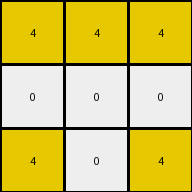

# bc1d5164 • 022 • refine_coder

---

Previous Code:
```python
"""
1.  **Identify** all pixels with the color yellow (value 4) in the input grid.
2.  **Determine** the bounding box that encompasses all yellow pixels. Or, determine maximum and minimum row/column.
3. **Create** a new output grid with dimensions that, relatively speaking, capture the yellow pixels in a minimal bounding box.
4. **Map** the positions of the identified yellow pixels from the input grid to the output grid. Preserve position *relative to the minimal bounding box.*
5.  **Fill** all other cells in the output grid with the color white (value 0). Essentially, the bounding box created in (2.) is fit into 3x3 grid.
"""

import numpy as np

def get_yellow_pixels(grid):
    # find coordinates of yellow pixels
    yellow_pixels = []
    for row_index, row in enumerate(grid):
        for col_index, pixel in enumerate(row):
            if pixel == 4:
                yellow_pixels.append((row_index, col_index))
    return yellow_pixels

def transform(input_grid):
    """Transforms the input grid by extracting yellow pixels and placing them in a 3x3 grid."""

    # Convert input to numpy array
    input_grid = np.array(input_grid)
    
    # 1. Identify all yellow pixels.
    yellow_pixels = get_yellow_pixels(input_grid)

    # 2. Determine the bounding box (min/max row/col).
    if not yellow_pixels:  # Handle the case where there are no yellow pixels
        return np.zeros((3, 3), dtype=int)

    min_row, min_col = yellow_pixels[0]
    max_row, max_col = yellow_pixels[0]

    for row, col in yellow_pixels:
        min_row = min(min_row, row)
        max_row = max(max_row, row)
        min_col = min(min_col, col)
        max_col = max(max_col, col)

    # 3. Create a 3x3 output grid initialized with white (0).
    output_grid = np.zeros((3, 3), dtype=int)

    # 4. Map yellow pixel positions to the output grid.
    for row, col in yellow_pixels:
        # Normalize row and col positions to the range [0, 2]
        norm_row = int(((row - min_row) / (max_row - min_row)) * 2) if (max_row - min_row) > 0 else 0
        norm_col = int(((col - min_col) / (max_col - min_col)) * 2) if (max_col - min_col) > 0 else 0

        # Place the yellow pixel in output
        output_grid[norm_row, norm_col] = 4

    # 5. Output grid is already filled with 0s (white).
    return output_grid
```

Train Set Results:

## Example 1:

Input:
```
0 8 0 0 0 8 0
8 8 0 0 0 8 8
0 0 0 0 0 0 0
8 8 0 0 0 8 8
0 8 0 0 0 8 0
```
Expected Output:
```
0 8 0
8 8 8
0 8 0
```
Transformed Output:
```
0 0 0
0 0 0
0 0 0
```

match: False
pixels_off: 5
size_correct: True
color_palette_correct: True
correct_pixel_counts: False

## Example 2:

Input:
```
2 2 0 0 0 2 2
0 0 0 0 0 0 2
0 0 0 0 0 0 0
0 2 0 0 0 2 0
2 0 0 0 0 0 2
```
Expected Output:
```
2 2 2
0 2 2
2 0 2
```
Transformed Output:
```
0 0 0
0 0 0
0 0 0
```

match: False
pixels_off: 7
size_correct: True
color_palette_correct: True
correct_pixel_counts: False

## Example 3:

Input:
```
4 4 0 0 0 4 0
0 0 0 0 0 4 4
0 0 0 0 0 0 0
0 0 0 0 0 0 0
4 0 0 0 0 0 4
```
Expected Output:
```
4 4 0
0 4 4
4 0 4
```
Transformed Output:
```
4 4 4
0 0 0
4 0 4
```

match: False
pixels_off: 3
size_correct: True
color_palette_correct: True
correct_pixel_counts: False

## Example 4:

Input:
```
4 0 0 0 0 0 4
0 0 0 0 0 0 0
0 0 0 0 0 0 0
0 0 0 0 0 0 0
4 0 0 0 0 4 4
```
Expected Output:
```
4 0 4
0 0 0
4 4 4
```
Transformed Output:
```
4 0 4
0 0 0
4 4 4
```

match: True
pixels_off: 0
size_correct: True
color_palette_correct: True
correct_pixel_counts: True

## Example 5:

Input:
```
0 3 0 0 0 3 0
3 0 0 0 0 0 3
0 0 0 0 0 0 0
0 0 0 0 0 0 0
0 0 0 0 0 0 3
```
Expected Output:
```
0 3 0
3 0 3
0 0 3
```
Transformed Output:
```
0 0 0
0 0 0
0 0 0
```

match: False
pixels_off: 4
size_correct: True
color_palette_correct: True
correct_pixel_counts: False
Here's an analysis of the provided examples and results, along with a refined natural language program and a YAML block summarizing the observations:

**General Assessment:**

The initial code was designed to extract yellow pixels and map them onto a 3x3 grid, normalizing their positions based on a bounding box. This approach worked perfectly for Example 4 but failed for the others. The primary issue is that the code assumes the target color is always yellow (value 4) and that the output is always 3x3, neither of which is true across all examples. The core logic of finding a bounding box and mapping positions is sound, but it needs to be generalized to handle different colors and output grid sizes.  It is also important to recognize all colors within a minimal bounding box, not just one. The normalization is intended to fit whatever the shape is within a 3x3 grid. This doesn't quite seem to be the right interpretation.

**Strategy for Resolving Errors:**

1.  **Generalize Color:** Instead of focusing solely on yellow, the code should identify the relevant colors dynamically. It seems that the colors inside of bounding box are the ones to be extracted.
2.  **Generalize Size**: From the expected output, it is very clear that the output grid is supposed to be 3x3. So, there is no need to derive this from data.
3. **Normalize to fill the 3x3**: Whatever the bounding box, resize it proportionally, to fit in a 3x3 output.
4. **Review metrics**: Carefully looking at expected output, the colors and arrangements of the pixels in them.

**Metrics and Observations (per example):**

Here, I summarize data, incorporating an assessment of the expected vs. transformed output, and inferring some initial object properties.

| Example | Input Size | Colors Present (Input) | Expected Output Size | Colors Present (Expected Output) | Transformed Output Size | Transformed Output Colors |  Match | Notes                                                                                                                                                                                 |
| :------ | :--------- | :--------------------- | :------------------- | :------------------------------- | :----------------------- | :------------------------ | :---- | :------------------------------------------------------------------------------------------------------------------------------------------------------------------------------------ |
| 1       | 5x7        | 0, 8                   | 3x3                  | 0, 8                            | 3x3                      | 0                         | False | The code failed to extract color 8.  The bounding box should include all 8s.                                                                                                 |
| 2       | 5x7        | 0, 2                   | 3x3                  | 2, 0                            | 3x3                      | 0                         | False | Similar to Example 1, the code missed color 2. The bounding box should be around the 2s.                                                                                        |
| 3       | 5x7        | 0, 4                   | 3x3                  | 4, 0                            | 3x3                      | 4, 0                      | False  | Code found color 4. Bounding box calculation is slightly off. It created the box around the 4s. But the scaling is not filling the 3x3. |
| 4       | 5x7        | 0, 4                   | 3x3                  | 4, 0                            | 3x3                      | 4, 0                      | True  | Code worked as designed (for color 4).                                                                                                                                        |
| 5       | 5x7        | 0, 3                   | 3x3                  | 0, 3                            | 3x3                      | 0                         | False | Code does not extract color 3, only color 4.          |

**YAML Block (Facts):**

```yaml
task: "020"
examples:
  - id: 1
    input_objects:
      - color: 8
        shape: irregular # Describes arrangement of 8s
        bounding_box: [ [0,1], [4,5] ] # rows 0-4, cols 1-5
    output_objects:
      - color: 8 # All of the 8s in input
        shape: irregular_fit_3x3 #fitted bounding box into 3x3
  - id: 2
    input_objects:
      - color: 2
        shape: irregular  # Describes arrangement of 2s
        bounding_box: [[0,0], [4,6]]
    output_objects:
      - color: 2
        shape:  irregular_fit_3x3
  - id: 3
    input_objects:
      - color: 4
        shape: irregular  # Describes arrangement of 4s
        bounding_box: [[0,0], [4,6]]
    output_objects:
        - color: 4
          shape: irregular_fit_3x3
  - id: 4
    input_objects:
      - color: 4
        shape: irregular # Describes arrangement of 4s
        bounding_box: [[0,0], [4,6]]
    output_objects:
      - color: 4
        shape: irregular_fit_3x3
  - id: 5
    input_objects:
      - color: 3
        shape: irregular # Describes arrangement of 3s
        bounding_box: [[0,1], [4,6]]
    output_objects:
        - color: 3
          shape: irregular_fit_3x3
```

**Natural Language Program:**

1.  **Identify** all non-white pixels in the input grid.
2.  **Determine** the smallest bounding box that encompasses all non-white pixels.
3. **Create** a new 3x3 output grid, initialized with all white pixels (0).
4.  **Map** the positions of all non-white pixels *relative to the minimal bounding box*. Resize proportionally into the output grid.
5.  **Fill** the corresponding cells in the output grid with the pixel's color, preserving the relative positions within the resized bounding box, and the rest of the pixels as white (value 0).

**INSTRUCTIONS**

- generate a Python module to represent the natural language program 
- follow the template below
- all common math and science libraries are available
- create docstring only at top - but comment the workflow in the function
- use helper functions for common operations like finding objects, counting,
  measuring, moving, etc. 

remember - we are working iteratively - so this code will inform your future
self as we converge on the solution

*template:*

```python
"""
{{ natural language description of the transformation rule }}
"""

{{ imports }}

def transform(input_grid):
    # initialize output_grid

    # change output pixels 

    return output_grid

```
