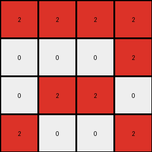
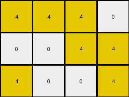
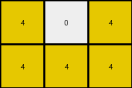
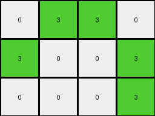

# bc1d5164 • 029 • refine_dreamer

---

Previous Code:
```python
"""
The transformation identifies the dominant non-zero color in the input grid, then extracts rows and columns that contain this color, forming a smaller output grid.
"""

import numpy as np

def get_dominant_nonzero_color(grid):
    """
    Finds the most frequent non-zero color in the grid.
    """
    # Flatten the grid and convert to a list
    flat_grid = grid.flatten().tolist()
    # Find unique non-zero colors
    nonzero_colors = [color for color in set(flat_grid) if color != 0]

    # Handle the edge case of input containing all zeros
    if not nonzero_colors:
        return None
    
    if len(nonzero_colors) == 1:
        return nonzero_colors[0]

    # Count occurrences of each non-zero color
    color_counts = {color: flat_grid.count(color) for color in nonzero_colors}
    # Return the color with the maximum count
    dominant_color = max(color_counts, key=color_counts.get)
    return dominant_color

def get_rows_with_color(grid, color):
    """
    Returns a list of row indices that contain the specified color.
    """
    rows = []
    for i, row in enumerate(grid):
        if color in row:
          if all(c in [0, color] for c in row):
            rows.append(i)
    return rows

def get_cols_with_color(grid, color):
    """
    Returns a list of column indices that contain the specified color.
    """
    cols = []
    for j in range(grid.shape[1]):
      col = grid[:,j]
      if color in col:
        if all(c in [0, color] for c in col):
          cols.append(j)
    return cols

def extract_rows(grid, row_indices):
    """Extracts specific rows from a grid, based on row indices."""
    return grid[row_indices]

def extract_cols(grid, col_indices):
    """Extracts specific columns from a grid, based on column indices."""
    return grid[:, col_indices]

def transform(input_grid):
    """
    Transforms the input grid by extracting rows and columns that contain the dominant non-zero color.
    """
    # Convert to numpy array for easier manipulation
    input_grid = np.array(input_grid)

    # 1. Identify the dominant non-zero color
    dominant_color = get_dominant_nonzero_color(input_grid)
    
    if dominant_color is None:
        return []

    # 2. Identify Rows with the dominant color
    rows_with_color = get_rows_with_color(input_grid, dominant_color)

    # 3. Filter Input by Rows
    intermediate_grid = extract_rows(input_grid, rows_with_color)
    
    # 4. Identify Columns with the dominant color in intermediate
    cols_with_color = get_cols_with_color(intermediate_grid, dominant_color)


    # 5. Filter Intermediate by Columns
    output_grid = extract_cols(intermediate_grid, cols_with_color)


    return output_grid.tolist()
```

Train Set Results:

## Example 1:

Input:
```
0 8 0 0 0 8 0
8 8 0 0 0 8 8
0 0 0 0 0 0 0
8 8 0 0 0 8 8
0 8 0 0 0 8 0
```
Expected Output:
```
0 8 0
8 8 8
0 8 0
```
Transformed Output:
```
0 8 8 0
8 8 8 8
8 8 8 8
0 8 8 0
```

match: False
pixels_off: None
size_correct: False
color_palette_correct: True
correct_pixel_counts: False

## Example 2:

Input:
```
2 2 0 0 0 2 2
0 0 0 0 0 0 2
0 0 0 0 0 0 0
0 2 0 0 0 2 0
2 0 0 0 0 0 2
```
Expected Output:
```
2 2 2
0 2 2
2 0 2
```
Transformed Output:
```
2 2 2 2
0 0 0 2
0 2 2 0
2 0 0 2
```

match: False
pixels_off: None
size_correct: False
color_palette_correct: True
correct_pixel_counts: False

## Example 3:

Input:
```
4 4 0 0 0 4 0
0 0 0 0 0 4 4
0 0 0 0 0 0 0
0 0 0 0 0 0 0
4 0 0 0 0 0 4
```
Expected Output:
```
4 4 0
0 4 4
4 0 4
```
Transformed Output:
```
4 4 4 0
0 0 4 4
4 0 0 4
```

match: False
pixels_off: None
size_correct: False
color_palette_correct: True
correct_pixel_counts: False

## Example 4:

Input:
```
4 0 0 0 0 0 4
0 0 0 0 0 0 0
0 0 0 0 0 0 0
0 0 0 0 0 0 0
4 0 0 0 0 4 4
```
Expected Output:
```
4 0 4
0 0 0
4 4 4
```
Transformed Output:
```
4 0 4
4 4 4
```

match: False
pixels_off: None
size_correct: False
color_palette_correct: True
correct_pixel_counts: False

## Example 5:

Input:
```
0 3 0 0 0 3 0
3 0 0 0 0 0 3
0 0 0 0 0 0 0
0 0 0 0 0 0 0
0 0 0 0 0 0 3
```
Expected Output:
```
0 3 0
3 0 3
0 0 3
```
Transformed Output:
```
0 3 3 0
3 0 0 3
0 0 0 3
```

match: False
pixels_off: None
size_correct: False
color_palette_correct: True
correct_pixel_counts: False
**INSTRUCTIONS**

The code above was generated based on observations from the first training
example

we have tested the transform function on each of the task example inputs and
compared with the expected output

review each of the examples provided and the results and consider how the
natural language program should be updated to accommodate this new knowledge

respond with the following deliverables:

- general assessment of the information provided and strategy for resolving the
  errors
- gather metrics about each of the examples and results - use code_execution to
  develop accurate reports on your assumptions
- a YAML block documenting facts - Focus on identifying objects, their properties, and the actions performed on them.
- a natural language program - Be as clear and concise as possible, providing a complete description of the transformation rule.


your responses should be considered as information in a report - not a
conversation
