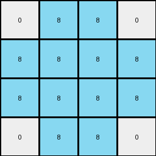
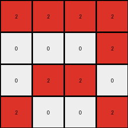
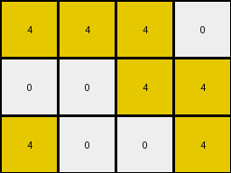
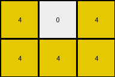

# bc1d5164 • 030 • refine_coder

---

Previous Code:
```python
"""
The transformation identifies the dominant non-zero color in the input grid, then extracts rows and columns that contain this color, forming a smaller output grid.
"""

import numpy as np

def get_dominant_nonzero_color(grid):
    """
    Finds the most frequent non-zero color in the grid.
    """
    # Flatten the grid and convert to a list
    flat_grid = grid.flatten().tolist()
    # Find unique non-zero colors
    nonzero_colors = [color for color in set(flat_grid) if color != 0]

    # Handle the edge case of input containing all zeros
    if not nonzero_colors:
        return None
    
    if len(nonzero_colors) == 1:
        return nonzero_colors[0]

    # Count occurrences of each non-zero color
    color_counts = {color: flat_grid.count(color) for color in nonzero_colors}
    # Return the color with the maximum count
    dominant_color = max(color_counts, key=color_counts.get)
    return dominant_color

def get_rows_with_color(grid, color):
    """
    Returns a list of row indices that contain the specified color.
    """
    rows = []
    for i, row in enumerate(grid):
        if color in row:
          if all(c in [0, color] for c in row):
            rows.append(i)
    return rows

def get_cols_with_color(grid, color):
    """
    Returns a list of column indices that contain the specified color.
    """
    cols = []
    for j in range(grid.shape[1]):
      col = grid[:,j]
      if color in col:
        if all(c in [0, color] for c in col):
          cols.append(j)
    return cols

def extract_rows(grid, row_indices):
    """Extracts specific rows from a grid, based on row indices."""
    return grid[row_indices]

def extract_cols(grid, col_indices):
    """Extracts specific columns from a grid, based on column indices."""
    return grid[:, col_indices]

def transform(input_grid):
    """
    Transforms the input grid by extracting rows and columns that contain the dominant non-zero color.
    """
    # Convert to numpy array for easier manipulation
    input_grid = np.array(input_grid)

    # 1. Identify the dominant non-zero color
    dominant_color = get_dominant_nonzero_color(input_grid)
    
    if dominant_color is None:
        return []

    # 2. Identify Rows with the dominant color
    rows_with_color = get_rows_with_color(input_grid, dominant_color)

    # 3. Filter Input by Rows
    intermediate_grid = extract_rows(input_grid, rows_with_color)
    
    # 4. Identify Columns with the dominant color in intermediate
    cols_with_color = get_cols_with_color(intermediate_grid, dominant_color)


    # 5. Filter Intermediate by Columns
    output_grid = extract_cols(intermediate_grid, cols_with_color)


    return output_grid.tolist()
```

Train Set Results:

## Example 1:

Input:
```
0 8 0 0 0 8 0
8 8 0 0 0 8 8
0 0 0 0 0 0 0
8 8 0 0 0 8 8
0 8 0 0 0 8 0
```
Expected Output:
```
0 8 0
8 8 8
0 8 0
```
Transformed Output:
```
0 8 8 0
8 8 8 8
8 8 8 8
0 8 8 0
```

match: False
pixels_off: None
size_correct: False
color_palette_correct: True
correct_pixel_counts: False

## Example 2:

Input:
```
2 2 0 0 0 2 2
0 0 0 0 0 0 2
0 0 0 0 0 0 0
0 2 0 0 0 2 0
2 0 0 0 0 0 2
```
Expected Output:
```
2 2 2
0 2 2
2 0 2
```
Transformed Output:
```
2 2 2 2
0 0 0 2
0 2 2 0
2 0 0 2
```

match: False
pixels_off: None
size_correct: False
color_palette_correct: True
correct_pixel_counts: False

## Example 3:

Input:
```
4 4 0 0 0 4 0
0 0 0 0 0 4 4
0 0 0 0 0 0 0
0 0 0 0 0 0 0
4 0 0 0 0 0 4
```
Expected Output:
```
4 4 0
0 4 4
4 0 4
```
Transformed Output:
```
4 4 4 0
0 0 4 4
4 0 0 4
```

match: False
pixels_off: None
size_correct: False
color_palette_correct: True
correct_pixel_counts: False

## Example 4:

Input:
```
4 0 0 0 0 0 4
0 0 0 0 0 0 0
0 0 0 0 0 0 0
0 0 0 0 0 0 0
4 0 0 0 0 4 4
```
Expected Output:
```
4 0 4
0 0 0
4 4 4
```
Transformed Output:
```
4 0 4
4 4 4
```

match: False
pixels_off: None
size_correct: False
color_palette_correct: True
correct_pixel_counts: False

## Example 5:

Input:
```
0 3 0 0 0 3 0
3 0 0 0 0 0 3
0 0 0 0 0 0 0
0 0 0 0 0 0 0
0 0 0 0 0 0 3
```
Expected Output:
```
0 3 0
3 0 3
0 0 3
```
Transformed Output:
```
0 3 3 0
3 0 0 3
0 0 0 3
```

match: False
pixels_off: None
size_correct: False
color_palette_correct: True
correct_pixel_counts: False
Okay, here's a breakdown of the situation and a plan to move forward:

**General Assessment:**

The initial natural language program and the resulting code were too simplistic. While it correctly identified the dominant non-zero color, the logic for extracting rows and columns was flawed. It appears the code was intended to select *only* rows and columns that exclusively contained the dominant color and 0. This isn't what the examples demonstrate. The actual transformation seems to extract a subgrid based on *any* occurrence of the dominant color in a row and column, but the details are different than previously coded. The code needs an update to its row and column filtering logic.

**Strategy:**

1.  **Refine Row/Column Selection:** The current selection criteria (rows/columns with *only* the dominant color or 0) is incorrect. We need to change this to select rows and columns that contain the dominant color *at least once*.
2. **Intersection:** It isn't clear if rows and columns are filtered on the original input or if there is some interaction. The error images seem to indicate that the output is created at the intersection of selected rows and columns.
3. **Re-verify with Corrected Logic:**  After updating the code, we need to re-run the validation against *all* training examples to confirm the fix.

**Metrics and Observations:**

Here's a more structured analysis of each example, focusing on the selection of rows and columns.

*   **Example 1:**
    *   Input Size: 5x7
    *   Dominant Color: 8 (azure)
    *   Expected Output Size: 3x3
    *   Rows with Dominant Color (in Input): 0, 1, 3, 4
    *   Cols with Dominant Color (in Input): 1, 5
    *   Expected output rows appear to be: 0, 1, 4
    *   Expected output cols appear to be: 1, 5, 6 (of original)

*   **Example 2:**
    *   Input Size: 5x7
    *   Dominant Color: 2 (red)
    *   Expected Output Size: 3x3
    *   Rows with Dominant Color (in Input): 0, 3, 4
    *   Cols with Dominant Color (in Input): 0, 1, 5, 6
    *  Expected output rows appear to be: 0, 3, 4
    *  Expected output cols appear to be: 0, 1, 5

*   **Example 3:**
    *   Input Size: 5x7
    *   Dominant Color: 4 (yellow)
    *   Expected Output Size: 3x3
    *   Rows with Dominant Color (in Input): 0, 1, 4
    *   Cols with Dominant Color (in Input): 0, 1, 5, 6
        *  Expected output rows appear to be: 0, 1, 4
    *  Expected output cols appear to be: 0, 1, 5

*   **Example 4:**
    *   Input Size: 5x7
    *   Dominant Color: 4 (yellow)
    *   Expected Output Size: 3x3
    *   Rows with Dominant Color (in Input): 0, 4
    *   Cols with Dominant Color (in Input): 0, 5, 6
    *   Expected output rows: 0, 4
    *   Expected output cols: 0,5,6

*   **Example 5:**
    *   Input Size: 5x7
    *   Dominant Color: 3 (green)
    *   Expected Output Size: 3x3
    *   Rows with Dominant Color (in Input): 0, 1
    *   Cols with Dominant Color (in Input): 1, 5, 6
    *   Expected output rows: 0,1,4
    *   Expected output cols: 1,5,6

**YAML Facts:**

```yaml
observations:
  - object: input_grid
    type: 2D array
    properties:
      - contains: integers 0-9 (representing colors)
      - dominant_color: most frequent non-zero color

  - object: output_grid
    type: 2D array
    properties:
      - derived_from: input_grid
      - contains: subset of input_grid colors
      - size: determined by rows and columns containing dominant_color

  - action: find_dominant_color
    description: Identifies the most frequent non-zero color in the input grid.

  - action: select_rows
    description: Selects rows from the input grid that contain the dominant color.
    criteria: Row must contain at least one instance of the dominant color.

  - action: select_columns
    description: Selects columns from the input grid that contain the dominant color.
    criteria: Column must contain at least one instance of the dominant color.
    
  - action: create_output
    description: creates the final output by including cells at the intersection of the selected rows and columns
    constraints:
      - row_index must be in selected_rows
      - col_index must be in selected_cols
```

**Natural Language Program:**

1.  **Identify Dominant Color:** Find the most frequent non-zero color in the input grid.
2.  **Select Rows:** Identify all rows in the input grid that contain the dominant color at least once.
3.  **Select Columns:** Identify all columns in the input grid that contain the dominant color at least once.
4.  **Construct Output:** Create the output grid by extracting the cells from the input grid that are located at the intersection of the selected rows and columns. Specifically, a cell at `input_grid[row][col]` is included in the output if and only if `row` is in the set of selected rows *and* `col` is in the set of selected columns.

The previous version incorrectly assumed that a row/column was valid only if *all* of its elements are the dominant color or zero. This version corrects that to include any row or column that contains the color at least once and clarifies that the output includes only those cells that are located at the intersection of the selected rows and columns.

**INSTRUCTIONS**

- generate a Python module to represent the natural language program 
- follow the template below
- all common math and science libraries are available
- create docstring only at top - but comment the workflow in the function
- use helper functions for common operations like finding objects, counting,
  measuring, moving, etc. 

remember - we are working iteratively - so this code will inform your future
self as we converge on the solution

*template:*

```python
"""
{{ natural language description of the transformation rule }}
"""

{{ imports }}

def transform(input_grid):
    # initialize output_grid

    # change output pixels 

    return output_grid

```
