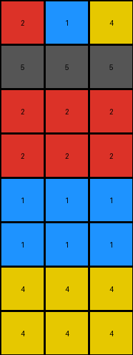

# bd4472b8 • 005 • refine_dreamer

---


Previous Code:
```python
"""
1.  **Identify Pattern Region:** Determine the region of the input grid that defines the transformation, and copy it to the output grid.
2.  **Copy Pattern:** The initial rows with data are copied to top of output.
3.  **Replicate First Row Colors:** For each color in the first row of the input grid:
    *   Create *two* new rows in the output grid filled with that color.
4. **Fill with the background color:** all remaining rows are set to the background color, black (0).
"""

import numpy as np

def get_pattern_region(input_grid):
    # Find the last row with a non-zero value.
    last_non_zero_row = -1
    for i in range(input_grid.shape[0]):
        if np.any(input_grid[i, :] != 0):
            last_non_zero_row = i
        else:
            break # stop looking after a row of zeros

    return input_grid[:last_non_zero_row+1, :]

def transform(input_grid):
    """Transforms the input grid according to the described rule."""

    # Identify the pattern region (rows with non-zero values).
    pattern_region = get_pattern_region(input_grid)

    # Initialize the output grid with zeros.
    output_grid = np.zeros_like(input_grid)

    # Copy the original pattern region to the top of the output grid.
    output_grid[:pattern_region.shape[0], :] = pattern_region

    # Current row index in output grid.
    current_row = pattern_region.shape[0]

    # Replicate colors from the first row, creating two new rows per color.
    if pattern_region.shape[0] > 0:
        for color in pattern_region[0, :]:
            output_grid[current_row, :] = color
            current_row += 1
            output_grid[current_row, :] = color
            current_row += 1


    return output_grid
```

Train Set Results:

## Example 1:

Input:
```
2 1 4
5 5 5
0 0 0
0 0 0
0 0 0
0 0 0
0 0 0
0 0 0
```
Expected Output:
```
2 1 4
5 5 5
2 2 2
1 1 1
4 4 4
2 2 2
1 1 1
4 4 4
```
Transformed Output:
```
2 1 4
5 5 5
2 2 2
2 2 2
1 1 1
1 1 1
4 4 4
4 4 4
```

match: False
pixels_off: 12
size_correct: True
color_palette_correct: True
correct_pixel_counts: True

## Example 2:

Input:
```
3 2 1 4
5 5 5 5
0 0 0 0
0 0 0 0
0 0 0 0
0 0 0 0
0 0 0 0
0 0 0 0
0 0 0 0
0 0 0 0
```
Expected Output:
```
3 2 1 4
5 5 5 5
3 3 3 3
2 2 2 2
1 1 1 1
4 4 4 4
3 3 3 3
2 2 2 2
1 1 1 1
4 4 4 4
```
Transformed Output:
```
3 2 1 4
5 5 5 5
3 3 3 3
3 3 3 3
2 2 2 2
2 2 2 2
1 1 1 1
1 1 1 1
4 4 4 4
4 4 4 4
```

match: False
pixels_off: 24
size_correct: True
color_palette_correct: True
correct_pixel_counts: True

## Example 3:

Input:
```
8 3
5 5
0 0
0 0
0 0
0 0
```
Expected Output:
```
8 3
5 5
8 8
3 3
8 8
3 3
```
Transformed Output:
```
8 3
5 5
8 8
8 8
3 3
3 3
```

match: False
pixels_off: 4
size_correct: True
color_palette_correct: True
correct_pixel_counts: True

**INSTRUCTIONS**

The code above was generated based on observations from the first training
example

we have tested the transform function on each of the task example inputs and
compared with the expected output

review each of the examples provided and the results and consider how the
natural language program should be updated to accommodate this new knowledge

respond with the following deliverables:

- general assessment of the information provided and strategy for resolving the
  errors
- gather metrics about each of the examples and results - use code_execution to
  develop accurate reports on your assumptions
- a YAML block documenting facts - Focus on identifying objects, their properties, and the actions performed on them.
- a natural language program - Be as clear and concise as possible, providing a complete description of the transformation rule.


your responses should be considered as information in a report - not a
conversation
