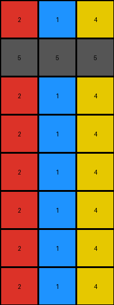
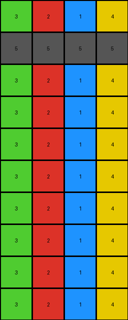

# bd4472b8 • 009 • refine_dreamer

---

Previous Code:
```python
"""
1. **Copy:** Copy the first two rows of the input grid directly to the output grid.
2. **Repeat:** Take the first row of the input grid.
3. **Fill Bottom:** Starting from the third row of the output grid, fill all subsequent rows by repeating the sequence of digits from the first row. Repeat the first row sequence four times in total to fill the output. The rows created are 4 * 2 = 8 rows.
"""

import numpy as np

def transform(input_grid):
    # Initialize output_grid as a copy of input_grid to avoid modifying the original
    output_grid = np.copy(input_grid)

    # Copy the first two rows
    # This is already done by initializing output_grid as a copy of input_grid

    # Get the first row
    first_row = input_grid[0]

    # Fill the rest of the output grid
    for i in range(2, len(output_grid), 2):  #start at row index 2 which is the third row
        output_grid[i] = first_row
        if i + 1 < len(output_grid):
            output_grid[i+1] = first_row
    return output_grid
```

Train Set Results:

## Example 1:

Input:
```
2 1 4
5 5 5
0 0 0
0 0 0
0 0 0
0 0 0
0 0 0
0 0 0
```
Expected Output:
```
2 1 4
5 5 5
2 2 2
1 1 1
4 4 4
2 2 2
1 1 1
4 4 4
```
Transformed Output:
```
2 1 4
5 5 5
2 1 4
2 1 4
2 1 4
2 1 4
2 1 4
2 1 4
```

match: False
pixels_off: 12
size_correct: True
color_palette_correct: True
correct_pixel_counts: True

## Example 2:

Input:
```
3 2 1 4
5 5 5 5
0 0 0 0
0 0 0 0
0 0 0 0
0 0 0 0
0 0 0 0
0 0 0 0
0 0 0 0
0 0 0 0
```
Expected Output:
```
3 2 1 4
5 5 5 5
3 3 3 3
2 2 2 2
1 1 1 1
4 4 4 4
3 3 3 3
2 2 2 2
1 1 1 1
4 4 4 4
```
Transformed Output:
```
3 2 1 4
5 5 5 5
3 2 1 4
3 2 1 4
3 2 1 4
3 2 1 4
3 2 1 4
3 2 1 4
3 2 1 4
3 2 1 4
```

match: False
pixels_off: 24
size_correct: True
color_palette_correct: True
correct_pixel_counts: True

## Example 3:

Input:
```
8 3
5 5
0 0
0 0
0 0
0 0
```
Expected Output:
```
8 3
5 5
8 8
3 3
8 8
3 3
```
Transformed Output:
```
8 3
5 5
8 3
8 3
8 3
8 3
```

match: False
pixels_off: 4
size_correct: True
color_palette_correct: True
correct_pixel_counts: True
**INSTRUCTIONS**

The code above was generated based on observations from the first training
example

we have tested the transform function on each of the task example inputs and
compared with the expected output

review each of the examples provided and the results and consider how the
natural language program should be updated to accommodate this new knowledge

respond with the following deliverables:

- general assessment of the information provided and strategy for resolving the
  errors
- gather metrics about each of the examples and results - use code_execution to
  develop accurate reports on your assumptions
- a YAML block documenting facts - Focus on identifying objects, their properties, and the actions performed on them.
- a natural language program - Be as clear and concise as possible, providing a complete description of the transformation rule.


your responses should be considered as information in a report - not a
conversation
