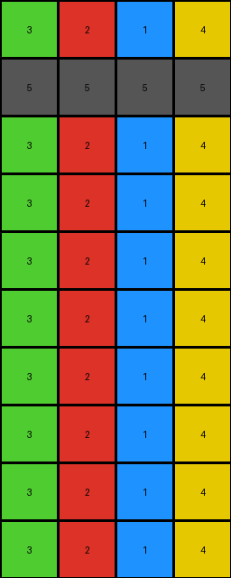

# bd4472b8 • 011 • refine_dreamer

---

Previous Code:
```python
"""
1.  **Copy First Two Rows:** Copy the first two rows of the `input_grid` directly to the `output_grid`.

2.  **Element-wise Repetition:** For each element (pixel value) in the first row of the `input_grid`:
    *   Create subsequent rows in the `output_grid` by repeating that element to create columns of each value from the first row, repeated for the height of the original input grid.

3. The number of rows created below the copied rows is equal to the input_grid height minus two, which is the number of rows copied to the top.
"""

import numpy as np

def transform(input_grid):
    # Initialize output_grid with the same dimensions as the input_grid
    output_grid = np.copy(input_grid)

    # Copy the first two rows of the input_grid to the output_grid
    #output_grid[:2] = input_grid[:2]  # Already handled by np.copy

    # Get the first row of the input grid
    first_row = input_grid[0]
    num_rows_to_add = input_grid.shape[0] - 2

    # Iterate through each element in the first row and create new rows
    for i in range(len(first_row)):
      for j in range(num_rows_to_add):
        output_grid[2 + j, i] = first_row[i]

    return output_grid
```

Train Set Results:

## Example 1:

Input:
```
2 1 4
5 5 5
0 0 0
0 0 0
0 0 0
0 0 0
0 0 0
0 0 0
```
Expected Output:
```
2 1 4
5 5 5
2 2 2
1 1 1
4 4 4
2 2 2
1 1 1
4 4 4
```
Transformed Output:
```
2 1 4
5 5 5
2 1 4
2 1 4
2 1 4
2 1 4
2 1 4
2 1 4
```

match: False
pixels_off: 12
size_correct: True
color_palette_correct: True
correct_pixel_counts: True

## Example 2:

Input:
```
3 2 1 4
5 5 5 5
0 0 0 0
0 0 0 0
0 0 0 0
0 0 0 0
0 0 0 0
0 0 0 0
0 0 0 0
0 0 0 0
```
Expected Output:
```
3 2 1 4
5 5 5 5
3 3 3 3
2 2 2 2
1 1 1 1
4 4 4 4
3 3 3 3
2 2 2 2
1 1 1 1
4 4 4 4
```
Transformed Output:
```
3 2 1 4
5 5 5 5
3 2 1 4
3 2 1 4
3 2 1 4
3 2 1 4
3 2 1 4
3 2 1 4
3 2 1 4
3 2 1 4
```

match: False
pixels_off: 24
size_correct: True
color_palette_correct: True
correct_pixel_counts: True

## Example 3:

Input:
```
8 3
5 5
0 0
0 0
0 0
0 0
```
Expected Output:
```
8 3
5 5
8 8
3 3
8 8
3 3
```
Transformed Output:
```
8 3
5 5
8 3
8 3
8 3
8 3
```

match: False
pixels_off: 4
size_correct: True
color_palette_correct: True
correct_pixel_counts: True
**INSTRUCTIONS**

The code above was generated based on observations from the first training
example

we have tested the transform function on each of the task example inputs and
compared with the expected output

review each of the examples provided and the results and consider how the
natural language program should be updated to accommodate this new knowledge

respond with the following deliverables:

- general assessment of the information provided and strategy for resolving the
  errors
- gather metrics about each of the examples and results - use code_execution to
  develop accurate reports on your assumptions
- a YAML block documenting facts - Focus on identifying objects, their properties, and the actions performed on them.
- a natural language program - Be as clear and concise as possible, providing a complete description of the transformation rule.


your responses should be considered as information in a report - not a
conversation
