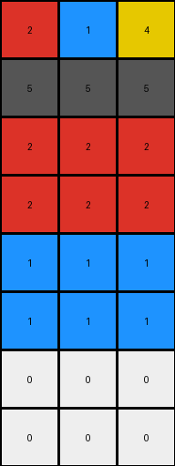
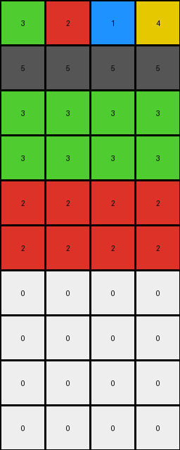
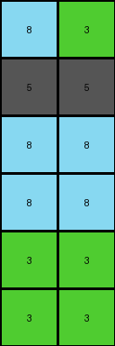

# bd4472b8 • 015 • refine_dreamer

---


Previous Code:
```python
"""
1.  **Initialization:** Obtain the input grid, which is a 2D array of integers.
2.  **Preserve top:** The first two rows of the input will maintain it's value to the output.
3. **Iterate:** Iterate through each of the next two rows, from row index 2 and row index 3.
4.  **Replacement:** For each pixel within the current row, if the pixel's value is 0 (white): check the position.
5. **Next Two Rows**: Iterate over row index 4 and 5.
6. Replace zero with the value of the first cell (0,0).
7. **Next Two Rows**: Iterate over row index 6 and 7.
8. Replace zero with the value of the second cell (0,1).
9.  **Output:** Return the modified grid as the output grid.
"""

import numpy as np

def transform(input_grid):
    output_grid = np.copy(input_grid)
    rows, cols = output_grid.shape

    # Preserve top two rows
    # No change needed as output_grid is initialized with input_grid

    # Iterate through rows 2 and 3 (index 2 and 3)
    for i in range(2, 4):
        for j in range(cols):
            if output_grid[i, j] == 0:
              output_grid[i,j] = output_grid[0,0]

    # Iterate through rows 4 and 5 (index 4 and 5)
    for i in range(4, min(6,rows)):  #added min() for edge case
        for j in range(cols):
             if output_grid[i, j] == 0:
              output_grid[i,j] = output_grid[0,1]
    
    return output_grid
```

Train Set Results:

## Example 1:

Input:
```
2 1 4
5 5 5
0 0 0
0 0 0
0 0 0
0 0 0
0 0 0
0 0 0
```
Expected Output:
```
2 1 4
5 5 5
2 2 2
1 1 1
4 4 4
2 2 2
1 1 1
4 4 4
```
Transformed Output:
```
2 1 4
5 5 5
2 2 2
2 2 2
1 1 1
1 1 1
0 0 0
0 0 0
```

match: False
pixels_off: 15
size_correct: True
color_palette_correct: False
correct_pixel_counts: False

## Example 2:

Input:
```
3 2 1 4
5 5 5 5
0 0 0 0
0 0 0 0
0 0 0 0
0 0 0 0
0 0 0 0
0 0 0 0
0 0 0 0
0 0 0 0
```
Expected Output:
```
3 2 1 4
5 5 5 5
3 3 3 3
2 2 2 2
1 1 1 1
4 4 4 4
3 3 3 3
2 2 2 2
1 1 1 1
4 4 4 4
```
Transformed Output:
```
3 2 1 4
5 5 5 5
3 3 3 3
3 3 3 3
2 2 2 2
2 2 2 2
0 0 0 0
0 0 0 0
0 0 0 0
0 0 0 0
```

match: False
pixels_off: 28
size_correct: True
color_palette_correct: False
correct_pixel_counts: False

## Example 3:

Input:
```
8 3
5 5
0 0
0 0
0 0
0 0
```
Expected Output:
```
8 3
5 5
8 8
3 3
8 8
3 3
```
Transformed Output:
```
8 3
5 5
8 8
8 8
3 3
3 3
```

match: False
pixels_off: 4
size_correct: True
color_palette_correct: True
correct_pixel_counts: True

**INSTRUCTIONS**

The code above was generated based on observations from the first training
example

we have tested the transform function on each of the task example inputs and
compared with the expected output

review each of the examples provided and the results and consider how the
natural language program should be updated to accommodate this new knowledge

respond with the following deliverables:

- general assessment of the information provided and strategy for resolving the
  errors
- gather metrics about each of the examples and results - use code_execution to
  develop accurate reports on your assumptions
- a YAML block documenting facts - Focus on identifying objects, their properties, and the actions performed on them.
- a natural language program - Be as clear and concise as possible, providing a complete description of the transformation rule.


your responses should be considered as information in a report - not a
conversation
