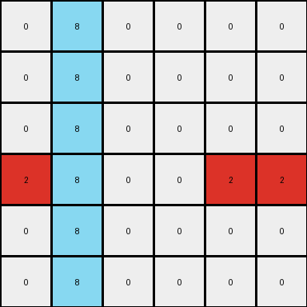

# bdad9b1f • 003 • refine_dreamer

---


Previous Code:
```python
"""
1.  **Identify Key Features:** Locate the horizontal row containing red pixels (value '2') and the vertical column containing azure pixels (value '8').

2.  **Intersection:** Find the cell where the identified row and column intersect. Change this cell's value to yellow (value '4').

3.  **Propagation:**  Extend the red pixels (2) to the right along the row until you meet the cell intersecting the azure column.

4.  **Replicate:** Copy the azure pixels vertically along the whole column.
"""

import numpy as np

def find_row_with_color(grid, color):
    for i, row in enumerate(grid):
        if color in row:
            return i
    return -1

def find_col_with_color(grid, color):
    grid_t = grid.transpose()
    for i, col in enumerate(grid_t):
        if color in col:
            return i
    return -1
    

def transform(input_grid):
    # initialize output_grid
    output_grid = np.copy(input_grid)
    
    # find the red row and azure column
    red_row = find_row_with_color(input_grid, 2)
    azure_col = find_col_with_color(input_grid, 8)
    
    # intersection point to yellow
    output_grid[red_row, azure_col] = 4

    # extend red to intersection
    for j in range(input_grid.shape[1]):
        if output_grid[red_row,j] == 0:
            output_grid[red_row,j] = 2
        if j == azure_col:
            break
    
    # fill azure down the column
    for i in range(output_grid.shape[0]):
        output_grid[i, azure_col] = 8
    
    return output_grid
```

Train Set Results:

## Example 1:

Input:
```
0 0 0 0 8 0
0 0 0 0 8 0
2 2 0 0 0 0
0 0 0 0 0 0
0 0 0 0 0 0
0 0 0 0 0 0
```
Expected Output:
```
0 0 0 0 8 0
0 0 0 0 8 0
2 2 2 2 4 2
0 0 0 0 8 0
0 0 0 0 8 0
0 0 0 0 8 0
```
Transformed Output:
```
0 0 0 0 8 0
0 0 0 0 8 0
2 2 2 2 8 0
0 0 0 0 8 0
0 0 0 0 8 0
0 0 0 0 8 0
```

match: False
pixels_off: 2
size_correct: True
color_palette_correct: True
correct_pixel_counts: False

## Example 2:

Input:
```
0 8 0 0 0 0
0 8 0 0 0 0
0 0 0 0 0 0
0 0 0 0 2 2
0 0 0 0 0 0
0 0 0 0 0 0
```
Expected Output:
```
0 8 0 0 0 0
0 8 0 0 0 0
0 8 0 0 0 0
2 4 2 2 2 2
0 8 0 0 0 0
0 8 0 0 0 0
```
Transformed Output:
```
0 8 0 0 0 0
0 8 0 0 0 0
0 8 0 0 0 0
2 8 0 0 2 2
0 8 0 0 0 0
0 8 0 0 0 0
```

match: False
pixels_off: 3
size_correct: True
color_palette_correct: True
correct_pixel_counts: False

**INSTRUCTIONS**

The code above was generated based on observations from the first training
example

we have tested the transform function on each of the task example inputs and
compared with the expected output

review each of the examples provided and the results and consider how the
natural language program should be updated to accommodate this new knowledge

respond with the following deliverables:

- general assessment of the information provided and strategy for resolving the
  errors
- gather metrics about each of the examples and results - use code_execution to
  develop accurate reports on your assumptions
- a YAML block documenting facts - Focus on identifying objects, their properties, and the actions performed on them.
- a natural language program - Be as clear and concise as possible, providing a complete description of the transformation rule.


your responses should be considered as information in a report - not a
conversation
