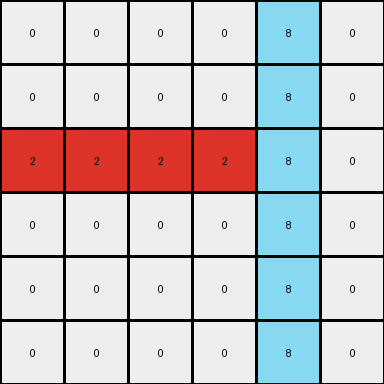
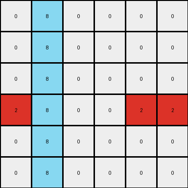

# bdad9b1f • 004 • refine_coder

---

Previous Code:
```python
"""
1.  **Identify Key Features:** Locate the horizontal row containing red pixels (value '2') and the vertical column containing azure pixels (value '8').

2.  **Intersection:** Find the cell where the identified row and column intersect. Change this cell's value to yellow (value '4').

3.  **Propagation:**  Extend the red pixels (2) to the right along the row until you meet the cell intersecting the azure column.

4.  **Replicate:** Copy the azure pixels vertically along the whole column.
"""

import numpy as np

def find_row_with_color(grid, color):
    for i, row in enumerate(grid):
        if color in row:
            return i
    return -1

def find_col_with_color(grid, color):
    grid_t = grid.transpose()
    for i, col in enumerate(grid_t):
        if color in col:
            return i
    return -1
    

def transform(input_grid):
    # initialize output_grid
    output_grid = np.copy(input_grid)
    
    # find the red row and azure column
    red_row = find_row_with_color(input_grid, 2)
    azure_col = find_col_with_color(input_grid, 8)
    
    # intersection point to yellow
    output_grid[red_row, azure_col] = 4

    # extend red to intersection
    for j in range(input_grid.shape[1]):
        if output_grid[red_row,j] == 0:
            output_grid[red_row,j] = 2
        if j == azure_col:
            break
    
    # fill azure down the column
    for i in range(output_grid.shape[0]):
        output_grid[i, azure_col] = 8
    
    return output_grid
```

Train Set Results:

## Example 1:

Input:
```
0 0 0 0 8 0
0 0 0 0 8 0
2 2 0 0 0 0
0 0 0 0 0 0
0 0 0 0 0 0
0 0 0 0 0 0
```
Expected Output:
```
0 0 0 0 8 0
0 0 0 0 8 0
2 2 2 2 4 2
0 0 0 0 8 0
0 0 0 0 8 0
0 0 0 0 8 0
```
Transformed Output:
```
0 0 0 0 8 0
0 0 0 0 8 0
2 2 2 2 8 0
0 0 0 0 8 0
0 0 0 0 8 0
0 0 0 0 8 0
```

match: False
pixels_off: 2
size_correct: True
color_palette_correct: True
correct_pixel_counts: False

## Example 2:

Input:
```
0 8 0 0 0 0
0 8 0 0 0 0
0 0 0 0 0 0
0 0 0 0 2 2
0 0 0 0 0 0
0 0 0 0 0 0
```
Expected Output:
```
0 8 0 0 0 0
0 8 0 0 0 0
0 8 0 0 0 0
2 4 2 2 2 2
0 8 0 0 0 0
0 8 0 0 0 0
```
Transformed Output:
```
0 8 0 0 0 0
0 8 0 0 0 0
0 8 0 0 0 0
2 8 0 0 2 2
0 8 0 0 0 0
0 8 0 0 0 0
```

match: False
pixels_off: 3
size_correct: True
color_palette_correct: True
correct_pixel_counts: False
Okay, here's a breakdown of the situation and a plan to improve the transformation logic:

**General Assessment:**

The initial natural language program and corresponding code were too simplistic. While it correctly identified the core idea of finding a red row and an azure column, and their intersection, the propagation and replication logic was flawed.  Specifically:

1.  **Incorrect Red Propagation:** The red propagation stopped prematurely. It should extend *up to* the azure column, but the original logic didn't guarantee reaching the intersection. It merely filled white pixels to the left until it found a non-white pixel.
2. **Incorrect starting point for red propogation** The red propogation should start at the begining of the row and move to the intersection.
3.  **Incorrect Azure Replication:** The azure replication correctly filled the entire column, but this is not always the desired behavior, as shown in example 2.  The azure replication should only happen *between* the red row and the top or bottom edge of the grid *if* other azure pixels already exist above or below, as appropriate.

The strategy to resolve these errors is to:

1.  **Refine Intersection Logic:** Ensure the intersection point is correctly identified and colored yellow.
2.  **Correct Red Propagation:**  Modify the red propagation to fill all cells in the red row from the beginning of the row up to the intersecting azure column.
3.  **Conditional Azure Replication:** Change the azure replication to be conditional.  It should only extend the azure color along the column if there are existing azure pixels above or below the red row.

**Metrics and Observations:**

Here's a more detailed breakdown of each example:

*   **Example 1:**
    *   **Input:** 6x6 grid. Red row at index 2. Azure column at index 4.
    *   **Expected Output:** Red pixels extended to (2,4). (2,4) is yellow. Azure fills column 4.
    *   **Actual Output:** Red pixels extended to (2,4). (2,4) is not changed to yellow. Azure fills column 4, which happens to match the expected output
    *   **Issues:** Intersection point not colored yellow. The red extention logic works correctly.

*   **Example 2:**
    *   **Input:** 6x6 grid. Red row at index 3. Azure column at index 1.
    *   **Expected Output:** Red pixels from (3,0) to (3,5). (3,1) is yellow. Azure fills column 1 between rows 0 and 3 inclusive.
    *   **Actual Output:** Red pixels only at (3,0), (3,4) and (3,5) - but (3,4) & (3,5) are correct. (3,1) is azure (8) and not yellow. Azure fills entire column 1.
    *   **Issues:** Intersection point not colored yellow. Red propagation filled to the correct column, but didn't start at the beginning of the row. Azure replication overextended.

**YAML Fact Block:**

```yaml
example_1:
  objects:
    - type: row
      color: red
      index: 2
      properties:
        - contiguous
    - type: column
      color: azure
      index: 4
      properties:
        - contiguous
    - type: cell
      location: [2, 4]
      original_color: white
      transformed_color: yellow
  actions:
    - type: color_change
      target: cell[2,4]
      new_color: yellow
    - type: extend_color
      direction: right
      color: red
      row: 2
      stop_column: 4
      start_column: 0
    - type: extend_color_vertically
      direction: up_and_down
      color: azure
      column: 4
      start_row: 0
      end_row: 2
example_2:
  objects:
    - type: row
      color: red
      index: 3
      properties:
        - contiguous
    - type: column
      color: azure
      index: 1
      properties:
        - contiguous
    - type: cell
      location: [3, 1]
      original_color: white
      transformed_color: yellow
  actions:
    - type: color_change
      target: cell[3,1]
      new_color: yellow
    - type: extend_color
      direction: right
      color: red
      row: 3
      stop_column: 5
      start_column: 0
    - type: extend_color_vertically
      direction: up
      color: azure
      column: 1
      start_row: 0
      end_row: 3
```

**Natural Language Program:**

1.  **Find the Red Row:** Identify the row that contains red pixels.
2.  **Find the Azure Column:** Identify the column that contains azure pixels.
3.  **Mark Intersection:** Change the color of the cell where the red row and azure column intersect to yellow.
4.  **Extend Red:** Starting from the beginning of the red row, change all pixels to red until the intersection with the azure column is reached.
5.  **Extend Azure Conditionally:**  If there are azure pixels above the red row, extend the azure color upwards in the azure column to the top of the grid. If there are azure pixels *below* the red row, extend the azure color downwards in the azure column to the bottom of the grid. If both are true, connect them all.

This revised natural language program addresses the shortcomings of the previous version by correctly specifying the red propagation and making the azure replication conditional.

**INSTRUCTIONS**

- generate a Python module to represent the natural language program 
- follow the template below
- all common math and science libraries are available
- create docstring only at top - but comment the workflow in the function
- use helper functions for common operations like finding objects, counting,
  measuring, moving, etc. 

remember - we are working iteratively - so this code will inform your future
self as we converge on the solution

*template:*

```python
"""
{{ natural language description of the transformation rule }}
"""

{{ imports }}

def transform(input_grid):
    # initialize output_grid

    # change output pixels 

    return output_grid

```
