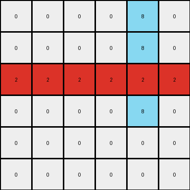
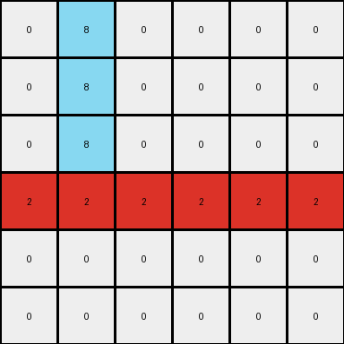

# bdad9b1f • 009 • refine_dreamer

---

Previous Code:
```python
"""
1. **Copy and Extend Azure:** Locate the vertical azure (8) line in the input grid. Copy this line to the output grid. Extend the copied line downwards by one additional azure pixel and by two.
2.  **Copy and Extend Red:** Locate the horizontal red (2) object. Copy and expand to fill the row, except where the azure object is.
3.  **Create Intersection:** Find the intersection point of the extended azure line (from step 1) and the original red line (from step 2).
4.  **Yellow Intersection**: Create a single pixel sized yellow(4) object at the intersection.
5. All other values in the output will match the input, in this case, the white background.
"""

import numpy as np

def find_object(grid, color):
    # Find coordinates of all pixels of the specified color.
    coords = np.argwhere(grid == color)
    if coords.size == 0:
        return None
    return coords

def transform(input_grid):
    output_grid = np.copy(input_grid)

    # 1. Copy and Extend Azure
    azure_coords = find_object(input_grid, 8)
    if azure_coords is not None:
        # Find the min and max row to identify the object
        min_row = np.min(azure_coords[:, 0])
        max_row = np.max(azure_coords[:, 0])
        col = azure_coords[0, 1]  # Column is constant for a vertical line
        # Copy and extend down
        for row in range(min_row, max_row + 3): # increased range
             if 0 <= row < output_grid.shape[0]:
                  output_grid[row, col] = 8

    # 2. Copy and Expand Red.
    red_coords = find_object(input_grid, 2)
    if (red_coords is not None):
      min_col = np.min(red_coords[:,1])
      max_col = np.max(red_coords[:,1])
      row = red_coords[0,0]

      for col in range(0, output_grid.shape[1]):
        output_grid[row,col] = 2

    # 3 & 4. Yellow Intersection
    azure_coords = find_object(output_grid, 8)
    red_coords = find_object(output_grid, 2)
    if (azure_coords is not None) and (red_coords is not None):
        for a_coord in azure_coords:
          for r_coord in red_coords:
            if (a_coord[0] == r_coord[0]):
                output_grid[a_coord[0], a_coord[1]] = 4

    return output_grid
```

Train Set Results:

## Example 1:

Input:
```
0 0 0 0 8 0
0 0 0 0 8 0
2 2 0 0 0 0
0 0 0 0 0 0
0 0 0 0 0 0
0 0 0 0 0 0
```
Expected Output:
```
0 0 0 0 8 0
0 0 0 0 8 0
2 2 2 2 4 2
0 0 0 0 8 0
0 0 0 0 8 0
0 0 0 0 8 0
```
Transformed Output:
```
0 0 0 0 8 0
0 0 0 0 8 0
2 2 2 2 2 2
0 0 0 0 8 0
0 0 0 0 0 0
0 0 0 0 0 0
```

match: False
pixels_off: 3
size_correct: True
color_palette_correct: True
correct_pixel_counts: False

## Example 2:

Input:
```
0 8 0 0 0 0
0 8 0 0 0 0
0 0 0 0 0 0
0 0 0 0 2 2
0 0 0 0 0 0
0 0 0 0 0 0
```
Expected Output:
```
0 8 0 0 0 0
0 8 0 0 0 0
0 8 0 0 0 0
2 4 2 2 2 2
0 8 0 0 0 0
0 8 0 0 0 0
```
Transformed Output:
```
0 8 0 0 0 0
0 8 0 0 0 0
0 8 0 0 0 0
2 2 2 2 2 2
0 0 0 0 0 0
0 0 0 0 0 0
```

match: False
pixels_off: 3
size_correct: True
color_palette_correct: True
correct_pixel_counts: False
**INSTRUCTIONS**

The code above was generated based on observations from the first training
example

we have tested the transform function on each of the task example inputs and
compared with the expected output

review each of the examples provided and the results and consider how the
natural language program should be updated to accommodate this new knowledge

respond with the following deliverables:

- general assessment of the information provided and strategy for resolving the
  errors
- gather metrics about each of the examples and results - use code_execution to
  develop accurate reports on your assumptions
- a YAML block documenting facts - Focus on identifying objects, their properties, and the actions performed on them.
- a natural language program - Be as clear and concise as possible, providing a complete description of the transformation rule.


your responses should be considered as information in a report - not a
conversation
