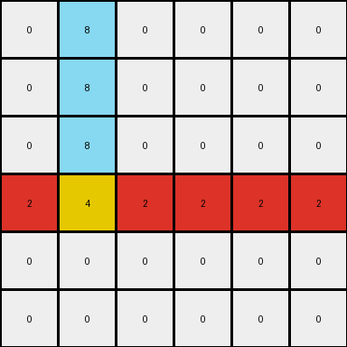

# bdad9b1f • 011 • refine_dreamer

---


Previous Code:
```python
"""
1.  **Locate and Extend Azure Line:** Find the vertical azure line in the input grid. Copy this line to the output grid. Extend this line downwards by two pixels, relative to its original end position.
2.  **Locate and Conditionally Fill Red Line:** Find the horizontal red line in the input grid. Copy the red line to the same row in the output grid. Fill the rest of that row with red, but stop before the column containing the azure line. Continue filling with red after the azure line column.
3.  **Create Yellow Intersection:** Place a single yellow pixel at the intersection of the extended azure line and the original red line. Specifically, the yellow pixel's row will be the same as the original red line, and its column will be the same as the original azure line.
4. All other cells in the output will match the corresponding cell in the input (in these examples the background is white (0)).
"""

import numpy as np

def find_object(grid, color):
    # Find coordinates of all pixels of the specified color.
    coords = np.argwhere(grid == color)
    if coords.size == 0:
        return None
    return coords

def transform(input_grid):
    output_grid = np.copy(input_grid)

    # 1. Locate and Extend Azure Line
    azure_coords = find_object(input_grid, 8)
    if azure_coords is not None:
        min_row = np.min(azure_coords[:, 0])
        max_row = np.max(azure_coords[:, 0])
        col = azure_coords[0, 1]
        for row in range(min_row, max_row + 3):  # Extend by two *additional* rows
            if 0 <= row < output_grid.shape[0]:
                output_grid[row, col] = 8

    # 2. Locate and Conditionally Fill Red Line
    red_coords = find_object(input_grid, 2)
    if red_coords is not None:
        row = red_coords[0, 0]
        if azure_coords is not None:
          azure_col = azure_coords[0,1]
          #fill red to the left of azure
          for col in range(0, azure_col):
            output_grid[row, col] = 2
          # fill red to the right of azure
          for col in range(azure_col + 1, output_grid.shape[1]):
              output_grid[row,col] = 2
        else: # if no azure, fill the entire row (should not happen in valid examples)
          for col in range(0,output_grid.shape[1]):
            output_grid[row,col] = 2

    # 3. Create Yellow Intersection
    if azure_coords is not None and red_coords is not None:
        red_row = red_coords[0, 0]
        azure_col = azure_coords[0, 1]
        if 0 <= red_row < output_grid.shape[0] and 0 <= azure_col < output_grid.shape[1] : # Added bounds check
          output_grid[red_row, azure_col] = 4

    return output_grid
```

Train Set Results:

## Example 1:

Input:
```
0 0 0 0 8 0
0 0 0 0 8 0
2 2 0 0 0 0
0 0 0 0 0 0
0 0 0 0 0 0
0 0 0 0 0 0
```
Expected Output:
```
0 0 0 0 8 0
0 0 0 0 8 0
2 2 2 2 4 2
0 0 0 0 8 0
0 0 0 0 8 0
0 0 0 0 8 0
```
Transformed Output:
```
0 0 0 0 8 0
0 0 0 0 8 0
2 2 2 2 4 2
0 0 0 0 8 0
0 0 0 0 0 0
0 0 0 0 0 0
```

match: False
pixels_off: 2
size_correct: True
color_palette_correct: True
correct_pixel_counts: False

## Example 2:

Input:
```
0 8 0 0 0 0
0 8 0 0 0 0
0 0 0 0 0 0
0 0 0 0 2 2
0 0 0 0 0 0
0 0 0 0 0 0
```
Expected Output:
```
0 8 0 0 0 0
0 8 0 0 0 0
0 8 0 0 0 0
2 4 2 2 2 2
0 8 0 0 0 0
0 8 0 0 0 0
```
Transformed Output:
```
0 8 0 0 0 0
0 8 0 0 0 0
0 8 0 0 0 0
2 4 2 2 2 2
0 0 0 0 0 0
0 0 0 0 0 0
```

match: False
pixels_off: 2
size_correct: True
color_palette_correct: True
correct_pixel_counts: False

**INSTRUCTIONS**

The code above was generated based on observations from the first training
example

we have tested the transform function on each of the task example inputs and
compared with the expected output

review each of the examples provided and the results and consider how the
natural language program should be updated to accommodate this new knowledge

respond with the following deliverables:

- general assessment of the information provided and strategy for resolving the
  errors
- gather metrics about each of the examples and results - use code_execution to
  develop accurate reports on your assumptions
- a YAML block documenting facts - Focus on identifying objects, their properties, and the actions performed on them.
- a natural language program - Be as clear and concise as possible, providing a complete description of the transformation rule.


your responses should be considered as information in a report - not a
conversation
