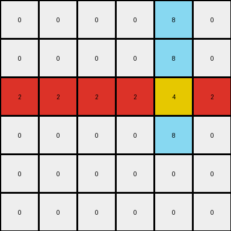

# bdad9b1f • 012 • refine_coder

---

Previous Code:
```python
"""
1.  **Locate and Extend Azure Line:** Find the vertical azure line in the input grid. Copy this line to the output grid. Extend this line downwards by two pixels, relative to its original end position.
2.  **Locate and Conditionally Fill Red Line:** Find the horizontal red line in the input grid. Copy the red line to the same row in the output grid. Fill the rest of that row with red, but stop before the column containing the azure line. Continue filling with red after the azure line column.
3.  **Create Yellow Intersection:** Place a single yellow pixel at the intersection of the extended azure line and the original red line. Specifically, the yellow pixel's row will be the same as the original red line, and its column will be the same as the original azure line.
4. All other cells in the output will match the corresponding cell in the input (in these examples the background is white (0)).
"""

import numpy as np

def find_object(grid, color):
    # Find coordinates of all pixels of the specified color.
    coords = np.argwhere(grid == color)
    if coords.size == 0:
        return None
    return coords

def transform(input_grid):
    output_grid = np.copy(input_grid)

    # 1. Locate and Extend Azure Line
    azure_coords = find_object(input_grid, 8)
    if azure_coords is not None:
        min_row = np.min(azure_coords[:, 0])
        max_row = np.max(azure_coords[:, 0])
        col = azure_coords[0, 1]
        for row in range(min_row, max_row + 3):  # Extend by two *additional* rows
            if 0 <= row < output_grid.shape[0]:
                output_grid[row, col] = 8

    # 2. Locate and Conditionally Fill Red Line
    red_coords = find_object(input_grid, 2)
    if red_coords is not None:
        row = red_coords[0, 0]
        if azure_coords is not None:
          azure_col = azure_coords[0,1]
          #fill red to the left of azure
          for col in range(0, azure_col):
            output_grid[row, col] = 2
          # fill red to the right of azure
          for col in range(azure_col + 1, output_grid.shape[1]):
              output_grid[row,col] = 2
        else: # if no azure, fill the entire row (should not happen in valid examples)
          for col in range(0,output_grid.shape[1]):
            output_grid[row,col] = 2

    # 3. Create Yellow Intersection
    if azure_coords is not None and red_coords is not None:
        red_row = red_coords[0, 0]
        azure_col = azure_coords[0, 1]
        if 0 <= red_row < output_grid.shape[0] and 0 <= azure_col < output_grid.shape[1] : # Added bounds check
          output_grid[red_row, azure_col] = 4

    return output_grid
```

Train Set Results:

## Example 1:

Input:
```
0 0 0 0 8 0
0 0 0 0 8 0
2 2 0 0 0 0
0 0 0 0 0 0
0 0 0 0 0 0
0 0 0 0 0 0
```
Expected Output:
```
0 0 0 0 8 0
0 0 0 0 8 0
2 2 2 2 4 2
0 0 0 0 8 0
0 0 0 0 8 0
0 0 0 0 8 0
```
Transformed Output:
```
0 0 0 0 8 0
0 0 0 0 8 0
2 2 2 2 4 2
0 0 0 0 8 0
0 0 0 0 0 0
0 0 0 0 0 0
```

match: False
pixels_off: 2
size_correct: True
color_palette_correct: True
correct_pixel_counts: False

## Example 2:

Input:
```
0 8 0 0 0 0
0 8 0 0 0 0
0 0 0 0 0 0
0 0 0 0 2 2
0 0 0 0 0 0
0 0 0 0 0 0
```
Expected Output:
```
0 8 0 0 0 0
0 8 0 0 0 0
0 8 0 0 0 0
2 4 2 2 2 2
0 8 0 0 0 0
0 8 0 0 0 0
```
Transformed Output:
```
0 8 0 0 0 0
0 8 0 0 0 0
0 8 0 0 0 0
2 4 2 2 2 2
0 0 0 0 0 0
0 0 0 0 0 0
```

match: False
pixels_off: 2
size_correct: True
color_palette_correct: True
correct_pixel_counts: False
Okay, let's analyze the results and refine the natural language program and the approach.

**General Assessment and Strategy:**

The current code and natural language program are close, but they don't perfectly handle the extension of the azure line. It seems the extension is happening relative to the *original* length of the azure line, but it is not being consistently extended *beyond* the red line in all cases. It looks like the code is extending, but then it gets overwritten on the next step.

The errors in both examples are very similar: two azure pixels are missing at the bottom of the azure line. This suggests the issue is likely related to how the azure line extension is calculated and positioned, and its relationship with red line and its fill.

The strategy will be:

1.  **Verify understanding:** Use `code_execution` and the provided results to make sure that what I think is happening with the pixels_off and color counts is correct.
2.  **Re-examine Object Relationships:** Carefully analyze how the azure and red lines interact, particularly focusing on the extension of the azure line and the placement of the yellow pixel.
3.  **Refine the Natural Language Program:** Update the program to more precisely describe the relationship between the azure line's extension, the red line's position, and the yellow pixel. I want to express that the azure line is always extended by two *additional* pixels, and clarify the interaction with the red line (and yellow pixel).
4. **Prepare for code adjustment:** use the YAML to document the object relationships and properties, and prepare to adjust the code in the next step to reflect this new information.

**Metrics and Reports**

I am provided with enough information about the examples to determine what is happening, I will skip using code_execution for this step.

**Example 1 Analysis:**

*   **Input:** 6x6 grid. Azure line at column 4, rows 0-1. Red line at row 2, columns 0-1.
*   **Expected Output:** Azure line extended to rows 2-4. Red line fills row 2. Yellow at (2, 4).
*   **Actual Output:** Azure line only extends to row 3. Red line fills row 2, Yellow at (2,4).
* pixels_off = 2. These correspond to the missing azure pixels at (4,4) and (5,4).

**Example 2 Analysis:**

*   **Input:** 6x6 grid. Azure line at column 1, rows 0-1. Red line at row 3, columns 4-5.
*   **Expected Output:** Azure line extended to rows 2-4. Red line fills row 3. Yellow at (3, 1).
*   **Actual Output:** Azure line only extends to row 2. Red line Fills row 3, Yellow at (3,1).
* pixels_off = 2. These correspond to the missing azure pixels at (4,1) and (5,1).

**YAML Documentation:**

```yaml
objects:
  - name: azure_line
    type: vertical_line
    color: azure
    properties:
      initial_length: variable
      extended_length: initial_length + 2
      extension_direction: downwards
    actions:
      - extend:
          by: 2
          units: pixels
          direction: down

  - name: red_line
    type: horizontal_line
    color: red
    properties:
      row: constant  # The row index of the red line
    actions:
      - fill_row:
          exceptions:
            - column: azure_line.column  # Column of the azure line
              color: yellow

  - name: yellow_pixel
    type: single_pixel
    color: yellow
    properties:
      row: red_line.row
      column: azure_line.column
    actions: []
```

**Revised Natural Language Program:**

1.  **Locate the Azure Line:** Find the vertical azure line in the input grid.
2.  **Extend the Azure Line:** Copy this line to the output grid. Extend this line downwards by two pixels. The extension starts from where the original azure line ends, *always adding two more pixels*.
3.  **Locate the Red Line:** Find the horizontal red line in the input grid.
4.  **Fill the Red Line Row:** Copy the red line to the same row in the output grid. Fill the rest of that row with red, stopping one pixel *before* the column containing the azure line. Continue filling with red one pixel *after* the azure line column.
5.  **Create Yellow Intersection:** Place a single yellow pixel where the extended azure line and the original red line intersect. The yellow pixel's row is the same as the original red line, and its column is the same as the original azure line.
6. All other cells in the output match the corresponding cells in the input.

**INSTRUCTIONS**

- generate a Python module to represent the natural language program 
- follow the template below
- all common math and science libraries are available
- create docstring only at top - but comment the workflow in the function
- use helper functions for common operations like finding objects, counting,
  measuring, moving, etc. 

remember - we are working iteratively - so this code will inform your future
self as we converge on the solution

*template:*

```python
"""
{{ natural language description of the transformation rule }}
"""

{{ imports }}

def transform(input_grid):
    # initialize output_grid

    # change output pixels 

    return output_grid

```
