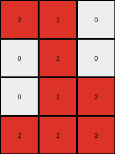
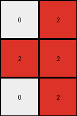
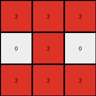

# be94b721 • 003 • refine_dreamer

---


Previous Code:
```python
"""
1.  **Identify Target:** Locate the contiguous region of red (value '2') pixels within the input grid.
2.  **Isolate:** Discard all pixels that are not part of the target red region.
3.  **Compress:** Remove all white (value '0') rows and columns that contain *only* white pixels, effectively shrinking the grid to tightly enclose the red region. The remaining red region constitutes the core of the output.
4. The result is the output grid.
"""

import numpy as np

def get_object(grid, color):
    # get the coordinates of all pixels of the specified color.
    coords = np.argwhere(grid == color)
    return coords

def compress_object(grid, object_coords):
    # remove all-white rows and columns that are outside the object
    
    if len(object_coords) == 0:
        return np.zeros((0,0), dtype=int)

    min_row = np.min(object_coords[:, 0])
    max_row = np.max(object_coords[:, 0])
    min_col = np.min(object_coords[:, 1])
    max_col = np.max(object_coords[:, 1])
    
    cropped_grid = grid[min_row:max_row + 1, min_col:max_col + 1]

    return cropped_grid

def transform(input_grid):
    # Convert input grid to a NumPy array
    input_grid = np.array(input_grid)

    # 1. Identify Target (Red Region)
    red_coords = get_object(input_grid, 2)

    # 2. Isolate and 3. Compress (combined for efficiency)
    output_grid = compress_object(input_grid, red_coords)

    return output_grid.tolist()
```

Train Set Results:

## Example 1:

Input:
```
0 0 0 0 0 0 0 0 0 0 0 0 0
0 2 2 0 0 3 3 0 0 0 0 0 0
0 0 2 0 0 0 3 0 0 1 0 0 0
0 0 2 2 0 0 0 0 1 1 0 0 0
0 2 2 2 0 0 0 0 1 1 1 0 0
0 0 0 0 0 0 0 0 0 0 0 0 0
0 0 0 0 0 0 0 0 0 0 0 0 0
```
Expected Output:
```
2 2 0
0 2 0
0 2 2
2 2 2
```
Transformed Output:
```
2 2 0
0 2 0
0 2 2
2 2 2
```

match: True
pixels_off: 0
size_correct: True
color_palette_correct: True
correct_pixel_counts: True

## Example 2:

Input:
```
0 0 0 0 0 0 0 6 6 0
0 3 0 0 4 4 0 0 6 0
3 3 3 0 4 4 0 0 0 0
0 3 0 0 4 4 0 0 0 0
0 0 0 0 0 0 0 0 0 0
```
Expected Output:
```
4 4
4 4
4 4
```
Transformed Output:
```

```

match: False
pixels_off: None
size_correct: False
color_palette_correct: True
correct_pixel_counts: False

## Example 3:

Input:
```
0 0 0 0 0 0 0 0 0 0 0
0 8 8 8 0 0 0 0 7 7 0
0 0 8 0 0 0 2 0 0 7 0
0 8 8 0 0 2 2 0 0 7 0
0 8 8 0 0 0 2 0 0 7 0
0 0 0 0 0 0 0 0 0 0 0
```
Expected Output:
```
8 8 8
0 8 0
8 8 0
8 8 0
```
Transformed Output:
```
0 2
2 2
0 2
```

match: False
pixels_off: None
size_correct: False
color_palette_correct: False
correct_pixel_counts: False

## Example 4:

Input:
```
0 0 0 0 0 0 0 0 0
0 0 0 7 0 0 2 2 2
0 0 0 7 7 0 0 2 0
0 0 0 0 7 0 2 2 2
8 8 8 0 0 0 0 0 0
0 8 0 0 0 0 0 0 0
0 0 0 0 0 0 0 0 0
```
Expected Output:
```
2 2 2
0 2 0
2 2 2
```
Transformed Output:
```
2 2 2
0 2 0
2 2 2
```

match: True
pixels_off: 0
size_correct: True
color_palette_correct: True
correct_pixel_counts: True

**INSTRUCTIONS**

The code above was generated based on observations from the first training
example

we have tested the transform function on each of the task example inputs and
compared with the expected output

review each of the examples provided and the results and consider how the
natural language program should be updated to accommodate this new knowledge

respond with the following deliverables:

- general assessment of the information provided and strategy for resolving the
  errors
- gather metrics about each of the examples and results - use code_execution to
  develop accurate reports on your assumptions
- a YAML block documenting facts - Focus on identifying objects, their properties, and the actions performed on them.
- a natural language program - Be as clear and concise as possible, providing a complete description of the transformation rule.


your responses should be considered as information in a report - not a
conversation
