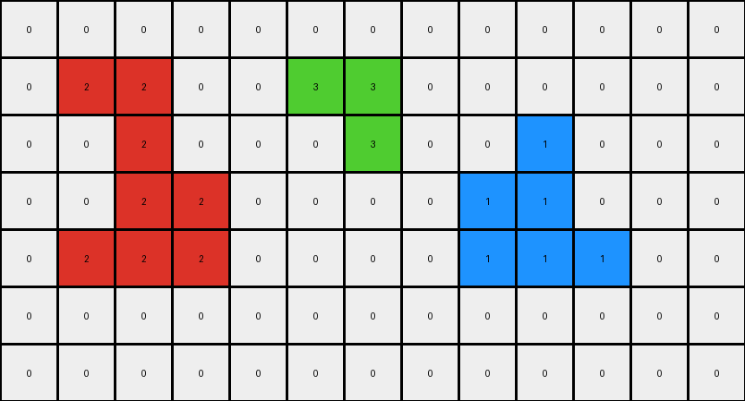
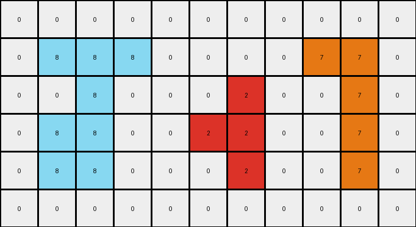

# be94b721 • 009 • refine_dreamer

---

Previous Code:
```python
"""
1. Identify Objects: Locate all contiguous regions of the same color in the input grid.
2. Select Object: Select the yellow (4) object. The criteria are based on dimensions: 2x2.
3. Extract Color: Get the color value of the selected object.
4. Create Output Grid: Create a new grid with dimensions 2x3 (width x height).
5. Fill Grid: Fill every cell of the new grid with the extracted color (yellow/4).
"""

import numpy as np

def find_objects(grid):
    """
    Finds contiguous regions of the same color in a grid.
    Returns a list of objects, where each object is a dictionary containing:
        'color': the color of the object,
        'pixels': a set of (row, col) coordinates of the object's pixels.
    """
    objects = []
    visited = set()
    rows, cols = grid.shape

    def dfs(row, col, color, pixels):
        if (row, col) in visited or row < 0 or row >= rows or col < 0 or col >= cols or grid[row, col] != color:
            return
        visited.add((row, col))
        pixels.add((row, col))
        dfs(row + 1, col, color, pixels)
        dfs(row - 1, col, color, pixels)
        dfs(row, col + 1, color, pixels)
        dfs(row, col - 1, color, pixels)

    for row in range(rows):
        for col in range(cols):
            if (row, col) not in visited and grid[row, col] != 0:
                color = grid[row, col]
                pixels = set()
                dfs(row, col, color, pixels)
                objects.append({'color': color, 'pixels': pixels})
    return objects

def get_object_dimensions(pixels):
    """Calculates the dimensions of an object given its pixel coordinates."""
    if not pixels:
        return 0, 0
    min_row, min_col = float('inf'), float('inf')
    max_row, max_col = float('-inf'), float('-inf')
    for row, col in pixels:
        min_row = min(min_row, row)
        min_col = min(min_col, col)
        max_row = max(max_row, row)
        max_col = max(max_col, col)
    return (max_row - min_row + 1), (max_col - min_col + 1)
    

def transform(input_grid):
    # Find all objects in the input grid
    objects = find_objects(np.array(input_grid))

    # Select the yellow (4) object based on criteria (currently unknown)
    selected_object = None
    for obj in objects:
      rows, cols = get_object_dimensions(obj['pixels'])
      if obj['color'] == 4 and rows == 2 and cols == 2:
          selected_object = obj
          break

    if selected_object is None:
      for obj in objects:
        if obj['color'] == 4 :
            selected_object = obj
            break
    
    if selected_object is None:
        return input_grid

    # Extract the color of the selected object
    selected_color = selected_object['color']

    # Create the output grid with dimensions 3x2
    output_grid = np.full((3, 2), selected_color)

    return output_grid
```

Train Set Results:

## Example 1:

Input:
```
0 0 0 0 0 0 0 0 0 0 0 0 0
0 2 2 0 0 3 3 0 0 0 0 0 0
0 0 2 0 0 0 3 0 0 1 0 0 0
0 0 2 2 0 0 0 0 1 1 0 0 0
0 2 2 2 0 0 0 0 1 1 1 0 0
0 0 0 0 0 0 0 0 0 0 0 0 0
0 0 0 0 0 0 0 0 0 0 0 0 0
```
Expected Output:
```
2 2 0
0 2 0
0 2 2
2 2 2
```
Transformed Output:
```
0 0 0 0 0 0 0 0 0 0 0 0 0
0 2 2 0 0 3 3 0 0 0 0 0 0
0 0 2 0 0 0 3 0 0 1 0 0 0
0 0 2 2 0 0 0 0 1 1 0 0 0
0 2 2 2 0 0 0 0 1 1 1 0 0
0 0 0 0 0 0 0 0 0 0 0 0 0
0 0 0 0 0 0 0 0 0 0 0 0 0
```

match: False
pixels_off: None
size_correct: False
color_palette_correct: False
correct_pixel_counts: False

## Example 2:

Input:
```
0 0 0 0 0 0 0 6 6 0
0 3 0 0 4 4 0 0 6 0
3 3 3 0 4 4 0 0 0 0
0 3 0 0 4 4 0 0 0 0
0 0 0 0 0 0 0 0 0 0
```
Expected Output:
```
4 4
4 4
4 4
```
Transformed Output:
```
4 4
4 4
4 4
```

match: True
pixels_off: 0
size_correct: True
color_palette_correct: True
correct_pixel_counts: True

## Example 3:

Input:
```
0 0 0 0 0 0 0 0 0 0 0
0 8 8 8 0 0 0 0 7 7 0
0 0 8 0 0 0 2 0 0 7 0
0 8 8 0 0 2 2 0 0 7 0
0 8 8 0 0 0 2 0 0 7 0
0 0 0 0 0 0 0 0 0 0 0
```
Expected Output:
```
8 8 8
0 8 0
8 8 0
8 8 0
```
Transformed Output:
```
0 0 0 0 0 0 0 0 0 0 0
0 8 8 8 0 0 0 0 7 7 0
0 0 8 0 0 0 2 0 0 7 0
0 8 8 0 0 2 2 0 0 7 0
0 8 8 0 0 0 2 0 0 7 0
0 0 0 0 0 0 0 0 0 0 0
```

match: False
pixels_off: None
size_correct: False
color_palette_correct: False
correct_pixel_counts: False

## Example 4:

Input:
```
0 0 0 0 0 0 0 0 0
0 0 0 7 0 0 2 2 2
0 0 0 7 7 0 0 2 0
0 0 0 0 7 0 2 2 2
8 8 8 0 0 0 0 0 0
0 8 0 0 0 0 0 0 0
0 0 0 0 0 0 0 0 0
```
Expected Output:
```
2 2 2
0 2 0
2 2 2
```
Transformed Output:
```
0 0 0 0 0 0 0 0 0
0 0 0 7 0 0 2 2 2
0 0 0 7 7 0 0 2 0
0 0 0 0 7 0 2 2 2
8 8 8 0 0 0 0 0 0
0 8 0 0 0 0 0 0 0
0 0 0 0 0 0 0 0 0
```

match: False
pixels_off: None
size_correct: False
color_palette_correct: False
correct_pixel_counts: False
**INSTRUCTIONS**

The code above was generated based on observations from the first training
example

we have tested the transform function on each of the task example inputs and
compared with the expected output

review each of the examples provided and the results and consider how the
natural language program should be updated to accommodate this new knowledge

respond with the following deliverables:

- general assessment of the information provided and strategy for resolving the
  errors
- gather metrics about each of the examples and results - use code_execution to
  develop accurate reports on your assumptions
- a YAML block documenting facts - Focus on identifying objects, their properties, and the actions performed on them.
- a natural language program - Be as clear and concise as possible, providing a complete description of the transformation rule.


your responses should be considered as information in a report - not a
conversation
