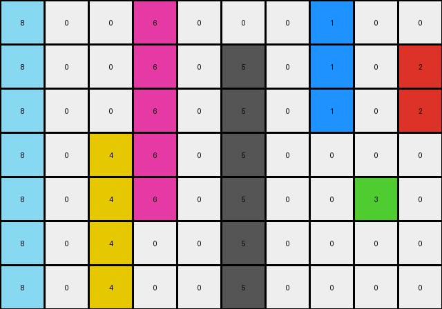
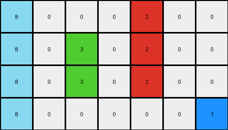
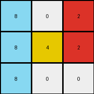

# beb8660c • 003 • refine_dreamer

---


Previous Code:
```python
"""
The input grid is rotated 90 degrees clockwise to produce the output grid.
"""

import numpy as np

def rotate_grid_clockwise(grid):
    """Rotates a 2D numpy array 90 degrees clockwise."""
    return np.rot90(grid, k=-1)

def transform(input_grid):
    """
    Transforms the input grid by rotating it 90 degrees clockwise.
    """
    # Convert the input grid to a NumPy array for easier manipulation.
    input_array = np.array(input_grid)

    # Rotate the array 90 degrees clockwise.
    output_array = rotate_grid_clockwise(input_array)

    # Convert the NumPy array back to a list of lists.
    output_grid = output_array.tolist()

    return output_grid
```

Train Set Results:

## Example 1:

Input:
```
0 2 2 0 0 0 0
0 0 0 0 3 0 0
1 1 1 0 0 0 0
0 0 0 0 0 0 0
0 5 5 5 5 5 5
0 0 0 0 0 0 0
6 6 6 6 6 0 0
0 0 0 4 4 4 4
0 0 0 0 0 0 0
8 8 8 8 8 8 8
```
Expected Output:
```
0 0 0 0 0 0 0
0 0 0 0 0 0 0
0 0 0 0 0 0 0
0 0 0 0 0 0 3
0 0 0 0 0 2 2
0 0 0 0 1 1 1
0 0 0 4 4 4 4
0 0 6 6 6 6 6
0 5 5 5 5 5 5
8 8 8 8 8 8 8
```
Transformed Output:
```
8 0 0 6 0 0 0 1 0 0
8 0 0 6 0 5 0 1 0 2
8 0 0 6 0 5 0 1 0 2
8 0 4 6 0 5 0 0 0 0
8 0 4 6 0 5 0 0 3 0
8 0 4 0 0 5 0 0 0 0
8 0 4 0 0 5 0 0 0 0
```

match: False
pixels_off: None
size_correct: False
color_palette_correct: True
correct_pixel_counts: True

## Example 2:

Input:
```
0 0 0 1
0 0 0 0
2 2 2 0
0 0 0 0
0 3 3 0
0 0 0 0
8 8 8 8
```
Expected Output:
```
0 0 0 0
0 0 0 0
0 0 0 0
0 0 0 1
0 0 3 3
0 2 2 2
8 8 8 8
```
Transformed Output:
```
8 0 0 0 2 0 0
8 0 3 0 2 0 0
8 0 3 0 2 0 0
8 0 0 0 0 0 1
```

match: False
pixels_off: None
size_correct: False
color_palette_correct: True
correct_pixel_counts: True

## Example 3:

Input:
```
2 2 0
0 4 0
8 8 8
```
Expected Output:
```
0 0 4
0 2 2
8 8 8
```
Transformed Output:
```
8 0 2
8 4 2
8 0 0
```

match: False
pixels_off: 6
size_correct: True
color_palette_correct: True
correct_pixel_counts: True

**INSTRUCTIONS**

The code above was generated based on observations from the first training
example

we have tested the transform function on each of the task example inputs and
compared with the expected output

review each of the examples provided and the results and consider how the
natural language program should be updated to accommodate this new knowledge

respond with the following deliverables:

- general assessment of the information provided and strategy for resolving the
  errors
- gather metrics about each of the examples and results - use code_execution to
  develop accurate reports on your assumptions
- a YAML block documenting facts - Focus on identifying objects, their properties, and the actions performed on them.
- a natural language program - Be as clear and concise as possible, providing a complete description of the transformation rule.


your responses should be considered as information in a report - not a
conversation
