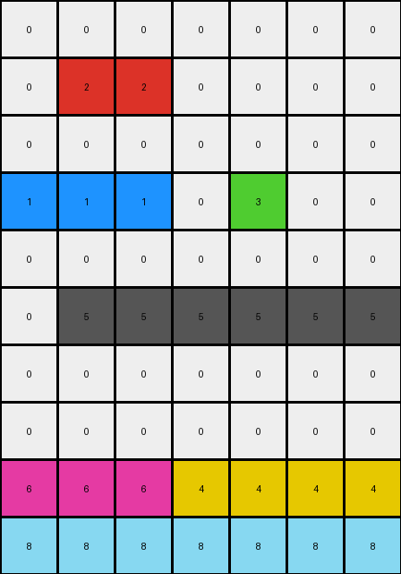
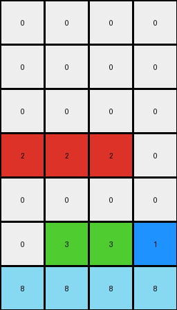

# beb8660c • 009 • refine_dreamer

---

Previous Code:
```python
"""
Shift all contiguous non-zero color blocks down, filling the spaces, but keep the bottom row fixed.
"""

import numpy as np

def find_blocks(grid):
    """
    Finds contiguous blocks of non-zero pixels in the grid.
    Returns a list of blocks, where each block is a list of (row, col) coordinates.
    """
    blocks = []
    visited = set()
    rows, cols = grid.shape

    def is_valid(r, c):
        return 0 <= r < rows and 0 <= c < cols

    def dfs(r, c, current_block, color):
        if (r, c) in visited or not is_valid(r, c) or grid[r, c] != color:
            return
        visited.add((r, c))
        current_block.append((r, c))
        for dr, dc in [(0, 1), (0, -1), (1, 0), (-1, 0)]:
            dfs(r + dr, c + dc, current_block, color)

    for r in range(rows):
        for c in range(cols):
            if grid[r, c] != 0 and (r, c) not in visited:
                current_block = []
                dfs(r, c, current_block, grid[r, c])
                blocks.append(current_block)
    return blocks

def shift_block_down(grid, block):
    """
    Shifts a single block down as far as possible within the grid.
    Returns the new block coordinates after shifting.
    """
    rows, cols = grid.shape
    max_shift = rows  # Maximum possible downward shift

    # Find the minimum shift allowed by obstacles or grid boundaries
    for r, c in block:
        for shift in range(1, rows - r):
            if r + shift + 1 == rows:
                max_shift = shift + 1
                break
            if grid[r + shift +1,c] != 0 :                
                max_shift = min(max_shift, shift)
                break    
            
        
    # Create new block coordinates after shifting
    new_block = [(r + max_shift, c) for r, c in block]
    return new_block
    

def transform(input_grid):
    """
    Transforms the input grid by shifting non-zero color blocks down.
    """
    grid = np.array(input_grid)  # Convert to NumPy array for easier manipulation
    rows, cols = grid.shape
    output_grid = np.zeros_like(grid)
    
    # 1. keep the bottom row
    output_grid[-1,:] = grid[-1,:]

    # 2. Find blocks in the input grid (excluding the fixed bottom row)
    blocks = find_blocks(grid[:-1,:])

    # 3. Shift each block down and update the output grid
    for block in blocks:
      new_block = shift_block_down(grid, block)
      for r, c in new_block:
          output_grid[r, c] = grid[block[0][0], block[0][1]]  # Use original color

    return output_grid.tolist()
```

Train Set Results:

## Example 1:

Input:
```
0 2 2 0 0 0 0
0 0 0 0 3 0 0
1 1 1 0 0 0 0
0 0 0 0 0 0 0
0 5 5 5 5 5 5
0 0 0 0 0 0 0
6 6 6 6 6 0 0
0 0 0 4 4 4 4
0 0 0 0 0 0 0
8 8 8 8 8 8 8
```
Expected Output:
```
0 0 0 0 0 0 0
0 0 0 0 0 0 0
0 0 0 0 0 0 0
0 0 0 0 0 0 3
0 0 0 0 0 2 2
0 0 0 0 1 1 1
0 0 0 4 4 4 4
0 0 6 6 6 6 6
0 5 5 5 5 5 5
8 8 8 8 8 8 8
```
Transformed Output:
```
0 0 0 0 0 0 0
0 2 2 0 0 0 0
0 0 0 0 0 0 0
1 1 1 0 3 0 0
0 0 0 0 0 0 0
0 5 5 5 5 5 5
0 0 0 0 0 0 0
0 0 0 0 0 0 0
6 6 6 4 4 4 4
8 8 8 8 8 8 8
```

match: False
pixels_off: 31
size_correct: True
color_palette_correct: True
correct_pixel_counts: False

## Example 2:

Input:
```
0 0 0 1
0 0 0 0
2 2 2 0
0 0 0 0
0 3 3 0
0 0 0 0
8 8 8 8
```
Expected Output:
```
0 0 0 0
0 0 0 0
0 0 0 0
0 0 0 1
0 0 3 3
0 2 2 2
8 8 8 8
```
Transformed Output:
```
0 0 0 0
0 0 0 0
0 0 0 0
2 2 2 0
0 0 0 0
0 3 3 1
8 8 8 8
```

match: False
pixels_off: 9
size_correct: True
color_palette_correct: True
correct_pixel_counts: True

## Example 3:

Input:
```
2 2 0
0 4 0
8 8 8
```
Expected Output:
```
0 0 4
0 2 2
8 8 8
```
match: ERROR: index 3 is out of bounds for axis 0 with size 3
pixels_off: None
size_correct: None
color_palette_correct: None
correct_pixel_counts: None
**INSTRUCTIONS**

The code above was generated based on observations from the first training
example

we have tested the transform function on each of the task example inputs and
compared with the expected output

review each of the examples provided and the results and consider how the
natural language program should be updated to accommodate this new knowledge

respond with the following deliverables:

- general assessment of the information provided and strategy for resolving the
  errors
- gather metrics about each of the examples and results - use code_execution to
  develop accurate reports on your assumptions
- a YAML block documenting facts - Focus on identifying objects, their properties, and the actions performed on them.
- a natural language program - Be as clear and concise as possible, providing a complete description of the transformation rule.


your responses should be considered as information in a report - not a
conversation
