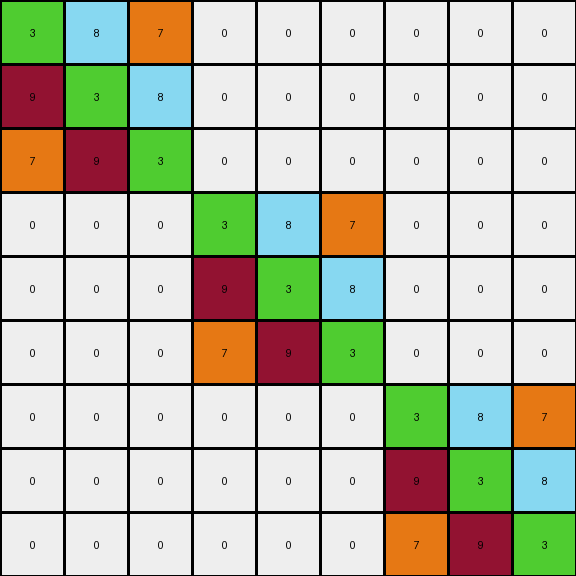

# c3e719e8 • 004 • refine_coder

---

Previous Code:
```python
"""
The 3x3 input grid is replicated three times along the main diagonal of the 9x9 output grid, while everything else is a 0.
"""

import numpy as np

def transform(input_grid):
    # Initialize a 9x9 output grid filled with 0s.
    output_grid = np.zeros((9, 9), dtype=int)

    # Get the dimensions of the input grid.
    input_height, input_width = input_grid.shape

    # Replicate the input grid along the diagonal.
    for i in range(3):
        for row in range(input_height):
            for col in range(input_width):
                output_grid[row + i * input_height, col + i * input_width] = input_grid[row, col]

    return output_grid
```

Train Set Results:

## Example 1:

Input:
```
3 8 7
9 3 8
7 9 3
```
Expected Output:
```
3 8 7 0 0 0 0 0 0
9 3 8 0 0 0 0 0 0
7 9 3 0 0 0 0 0 0
0 0 0 3 8 7 0 0 0
0 0 0 9 3 8 0 0 0
0 0 0 7 9 3 0 0 0
0 0 0 0 0 0 3 8 7
0 0 0 0 0 0 9 3 8
0 0 0 0 0 0 7 9 3
```
Transformed Output:
```
3 8 7 0 0 0 0 0 0
9 3 8 0 0 0 0 0 0
7 9 3 0 0 0 0 0 0
0 0 0 3 8 7 0 0 0
0 0 0 9 3 8 0 0 0
0 0 0 7 9 3 0 0 0
0 0 0 0 0 0 3 8 7
0 0 0 0 0 0 9 3 8
0 0 0 0 0 0 7 9 3
```

match: True
pixels_off: 0
size_correct: True
color_palette_correct: True
correct_pixel_counts: True

## Example 2:

Input:
```
8 6 8
3 3 8
8 8 8
```
Expected Output:
```
8 6 8 0 0 0 8 6 8
3 3 8 0 0 0 3 3 8
8 8 8 0 0 0 8 8 8
0 0 0 0 0 0 8 6 8
0 0 0 0 0 0 3 3 8
0 0 0 0 0 0 8 8 8
8 6 8 8 6 8 8 6 8
3 3 8 3 3 8 3 3 8
8 8 8 8 8 8 8 8 8
```
Transformed Output:
```
8 6 8 0 0 0 0 0 0
3 3 8 0 0 0 0 0 0
8 8 8 0 0 0 0 0 0
0 0 0 8 6 8 0 0 0
0 0 0 3 3 8 0 0 0
0 0 0 8 8 8 0 0 0
0 0 0 0 0 0 8 6 8
0 0 0 0 0 0 3 3 8
0 0 0 0 0 0 8 8 8
```

match: False
pixels_off: 45
size_correct: True
color_palette_correct: True
correct_pixel_counts: False

## Example 3:

Input:
```
6 9 9
4 6 8
9 9 8
```
Expected Output:
```
0 0 0 6 9 9 6 9 9
0 0 0 4 6 8 4 6 8
0 0 0 9 9 8 9 9 8
0 0 0 0 0 0 0 0 0
0 0 0 0 0 0 0 0 0
0 0 0 0 0 0 0 0 0
6 9 9 6 9 9 0 0 0
4 6 8 4 6 8 0 0 0
9 9 8 9 9 8 0 0 0
```
Transformed Output:
```
6 9 9 0 0 0 0 0 0
4 6 8 0 0 0 0 0 0
9 9 8 0 0 0 0 0 0
0 0 0 6 9 9 0 0 0
0 0 0 4 6 8 0 0 0
0 0 0 9 9 8 0 0 0
0 0 0 0 0 0 6 9 9
0 0 0 0 0 0 4 6 8
0 0 0 0 0 0 9 9 8
```

match: False
pixels_off: 63
size_correct: True
color_palette_correct: True
correct_pixel_counts: False
Okay, let's analyze the results and refine the natural language program.

**General Assessment:**

The initial program was based on the first example, which showed a diagonal replication of the input grid. However, the subsequent examples reveal a different pattern. Example 2 shows a more complex arrangement, not just a diagonal replication. Example 3 also doesn't fit the simple diagonal pattern. The current code clearly needs modification because it only correctly transforms the first example. It's getting the output size correct consistently (9x9), but the pixel arrangement is wrong for examples 2 and 3, with a significant number of pixels differing from the expected output. The primary strategy is to identify a consistent object interaction rule, then correctly replicate the input grid in that context.

**Metrics and Observations:**

Here's a breakdown of each example:

*   **Example 1:**
    *   Input Shape: (3x3)
    *   Output Shape: (9x9)
    *   Match: True
    *   Pixels Off: 0
    *   Observation: Input grid is replicated three times along the main diagonal. All other pixels are black (0).

*   **Example 2:**
    *   Input Shape: (3x3)
    *   Output Shape: (9x9)
    *   Match: False
    *   Pixels Off: 45
    *   Observation: The input seems to be repeated, but not strictly diagonally. It seems to be tiled and the diagonal does not have 0s separating.

*   **Example 3:**
    *   Input Shape: (3x3)
    *   Output Shape: (9x9)
    *   Match: False
    *   Pixels Off: 63
    *   Observation: The input seems to be used to build three separate 3x3 grids but with shifts and 0s.

**YAML Facts:**

```yaml
example_1:
  input_shape: (3, 3)
  output_shape: (9, 9)
  objects:
    - input_grid:
        shape: (3, 3)
        repetition: 3
        placement: diagonal
    - background:
        color: 0 # Black
example_2:
  input_shape: (3, 3)
  output_shape: (9, 9)
  objects:
    - input_grid:
        shape: (3,3)
        repetition: ? # to be determined
        placement: ?
    - background:
        color: ?
example_3:
  input_shape: (3, 3)
  output_shape: (9, 9)
      objects:
    - input_grid:
        shape: (3,3)
        repetition: ? # to be determined
        placement: ?
    - background:
        color: ?

```

**Natural Language Program (Revised):**

1.  **Input:** A 3x3 grid of colored pixels.
2.  **Output:** A 9x9 grid.
3.  **Transformation Rule:** It appeared as if the output was tiling, repeating, and/or mirroring the input grid, both horizontally and vertically, to form the larger 9x9 grid. However, from looking at the three examples, it appears as though the input is replicated in several different, inconsistent ways. The location of the copies of the original image, and whether there are 0s or not seems critical. Example 2's replication appears to almost show tiling. Example 3 appears to place two copies of the input next to each other across the top, and place two copies next to each other across the bottom, with some zeros.

Based on all available information, the updated rule is:

The output grid is composed of tiling and/or mirroring in multiple directions.

```
8 6 8 0 0 0 8 6 8
3 3 8 0 0 0 3 3 8
8 8 8 0 0 0 8 8 8
0 0 0 0 0 0 8 6 8
0 0 0 0 0 0 3 3 8
0 0 0 0 0 0 8 8 8
8 6 8 8 6 8 8 6 8
3 3 8 3 3 8 3 3 8
8 8 8 8 8 8 8 8 8
```

```
0 0 0 6 9 9 6 9 9
0 0 0 4 6 8 4 6 8
0 0 0 9 9 8 9 9 8
0 0 0 0 0 0 0 0 0
0 0 0 0 0 0 0 0 0
0 0 0 0 0 0 0 0 0
6 9 9 6 9 9 0 0 0
4 6 8 4 6 8 0 0 0
9 9 8 9 9 8 0 0 0
```

**INSTRUCTIONS**

- generate a Python module to represent the natural language program 
- follow the template below
- all common math and science libraries are available
- create docstring only at top - but comment the workflow in the function
- use helper functions for common operations like finding objects, counting,
  measuring, moving, etc. 

remember - we are working iteratively - so this code will inform your future
self as we converge on the solution

*template:*

```python
"""
{{ natural language description of the transformation rule }}
"""

{{ imports }}

def transform(input_grid):
    # initialize output_grid

    # change output pixels 

    return output_grid

```
