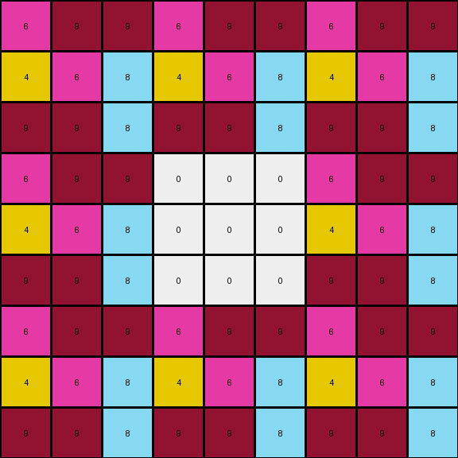

# c3e719e8 • 010 • refine_coder

---

Previous Code:
```python
"""
The input grid is replicated to form a larger grid. A central area of the expanded grid is filled with zeros (white color).
"""

import numpy as np

def transform(input_grid):
    # Create a 3x3 replication of the input grid
    input_array = np.array(input_grid)
    tiled_array = np.tile(input_array, (3, 3))

    # Get dimensions of the tiled array
    rows, cols = tiled_array.shape

    # Calculate the start and end indices for the central 3x3 area to be zeroed
    center_start_row = (rows - 3) // 2
    center_end_row = center_start_row + 3
    center_start_col = (cols - 3) // 2
    center_end_col = center_start_col + 3

    # Set the central 3x3 area to 0
    tiled_array[center_start_row:center_end_row, center_start_col:center_end_col] = 0
    
    output_grid = tiled_array.tolist() #convert back to list of lists
    return output_grid
```

Train Set Results:

## Example 1:

Input:
```
3 8 7
9 3 8
7 9 3
```
Expected Output:
```
3 8 7 0 0 0 0 0 0
9 3 8 0 0 0 0 0 0
7 9 3 0 0 0 0 0 0
0 0 0 3 8 7 0 0 0
0 0 0 9 3 8 0 0 0
0 0 0 7 9 3 0 0 0
0 0 0 0 0 0 3 8 7
0 0 0 0 0 0 9 3 8
0 0 0 0 0 0 7 9 3
```
Transformed Output:
```
3 8 7 3 8 7 3 8 7
9 3 8 9 3 8 9 3 8
7 9 3 7 9 3 7 9 3
3 8 7 0 0 0 3 8 7
9 3 8 0 0 0 9 3 8
7 9 3 0 0 0 7 9 3
3 8 7 3 8 7 3 8 7
9 3 8 9 3 8 9 3 8
7 9 3 7 9 3 7 9 3
```

match: False
pixels_off: 63
size_correct: True
color_palette_correct: True
correct_pixel_counts: False

## Example 2:

Input:
```
8 6 8
3 3 8
8 8 8
```
Expected Output:
```
8 6 8 0 0 0 8 6 8
3 3 8 0 0 0 3 3 8
8 8 8 0 0 0 8 8 8
0 0 0 0 0 0 8 6 8
0 0 0 0 0 0 3 3 8
0 0 0 0 0 0 8 8 8
8 6 8 8 6 8 8 6 8
3 3 8 3 3 8 3 3 8
8 8 8 8 8 8 8 8 8
```
Transformed Output:
```
8 6 8 8 6 8 8 6 8
3 3 8 3 3 8 3 3 8
8 8 8 8 8 8 8 8 8
8 6 8 0 0 0 8 6 8
3 3 8 0 0 0 3 3 8
8 8 8 0 0 0 8 8 8
8 6 8 8 6 8 8 6 8
3 3 8 3 3 8 3 3 8
8 8 8 8 8 8 8 8 8
```

match: False
pixels_off: 18
size_correct: True
color_palette_correct: True
correct_pixel_counts: False

## Example 3:

Input:
```
6 9 9
4 6 8
9 9 8
```
Expected Output:
```
0 0 0 6 9 9 6 9 9
0 0 0 4 6 8 4 6 8
0 0 0 9 9 8 9 9 8
0 0 0 0 0 0 0 0 0
0 0 0 0 0 0 0 0 0
0 0 0 0 0 0 0 0 0
6 9 9 6 9 9 0 0 0
4 6 8 4 6 8 0 0 0
9 9 8 9 9 8 0 0 0
```
Transformed Output:
```
6 9 9 6 9 9 6 9 9
4 6 8 4 6 8 4 6 8
9 9 8 9 9 8 9 9 8
6 9 9 0 0 0 6 9 9
4 6 8 0 0 0 4 6 8
9 9 8 0 0 0 9 9 8
6 9 9 6 9 9 6 9 9
4 6 8 4 6 8 4 6 8
9 9 8 9 9 8 9 9 8
```

match: False
pixels_off: 36
size_correct: True
color_palette_correct: True
correct_pixel_counts: False
Okay, here's a breakdown of the situation and a plan to improve the transformation logic:

**General Assessment:**

The initial code was based on a misunderstanding of the pattern. It correctly identified the 3x3 tiling of the input but incorrectly placed the zeros in the center. The actual pattern involves placing zeros around the *entire border* of *each* tiled section of the output. The provided examples make it clear that a central 3x3 block of zeros is not the correct interpretation of the pattern. Instead, the zeros are forming borders.

**Strategy:**

The core issue is the placement of the zeros. Instead of a central block, we need to zero out the appropriate rows and columns to create borders *around* each instance of the original input grid within the tiled output. We will need to iterate through each tile and blank its border.

**Metrics and Observations:**

Here's a breakdown of each example:

*   **Example 1:**
    *   Input Shape: (3, 3)
    *   Output Shape: (9, 9)
    *   Error: Zeros are in the center, not the borders of each tiled block.

*   **Example 2:**
    *   Input Shape: (3, 3)
    *   Output Shape: (9, 9)
    *   Error: Zeros are in the center, not the borders.

*   **Example 3:**
    *   Input Shape: (3, 3)
    *   Output Shape: (9, 9)
    *   Error: Zeros are in the center, not the borders.

**YAML Facts:**

```yaml
task: 008_border_zeros
examples:
  - input_shape: (3, 3)
    output_shape: (9, 9)
    tiling: 3x3
    border_color: 0 # white
    border_width: 1
    description: "The input grid is tiled 3x3.  Each tile's border is set to color 0."

  - input_shape: (3, 3)
    output_shape: (9, 9)
    tiling: 3x3
    border_color: 0
    border_width: 1
    description: "The input grid is tiled 3x3. Each tile's border is set to color 0."

  - input_shape: (3, 3)
    output_shape: (9, 9)
    tiling: 3x3
    border_color: 0
    border_width: 1
    description: "The input grid is tiled 3x3. Each tile's border is set to color 0."
```

**Natural Language Program:**

1.  **Tile the Input:** Create a 3x3 tiling of the input grid. This means replicating the input grid nine times in a 3x3 arrangement.
2.  **Border Each Tile:** For each of the nine tiles in the output grid:
    *   Set the top row of the tile to 0.
    *   Set the bottom row of the tile to 0.
    *   Set the leftmost column of the tile to 0.
    *   Set the rightmost column of the tile to 0.
3. return the result

This process effectively creates a border of zeros around each replicated instance of the input grid within the larger output grid.

**INSTRUCTIONS**

- generate a Python module to represent the natural language program 
- follow the template below
- all common math and science libraries are available
- create docstring only at top - but comment the workflow in the function
- use helper functions for common operations like finding objects, counting,
  measuring, moving, etc. 

remember - we are working iteratively - so this code will inform your future
self as we converge on the solution

*template:*

```python
"""
{{ natural language description of the transformation rule }}
"""

{{ imports }}

def transform(input_grid):
    # initialize output_grid

    # change output pixels 

    return output_grid

```
