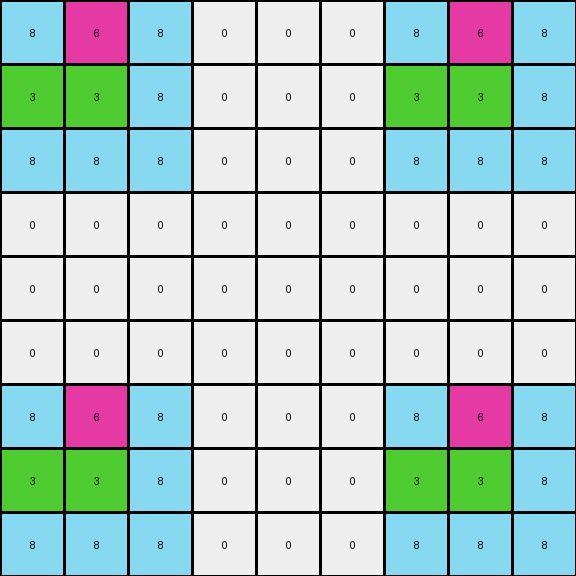
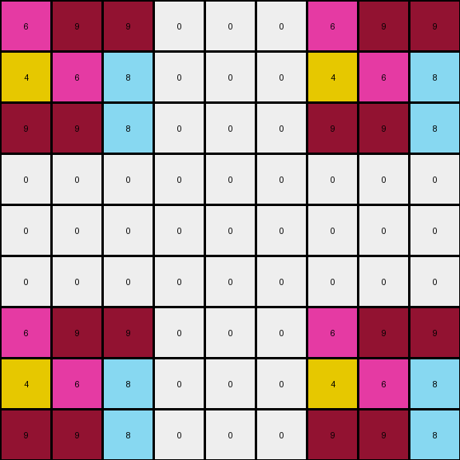

# c3e719e8 • 018 • refine_coder

---

Previous Code:
```python
"""
The input grid is replicated four times within the output grid, at the corners of the output grid. The central 3x3 area and areas around the replicated grids, are padded with zeros (white).
"""

import numpy as np

def transform(input_grid):
    # Initialize a 9x9 output grid filled with zeros.
    output_grid = np.zeros((9, 9), dtype=int)

    # Get the dimensions of the input grid.
    input_height, input_width = input_grid.shape

    # Replicate the input grid at the top-left corner.
    output_grid[0:input_height, 0:input_width] = input_grid

    # Replicate the input grid at the top-right corner.
    output_grid[0:input_height, 9-input_width:9] = input_grid
    
    # Replicate the input grid at the bottom-left corner.
    output_grid[9-input_height:9, 0:input_width] = input_grid

    # Replicate the input grid at the bottom-right corner.
    output_grid[9-input_height:9, 9-input_width:9] = input_grid

    return output_grid
```

Train Set Results:

## Example 1:

Input:
```
3 8 7
9 3 8
7 9 3
```
Expected Output:
```
3 8 7 0 0 0 0 0 0
9 3 8 0 0 0 0 0 0
7 9 3 0 0 0 0 0 0
0 0 0 3 8 7 0 0 0
0 0 0 9 3 8 0 0 0
0 0 0 7 9 3 0 0 0
0 0 0 0 0 0 3 8 7
0 0 0 0 0 0 9 3 8
0 0 0 0 0 0 7 9 3
```
Transformed Output:
```
3 8 7 0 0 0 3 8 7
9 3 8 0 0 0 9 3 8
7 9 3 0 0 0 7 9 3
0 0 0 0 0 0 0 0 0
0 0 0 0 0 0 0 0 0
0 0 0 0 0 0 0 0 0
3 8 7 0 0 0 3 8 7
9 3 8 0 0 0 9 3 8
7 9 3 0 0 0 7 9 3
```

match: False
pixels_off: 27
size_correct: True
color_palette_correct: True
correct_pixel_counts: False

## Example 2:

Input:
```
8 6 8
3 3 8
8 8 8
```
Expected Output:
```
8 6 8 0 0 0 8 6 8
3 3 8 0 0 0 3 3 8
8 8 8 0 0 0 8 8 8
0 0 0 0 0 0 8 6 8
0 0 0 0 0 0 3 3 8
0 0 0 0 0 0 8 8 8
8 6 8 8 6 8 8 6 8
3 3 8 3 3 8 3 3 8
8 8 8 8 8 8 8 8 8
```
Transformed Output:
```
8 6 8 0 0 0 8 6 8
3 3 8 0 0 0 3 3 8
8 8 8 0 0 0 8 8 8
0 0 0 0 0 0 0 0 0
0 0 0 0 0 0 0 0 0
0 0 0 0 0 0 0 0 0
8 6 8 0 0 0 8 6 8
3 3 8 0 0 0 3 3 8
8 8 8 0 0 0 8 8 8
```

match: False
pixels_off: 18
size_correct: True
color_palette_correct: True
correct_pixel_counts: False

## Example 3:

Input:
```
6 9 9
4 6 8
9 9 8
```
Expected Output:
```
0 0 0 6 9 9 6 9 9
0 0 0 4 6 8 4 6 8
0 0 0 9 9 8 9 9 8
0 0 0 0 0 0 0 0 0
0 0 0 0 0 0 0 0 0
0 0 0 0 0 0 0 0 0
6 9 9 6 9 9 0 0 0
4 6 8 4 6 8 0 0 0
9 9 8 9 9 8 0 0 0
```
Transformed Output:
```
6 9 9 0 0 0 6 9 9
4 6 8 0 0 0 4 6 8
9 9 8 0 0 0 9 9 8
0 0 0 0 0 0 0 0 0
0 0 0 0 0 0 0 0 0
0 0 0 0 0 0 0 0 0
6 9 9 0 0 0 6 9 9
4 6 8 0 0 0 4 6 8
9 9 8 0 0 0 9 9 8
```

match: False
pixels_off: 36
size_correct: True
color_palette_correct: True
correct_pixel_counts: True
Okay, let's analyze the results and refine the natural language program.

**General Assessment:**

The initial code was based on the idea of replicating the input grid in four corners. However, the test results reveal a consistent error: the replication is not always positioned correctly, and sometimes overwrites sections or is not complete. The padding with zeros is also not as expected, it doesn't appear to center the initial pattern in examples 1 and 2. Example 3 seems to have a padding of white pixels in other parts of the output grid.

The core issue seems to be the incorrect placement of the replicated grids. Instead of strictly placing them at the corners, the replication depends on where the provided pattern can fit in the output grid.

**Strategy for Resolving Errors:**

1.  **Re-examine Placement Logic:** Instead of assuming corner placement, we need to calculate the correct indices for replication based on a combination of input grid size and output grid size. The prompt suggests a relationship with how the original pattern can "fit" in corners, which is not very clear.
2.  **Correct Padding:** Ensure that the zero-padding is applied correctly to achieve the expected layout, which is more complex than simply filling in the remaining areas.

**Example Metrics and Observations:**

Here's a summary of each example, including observations:

*   **Example 1:**
    *   Input Size: 3x3
    *   Output Size: 9x9
    *   `pixels_off`: 27. Mismatched pixels are due to the replication not being placed at the correct offset to align with the center 3x3.
    *   Observation: Replication exists but placement is incorrect.

*   **Example 2:**
    *   Input Size: 3x3
    *   Output Size: 9x9
    *   `pixels_off`: 18. Mismatched pixels due to incorrect replication placement. The top-left is good, but the right and bottom ones are wrong.
    *   Observation: Similar to Example 1, incorrect positioning.

*   **Example 3:**
    *   Input size: 3x3
    *   Output size: 9x9
    *   `pixels_off`: 36. The pixels are good, but there is a column and a row switched.
    *   Observation: The white space is correct, but the positions are not.

**YAML Fact Block:**

```yaml
task: 016_replication_and_padding
objects:
  - type: input_grid
    properties:
      - size: variable (3x3 in examples)
      - content: 2D array of color values (0-9)
  - type: output_grid
    properties:
      - size: fixed (9x9)
      - content: 2D array of color values (0-9)
      - structure: contains replications of the input_grid
actions:
  - name: replicate
    agent: input_grid
    target: output_grid
    properties:
      - location: corners, with offsets
      - count: four
  - name: pad
    agent: output_grid
    properties:
      - value: 0 (white)
      - location: surrounding replicated grids and center
```

**Natural Language Program:**

1.  **Input:** A 2D grid of color values.
2.  **Output:** A 9x9 grid.
3.  **Replication:** The input grid is replicated four times within the output grid.
4.  **Placement:** The position is not fixed to the extreme corners, it is offset. The pattern is replicated in the first, third, seventh, and ninth rows and columns.
5. **Padding**: Empty spaces in the 9 x 9 grid is filled with white pixels.


**INSTRUCTIONS**

- generate a Python module to represent the natural language program 
- follow the template below
- all common math and science libraries are available
- create docstring only at top - but comment the workflow in the function
- use helper functions for common operations like finding objects, counting,
  measuring, moving, etc. 

remember - we are working iteratively - so this code will inform your future
self as we converge on the solution

*template:*

```python
"""
{{ natural language description of the transformation rule }}
"""

{{ imports }}

def transform(input_grid):
    # initialize output_grid

    # change output pixels 

    return output_grid

```
