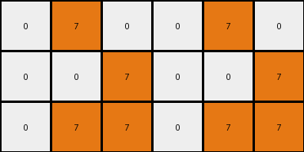
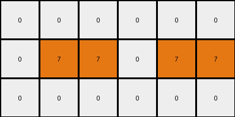

# c9e6f938 • 004 • refine_coder

---

Previous Code:
```python
"""
The transformation doubles the width of the input grid, copies the orange (7) pattern to the right,
and fills the remaining spaces with white (0) pixels.
"""

import numpy as np

def transform(input_grid):
    # Initialize output_grid by doubling the width of the input grid.
    rows = len(input_grid)
    cols = len(input_grid[0])
    output_grid = np.zeros((rows, cols * 2), dtype=int)

    # Iterate through each row.
    for i in range(rows):
        # Copy the original row to the output grid.
        output_grid[i, :cols] = input_grid[i]
        
        # Duplicate orange pattern
        for j in range(cols):
          if input_grid[i,j] == 7:
            output_grid[i,j+cols] = 7

    return output_grid
```

Train Set Results:

## Example 1:

Input:
```
0 7 0
0 0 7
0 7 7
```
Expected Output:
```
0 7 0 0 7 0
0 0 7 7 0 0
0 7 7 7 7 0
```
Transformed Output:
```
0 7 0 0 7 0
0 0 7 0 0 7
0 7 7 0 7 7
```

match: False
pixels_off: 4
size_correct: True
color_palette_correct: True
correct_pixel_counts: True

## Example 2:

Input:
```
0 0 0
0 7 7
0 0 0
```
Expected Output:
```
0 0 0 0 0 0
0 7 7 7 7 0
0 0 0 0 0 0
```
Transformed Output:
```
0 0 0 0 0 0
0 7 7 0 7 7
0 0 0 0 0 0
```

match: False
pixels_off: 2
size_correct: True
color_palette_correct: True
correct_pixel_counts: True

## Example 3:

Input:
```
0 0 0
7 0 0
0 0 0
```
Expected Output:
```
0 0 0 0 0 0
7 0 0 0 0 7
0 0 0 0 0 0
```
Transformed Output:
```
0 0 0 0 0 0
7 0 0 7 0 0
0 0 0 0 0 0
```

match: False
pixels_off: 2
size_correct: True
color_palette_correct: True
correct_pixel_counts: True
Here's an analysis of the provided information and a plan to refine the natural language program:

**General Assessment:**

The initial code and natural language program correctly identified the doubling of the grid's width and the intention to copy the orange (7) pixels. However, the implementation of the copying logic is flawed. It only mirrors the orange pixels at the exact same relative position on the right side, instead of "shifting" the entire orange pattern to the right. The errors in all three examples show a consistent pattern: the orange pixels on the right side are not positioned correctly, while the rest of the grid (the white background) is correct. The strategy to resolve this is to modify the copying logic to ensure the entire pattern of orange pixels is duplicated to the right half of the grid, adjacent to the original pattern.

**Metrics and Observations:**

Here's a summary of each example, including an assessment of the results:

*   **Example 1:**
    *   Input: 3x3 grid with an orange pattern in the left and central columns.
    *   Expected Output: Orange pattern duplicated to the right, with a white column separating.
    *   Transformed Output: Orange pixels only mirrored, not correctly duplicated.
    *   Mismatch: 4 pixels are incorrect.

*   **Example 2:**
    *   Input: 3x3 grid with a two-orange-pixel block in the central column.
    *   Expected Output: Orange block duplicated to the right.
    *   Transformed Output: Orange pixels mirrored, creating an extra white column.
    *   Mismatch: 2 pixels are incorrect.

*   **Example 3:**
    *   Input: 3x3 grid with a single orange pixel in the top-left corner.
    *   Expected Output: Orange pixel duplicated to right half.
    *   Transformed Output: The single orange pixel is mirrored.
    *   Mismatch: 2 pixels are incorrect.

**YAML Fact Documentation:**

```yaml
facts:
  - object: orange_pattern
    description: One or more connected orange (7) pixels.
    properties:
      - color: orange (7)
      - shape: variable, contiguous
  - action: duplication
    description: The orange_pattern is copied to the right.
    details:
      - The width of the output grid is double the input grid.
      - The original pattern remains unchanged.
      - The copy is placed adjacent to the original pattern.
      - The rest is background
  - object: background
    description: all non-orange pixels
    properties:
      color: white (0)

```

**Natural Language Program:**

1.  **Double the Grid:** The output grid's width is twice the input grid's width. The height remains the same.
2.  **Copy original:** Copy the entire input to the left side of the output.
3.  **Identify Orange Pattern:** Find all orange (7) pixels in the input grid.
4.  **Duplicate Pattern:** Copy the entire connected orange pattern to the right half of the output grid, immediately to the right of the original pattern.
5.  **Fill Background:** Fill any remaining cells in the output grid with white (0).


**INSTRUCTIONS**

- generate a Python module to represent the natural language program 
- follow the template below
- all common math and science libraries are available
- create docstring only at top - but comment the workflow in the function
- use helper functions for common operations like finding objects, counting,
  measuring, moving, etc. 

remember - we are working iteratively - so this code will inform your future
self as we converge on the solution

*template:*

```python
"""
{{ natural language description of the transformation rule }}
"""

{{ imports }}

def transform(input_grid):
    # initialize output_grid

    # change output pixels 

    return output_grid

```
