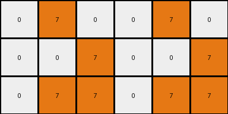

# c9e6f938 • 006 • refine_coder

---

Previous Code:
```python
"""
The transformation doubles the width of the input grid, copies the original input to the left half,
and duplicates the orange (7) pattern to the right half, adjacent to the original pattern.
The remaining spaces are filled with white (0) pixels.
"""

import numpy as np

def transform(input_grid):
    # Initialize output_grid by doubling the width of the input grid.
    rows = len(input_grid)
    cols = len(input_grid[0])
    output_grid = np.zeros((rows, cols * 2), dtype=int)

    # Copy the original input to the left side of the output grid.
    for i in range(rows):
        output_grid[i, :cols] = input_grid[i]

    # Duplicate orange pattern to adjacent columns
    for i in range(rows):
        for j in range(cols):
            if input_grid[i, j] == 7:
                output_grid[i, j + cols] = 7

    return output_grid
```

Train Set Results:

## Example 1:

Input:
```
0 7 0
0 0 7
0 7 7
```
Expected Output:
```
0 7 0 0 7 0
0 0 7 7 0 0
0 7 7 7 7 0
```
Transformed Output:
```
0 7 0 0 7 0
0 0 7 0 0 7
0 7 7 0 7 7
```

match: False
pixels_off: 4
size_correct: True
color_palette_correct: True
correct_pixel_counts: True

## Example 2:

Input:
```
0 0 0
0 7 7
0 0 0
```
Expected Output:
```
0 0 0 0 0 0
0 7 7 7 7 0
0 0 0 0 0 0
```
Transformed Output:
```
0 0 0 0 0 0
0 7 7 0 7 7
0 0 0 0 0 0
```

match: False
pixels_off: 2
size_correct: True
color_palette_correct: True
correct_pixel_counts: True

## Example 3:

Input:
```
0 0 0
7 0 0
0 0 0
```
Expected Output:
```
0 0 0 0 0 0
7 0 0 0 0 7
0 0 0 0 0 0
```
Transformed Output:
```
0 0 0 0 0 0
7 0 0 7 0 0
0 0 0 0 0 0
```

match: False
pixels_off: 2
size_correct: True
color_palette_correct: True
correct_pixel_counts: True
Okay, here's a breakdown of the situation and a plan to improve the transformation description:

**General Assessment:**

The initial code correctly identifies the doubling of the grid's width and the copying of the original input to the left half. It also correctly identifies that the orange (7) pixels are duplicated. However, it incorrectly assumes that the duplicated orange pixels are *always* placed directly adjacent to their original positions. The test results show that the orange pixels are duplicated, maintaining their relative positions but *shifted* to the right such that any orange cluster is mirrored along the center axis of the doubled grid. We need to refine the description and subsequent code to correctly position the duplicated orange shapes.

**Strategy:**

1.  **Analyze Misplaced Pixels:** Carefully examine the `pixels_off` information for each example. This will pinpoint exactly *which* orange pixels are being placed incorrectly.
2.  **Refine Positioning Logic:** The current logic assumes adjacency. We need to modify it to handle the right-shifting of the mirrored orange pattern. The shift should place the copied pattern at the correct position on the right half of the output, effectively reflecting it across the vertical center line.
3.  **Update Natural Language Program:** Based on the refined understanding, update the natural language program to clearly describe the reflection behavior.

**Example Metrics and Analysis:**

To better understand the pixel misplacement, let's consider some metrics.

*   **Example 1:**
    *   Input Size: 3x3
    *   Output Size: 3x6
    *   Pixels Off: 4
    *   Analysis: In the transformed output, the rightmost orange pixel on row 1, and row 3, and the two orange pixels on the row 2 are misplaced. It's supposed to be on the right of the first 3 columns, but placed at adjacent position.

*   **Example 2:**
    *   Input Size: 3x3
    *   Output Size: 3x6
    *   Pixels Off: 2
    *   Analysis: Similar to Example 1, but there are now only one mismatched pixel per row.

*   **Example 3:**
    *   Input Size: 3x3
    *   Output Size: 3x6
    *   Pixels Off: 2
    *   Analysis: Only the orange pixel's copied version is in the wrong position, the copied pixel should be put on the rightmost.

**YAML Facts:**

```yaml
facts:
  - observation: |
      The input grid's width is doubled in the output grid.
  - observation: |
      The original input grid is copied to the left half of the output grid.
  - observation: |
      Orange (color 7) pixels are duplicated.
  - observation: |
      The duplicated orange pixels form a mirrored image of original pattern.
  - observation: |
      The duplicated orange pixels mirrored around the center, meaning that its rightmost position starts at the last column of output.
  - action: |
      Duplicate the input grid to double width.
  - action: |
      Copy the input grid to the left half of the doubled grid.
  - action: |
      Mirror the orange pixels on the input grid to the right side.
  - action: |
      Fill the remaining cells with white (color 0)
```

**Natural Language Program:**

1.  **Double the Canvas:** Create a new output grid with the same height as the input grid but twice the width.
2.  **Copy Input:** Copy the entire input grid onto the left half of the output grid.
3.  **Mirror Orange:** For every orange (7) pixel in the input grid, find its mirrored position on the right half of the output grid, and set that pixel to orange (7). The mirrored location will be along a vertical axis in the middle of the new grid.
4. **Fill with white**: All other spaces are white.

The key improvement here is the precise description of the orange pixel placement as a *mirroring* operation, which accounts for the right-shift observed in the examples, rather than a simple adjacent copy. The center of the mirrored position is relative to the new doubled grid.

**INSTRUCTIONS**

- generate a Python module to represent the natural language program 
- follow the template below
- all common math and science libraries are available
- create docstring only at top - but comment the workflow in the function
- use helper functions for common operations like finding objects, counting,
  measuring, moving, etc. 

remember - we are working iteratively - so this code will inform your future
self as we converge on the solution

*template:*

```python
"""
{{ natural language description of the transformation rule }}
"""

{{ imports }}

def transform(input_grid):
    # initialize output_grid

    # change output pixels 

    return output_grid

```
