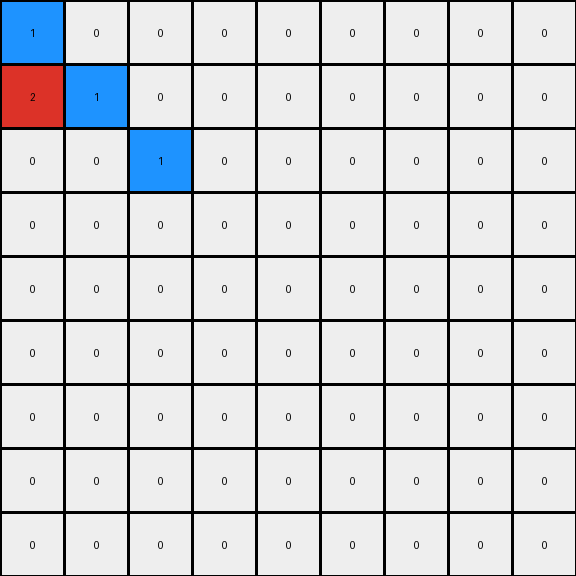
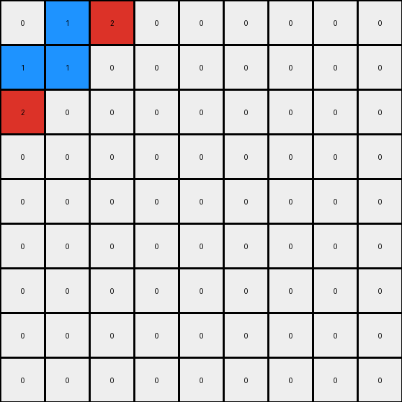
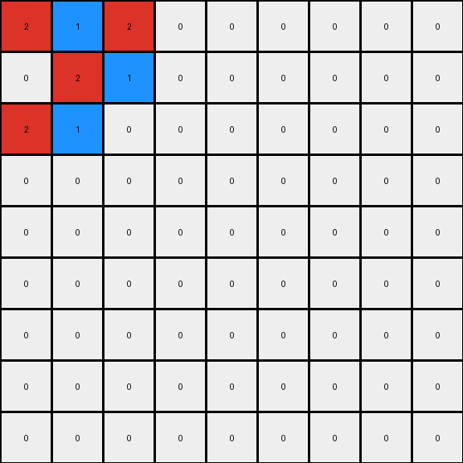

# cce03e0d • 003 • refine_dreamer

---


Previous Code:
```python
"""
The transformation rule is to expand the input grid into a 9x9 grid. The original input grid's content is placed in the top-left corner of the output grid, and the rest of the output grid is filled with zeros.
"""

import numpy as np

def transform(input_grid):
    """
    Expands the input grid to a 9x9 grid, placing the input in the top-left corner.
    
    Parameters:
    input_grid (numpy.ndarray): A 2D numpy array representing the input grid.
    
    Returns:
    numpy.ndarray: The expanded 9x9 output grid.
    """
    # initialize output_grid as a 9x9 array filled with 0s
    output_grid = np.zeros((9, 9), dtype=int)

    # get dimensions of input grid
    rows, cols = input_grid.shape

    # copy the input grid to the top-left corner of output grid
    output_grid[:rows, :cols] = input_grid

    return output_grid
```

Train Set Results:

## Example 1:

Input:
```
1 0 0
2 1 0
0 0 1
```
Expected Output:
```
0 0 0 0 0 0 0 0 0
0 0 0 0 0 0 0 0 0
0 0 0 0 0 0 0 0 0
1 0 0 0 0 0 0 0 0
2 1 0 0 0 0 0 0 0
0 0 1 0 0 0 0 0 0
0 0 0 0 0 0 0 0 0
0 0 0 0 0 0 0 0 0
0 0 0 0 0 0 0 0 0
```
Transformed Output:
```
1 0 0 0 0 0 0 0 0
2 1 0 0 0 0 0 0 0
0 0 1 0 0 0 0 0 0
0 0 0 0 0 0 0 0 0
0 0 0 0 0 0 0 0 0
0 0 0 0 0 0 0 0 0
0 0 0 0 0 0 0 0 0
0 0 0 0 0 0 0 0 0
0 0 0 0 0 0 0 0 0
```

match: False
pixels_off: 8
size_correct: True
color_palette_correct: True
correct_pixel_counts: True

## Example 2:

Input:
```
0 1 2
1 1 0
2 0 0
```
Expected Output:
```
0 0 0 0 0 0 0 1 2
0 0 0 0 0 0 1 1 0
0 0 0 0 0 0 2 0 0
0 0 0 0 0 0 0 0 0
0 0 0 0 0 0 0 0 0
0 0 0 0 0 0 0 0 0
0 1 2 0 0 0 0 0 0
1 1 0 0 0 0 0 0 0
2 0 0 0 0 0 0 0 0
```
Transformed Output:
```
0 1 2 0 0 0 0 0 0
1 1 0 0 0 0 0 0 0
2 0 0 0 0 0 0 0 0
0 0 0 0 0 0 0 0 0
0 0 0 0 0 0 0 0 0
0 0 0 0 0 0 0 0 0
0 0 0 0 0 0 0 0 0
0 0 0 0 0 0 0 0 0
0 0 0 0 0 0 0 0 0
```

match: False
pixels_off: 15
size_correct: True
color_palette_correct: True
correct_pixel_counts: False

## Example 3:

Input:
```
2 1 2
0 2 1
2 1 0
```
Expected Output:
```
2 1 2 0 0 0 2 1 2
0 2 1 0 0 0 0 2 1
2 1 0 0 0 0 2 1 0
0 0 0 2 1 2 0 0 0
0 0 0 0 2 1 0 0 0
0 0 0 2 1 0 0 0 0
2 1 2 0 0 0 0 0 0
0 2 1 0 0 0 0 0 0
2 1 0 0 0 0 0 0 0
```
Transformed Output:
```
2 1 2 0 0 0 0 0 0
0 2 1 0 0 0 0 0 0
2 1 0 0 0 0 0 0 0
0 0 0 0 0 0 0 0 0
0 0 0 0 0 0 0 0 0
0 0 0 0 0 0 0 0 0
0 0 0 0 0 0 0 0 0
0 0 0 0 0 0 0 0 0
0 0 0 0 0 0 0 0 0
```

match: False
pixels_off: 21
size_correct: True
color_palette_correct: True
correct_pixel_counts: False

**INSTRUCTIONS**

The code above was generated based on observations from the first training
example

we have tested the transform function on each of the task example inputs and
compared with the expected output

review each of the examples provided and the results and consider how the
natural language program should be updated to accommodate this new knowledge

respond with the following deliverables:

- general assessment of the information provided and strategy for resolving the
  errors
- gather metrics about each of the examples and results - use code_execution to
  develop accurate reports on your assumptions
- a YAML block documenting facts - Focus on identifying objects, their properties, and the actions performed on them.
- a natural language program - Be as clear and concise as possible, providing a complete description of the transformation rule.


your responses should be considered as information in a report - not a
conversation
