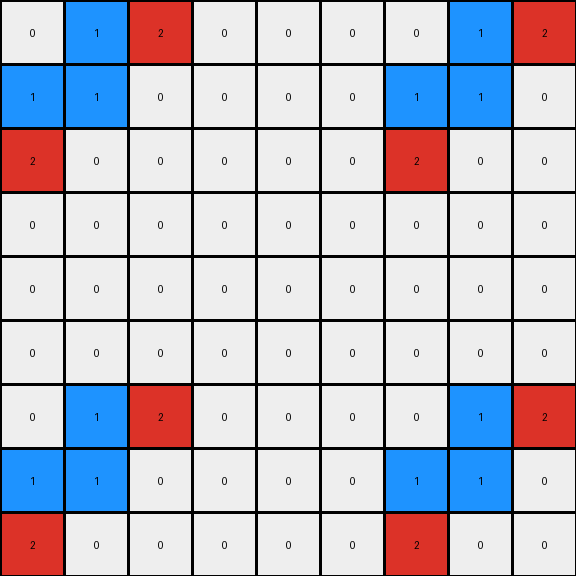
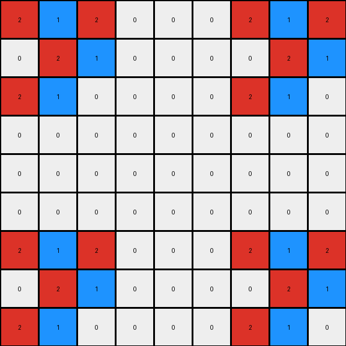

# cce03e0d • 005 • refine_dreamer

---


Previous Code:
```python
"""
The output grid is always 9x9. The input 3x3 grid is placed at the top-left corner.  Then, three columns of zeros are added to the right, followed by a copy of the input grid's columns.  The same pattern is applied to the rows: three rows of the input, three rows of zeros, and then three rows of the input.
"""

import numpy as np

def transform(input_grid):
    # Initialize the output grid as a 9x9 array of zeros.
    output_grid = np.zeros((9, 9), dtype=int)

    # Place the input grid at the top-left corner.
    output_grid[:3, :3] = input_grid

    # Add three columns of zeros.
    # (already initialized to zeros)

    # Repeat the input grid's columns.
    output_grid[:3, 6:9] = input_grid

    # Add three rows of zeros below original input.
    #(already initialized)

    # repeat rows
    output_grid[6:9, :3] = input_grid

    # repeat with offset columns
    output_grid[6:9, 6:9] = input_grid
    
    return output_grid
```

Train Set Results:

## Example 1:

Input:
```
1 0 0
2 1 0
0 0 1
```
Expected Output:
```
0 0 0 0 0 0 0 0 0
0 0 0 0 0 0 0 0 0
0 0 0 0 0 0 0 0 0
1 0 0 0 0 0 0 0 0
2 1 0 0 0 0 0 0 0
0 0 1 0 0 0 0 0 0
0 0 0 0 0 0 0 0 0
0 0 0 0 0 0 0 0 0
0 0 0 0 0 0 0 0 0
```
Transformed Output:
```
1 0 0 0 0 0 1 0 0
2 1 0 0 0 0 2 1 0
0 0 1 0 0 0 0 0 1
0 0 0 0 0 0 0 0 0
0 0 0 0 0 0 0 0 0
0 0 0 0 0 0 0 0 0
1 0 0 0 0 0 1 0 0
2 1 0 0 0 0 2 1 0
0 0 1 0 0 0 0 0 1
```

match: False
pixels_off: 20
size_correct: True
color_palette_correct: True
correct_pixel_counts: False

## Example 2:

Input:
```
0 1 2
1 1 0
2 0 0
```
Expected Output:
```
0 0 0 0 0 0 0 1 2
0 0 0 0 0 0 1 1 0
0 0 0 0 0 0 2 0 0
0 0 0 0 0 0 0 0 0
0 0 0 0 0 0 0 0 0
0 0 0 0 0 0 0 0 0
0 1 2 0 0 0 0 0 0
1 1 0 0 0 0 0 0 0
2 0 0 0 0 0 0 0 0
```
Transformed Output:
```
0 1 2 0 0 0 0 1 2
1 1 0 0 0 0 1 1 0
2 0 0 0 0 0 2 0 0
0 0 0 0 0 0 0 0 0
0 0 0 0 0 0 0 0 0
0 0 0 0 0 0 0 0 0
0 1 2 0 0 0 0 1 2
1 1 0 0 0 0 1 1 0
2 0 0 0 0 0 2 0 0
```

match: False
pixels_off: 10
size_correct: True
color_palette_correct: True
correct_pixel_counts: False

## Example 3:

Input:
```
2 1 2
0 2 1
2 1 0
```
Expected Output:
```
2 1 2 0 0 0 2 1 2
0 2 1 0 0 0 0 2 1
2 1 0 0 0 0 2 1 0
0 0 0 2 1 2 0 0 0
0 0 0 0 2 1 0 0 0
0 0 0 2 1 0 0 0 0
2 1 2 0 0 0 0 0 0
0 2 1 0 0 0 0 0 0
2 1 0 0 0 0 0 0 0
```
Transformed Output:
```
2 1 2 0 0 0 2 1 2
0 2 1 0 0 0 0 2 1
2 1 0 0 0 0 2 1 0
0 0 0 0 0 0 0 0 0
0 0 0 0 0 0 0 0 0
0 0 0 0 0 0 0 0 0
2 1 2 0 0 0 2 1 2
0 2 1 0 0 0 0 2 1
2 1 0 0 0 0 2 1 0
```

match: False
pixels_off: 14
size_correct: True
color_palette_correct: True
correct_pixel_counts: True

**INSTRUCTIONS**

The code above was generated based on observations from the first training
example

we have tested the transform function on each of the task example inputs and
compared with the expected output

review each of the examples provided and the results and consider how the
natural language program should be updated to accommodate this new knowledge

respond with the following deliverables:

- general assessment of the information provided and strategy for resolving the
  errors
- gather metrics about each of the examples and results - use code_execution to
  develop accurate reports on your assumptions
- a YAML block documenting facts - Focus on identifying objects, their properties, and the actions performed on them.
- a natural language program - Be as clear and concise as possible, providing a complete description of the transformation rule.


your responses should be considered as information in a report - not a
conversation
